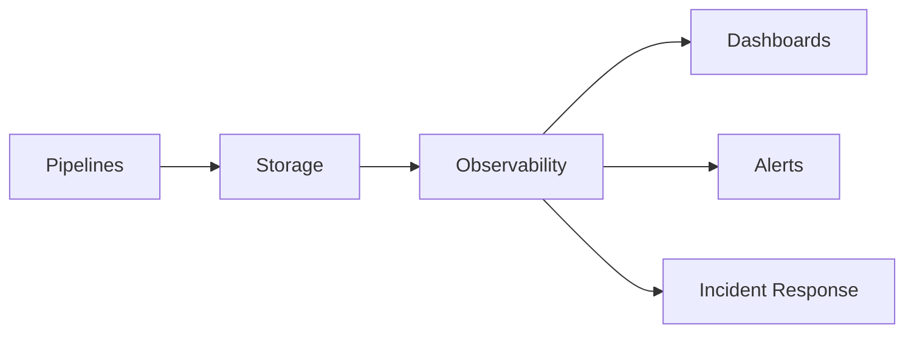
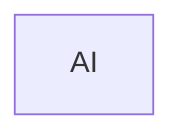
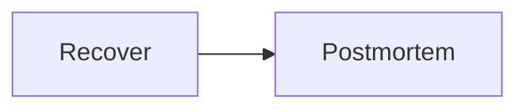

# Data Observability

> AI Social OS Data Layer

Version: 2.0.0

Status: Stable

Last Updated: 2026-07-25

---

# Table of Contents

- Overview
- Objectives
- Observability Architecture
- Metrics
- Logging
- Tracing
- Data Quality Monitoring
- Schema Monitoring
- Pipeline Monitoring
- Alerting
- Dashboards
- Incident Response
- Design Principles
- Summary

---

# Overview

Data Observability giúp theo dõi toàn bộ vòng đời của dữ liệu trong AI Social OS.

Không chỉ theo dõi hệ thống hạ tầng mà còn theo dõi.

- Data Quality
- Pipeline Health
- Freshness
- Lineage
- Schema Evolution

Mục tiêu là phát hiện sớm các vấn đề trước khi ảnh hưởng tới AI hoặc người dùng.

---

# Objectives

Data Observability hướng tới.

- Visibility
- Reliability
- Early Detection
- Root Cause Analysis
- SLA Monitoring
- Continuous Improvement

---

# High-Level Architecture



---

# Monitoring Scope

Quan sát toàn bộ.

- Databases
- Event Store
- Cache
- Search
- Vector DB
- Graph DB
- Lakehouse
- ETL
- Streaming

---

# Metrics

Thu thập.

- Records Processed
- Pipeline Latency
- Query Latency
- Throughput
- Error Rate
- Storage Usage
- Replication Delay

---

# Logging

Mỗi Pipeline ghi log.

Ví dụ.

```mermaid
flowchart LR
```

Log phải hỗ trợ.

- Search
- Correlation
- Audit

---

# Distributed Tracing

Theo dõi.



Có thể xác định thời gian xử lý của từng bước.

---

# Data Freshness

Theo dõi.

```mermaid
flowchart LR
```

Ví dụ.

| Dataset | SLA |
|----------|-----|
| User | < 1 min |
| Feed | < 30 sec |
| Analytics | < 15 min |

---

# Data Quality Monitoring

Kiểm tra.

- Null Values
- Duplicate Records
- Missing Data
- Invalid Format
- Constraint Violations

---

# Schema Monitoring

Phát hiện.

- Schema Drift
- Missing Columns
- Type Changes
- Breaking Changes

---

# Pipeline Monitoring

Theo dõi.

- Success Rate
- Retry Count
- Queue Length
- Consumer Lag
- Dead Letter Queue

---

# Alerting

Ví dụ.

```text
Pipeline Failed

High Latency

Replication Delay

Schema Changed

Storage Full

High Error Rate
```

---

# Dashboards

Dashboard cung cấp.

- Pipeline Status
- Data Freshness
- Data Quality Score
- Storage Health
- Event Throughput
- Search Latency
- Vector Index Health

---

# Incident Response



---

# Recommended Technologies

- Prometheus
- Grafana
- OpenTelemetry
- Jaeger
- Loki
- Elasticsearch

---

# Design Principles

- Observable by Default
- Metrics First
- End-to-End Tracing
- Automated Alerts
- Root Cause Visibility

---

# Summary

Data Observability giúp AI Social OS giám sát toàn bộ dòng chảy dữ liệu từ lúc được tạo ra đến khi được AI hoặc người dùng sử dụng, đảm bảo dữ liệu luôn chính xác, đầy đủ và sẵn sàng phục vụ hệ thống.