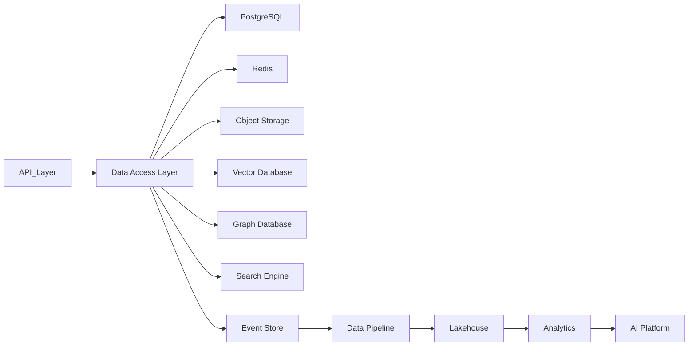
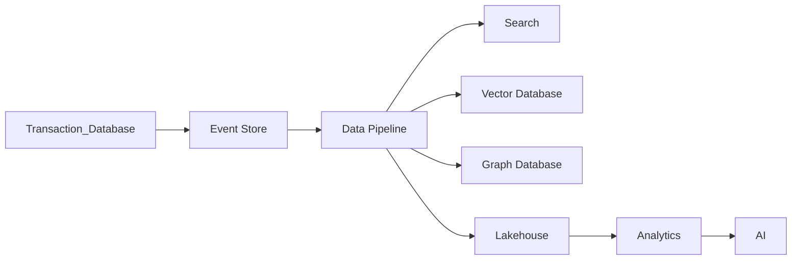

# Data Layer Summary

> AI Social OS Data Layer

Version: 2.0.0

Status: Stable

Last Updated: 2026-07-25

---

# Components

## Core

- Data Architecture
- Data Model
- Database Strategy
- Transaction Model

---

## Storage

- PostgreSQL
- Redis
- Object Storage
- Vector Database
- Graph Database
- Search Engine
- Event Store
- Lakehouse

---

## Processing

- Data Pipeline
- Event Streaming
- ETL / ELT
- Batch Processing

---

## Governance

- Data Versioning
- Data Governance
- Data Security
- Backup & Disaster Recovery
- Data Observability

---

# High-Level Architecture

---

# Responsibilities

Data Layer chịu trách nhiệm.

- Quản lý dữ liệu giao dịch
- Lưu trữ media
- Semantic Retrieval
- AI Memory Storage
- Event Sourcing
- Search
- Analytics
- Data Governance
- Security
- Disaster Recovery

---

# Data Flow

---

# Supported Data Types

| Data Type | Storage |
|------------|---------|
| Structured Data | PostgreSQL |
| Cache | Redis |
| Media | Object Storage |
| Embeddings | Vector Database |
| Relationships | Graph Database |
| Search Index | OpenSearch |
| Domain Events | Event Store |
| Analytics | Lakehouse |

---

# Cross-Layer Integration

| Layer | Interaction |
|---------|------------|
| AI | Embeddings, Memory, RAG |
| Social | Posts, Comments, Feed |
| Plugin | Connectors, Metadata |
| API | CRUD, Queries |
| Security | Encryption, IAM |
| Infrastructure | Storage, Monitoring |

---

# Quality Attributes

Data Layer được thiết kế với các thuộc tính.

- High Availability
- Horizontal Scalability
- Fault Tolerance
- Security
- Auditability
- Observability
- AI Native
- Event Driven

---

# Design Principles

- Polyglot Persistence
- Domain Driven Design
- Event Sourcing
- CQRS Ready
- Immutable Data
- Zero Trust
- Multi-Tenant
- Cloud Native

---

# Future Evolution

Data Layer có thể mở rộng thêm.

- Feature Store
- Time Series Database
- Data Mesh
- Streaming SQL
- Federated Query Engine
- Online Feature Serving
- AI-native Storage Engine

---

# Summary

Data Layer là nền tảng dữ liệu của AI Social OS, kết hợp nhiều công nghệ lưu trữ và xử lý khác nhau để đáp ứng đồng thời các yêu cầu về giao dịch thời gian thực, AI, Social Network, Analytics và Enterprise.

Thông qua kiến trúc Polyglot Persistence, Event-driven Architecture và Data Governance toàn diện, Data Layer cung cấp một nền tảng dữ liệu hiện đại, có khả năng mở rộng, an toàn và sẵn sàng cho các ứng dụng AI thế hệ mới.