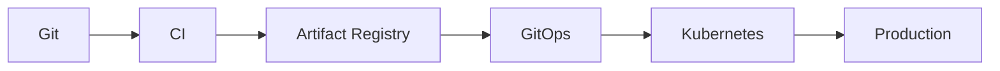

# Deployment Overview

> AI Social OS Deployment Layer

Version: 2.0.0

Status: Stable

Last Updated: 2026-07-25

---

# Table of Contents

- Overview
- Objectives
- Deployment Philosophy
- Deployment Architecture
- Deployment Lifecycle
- Components
- Deployment Targets
- Deployment Types
- Quality Gates
- Automation
- Design Principles
- Summary

---

# Overview

Deployment Layer chịu trách nhiệm triển khai toàn bộ AI Social OS từ Source Code đến Production.

Deployment phải.

- Repeatable
- Automated
- Auditable
- Secure
- Zero Downtime

---

# Objectives

Deployment hướng tới.

- Continuous Delivery
- Fast Release
- Safe Deployment
- Zero Downtime
- Rollback Ready
- GitOps

---

# Deployment Philosophy

Triết lý triển khai.

- Everything as Code
- Immutable Artifacts
- Git as Source of Truth
- Automated Promotion
- Progressive Delivery

---

# High-Level Architecture



---

# Deployment Lifecycle

```mermaid
flowchart LR
```

---

# Components

Deployment Layer bao gồm.

- CI Pipeline
- CD Pipeline
- Artifact Registry
- GitOps Controller
- Release Manager
- Rollback Engine

---

# Deployment Targets

Có thể triển khai tới.

- Kubernetes
- Serverless
- Edge Nodes
- AI GPU Cluster
- Batch Cluster

---

# Deployment Types

Hỗ trợ.

- Rolling Update
- Blue Green
- Canary
- Shadow Deployment

---

# Quality Gates

Mỗi Deployment phải vượt qua.

- Build
- Unit Test
- Integration Test
- Security Scan
- Image Scan
- Policy Check

---

# Automation

Toàn bộ quá trình triển khai được tự động.

Không Deploy thủ công vào Production.

---

# Design Principles

- Automated
- Repeatable
- Immutable
- Observable
- Secure

---

# Summary

Deployment Layer cung cấp quy trình triển khai chuẩn hóa, tự động và có khả năng mở rộng, giúp AI Social OS phát hành phần mềm nhanh chóng nhưng vẫn đảm bảo tính ổn định và an toàn.