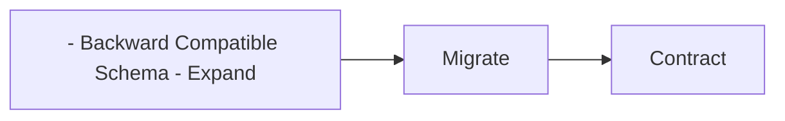

# Rollback Strategy

> AI Social OS Deployment Layer

Version: 2.0.0

Status: Stable

Last Updated: 2026-07-25

---

# Table of Contents

- Overview
- Objectives
- Rollback Principles
- Rollback Types
- Trigger Conditions
- Rollback Workflow
- Database Rollback
- Infrastructure Rollback
- AI Model Rollback
- Validation
- Monitoring
- Design Principles
- Summary

---

# Overview

Rollback Strategy định nghĩa cách AI Social OS quay trở lại trạng thái ổn định khi một phiên bản mới gặp sự cố.

Rollback phải.

- Fast
- Safe
- Predictable
- Automated

---

# Objectives

Rollback hướng tới.

- Minimize Downtime
- Reduce Business Impact
- Preserve Data
- Fast Recovery
- Auditability

---

# Rollback Principles

Rollback chỉ thực hiện khi.

- Deployment Failed
- Health Check Failed
- Error Rate Increased
- Business Metrics Degraded
- Manual Approval

Rollback không được làm mất dữ liệu.

---

# Rollback Types

## Application Rollback

Quay về Container Image trước đó.

---

## Configuration Rollback

Khôi phục Config Version trước.

---

## Infrastructure Rollback

Khôi phục Infrastructure thông qua GitOps hoặc Terraform.

---

## Database Rollback

Áp dụng Migration Rollback nếu tương thích.

---

## AI Model Rollback

Quay lại phiên bản Model ổn định trước đó.

---

# Trigger Conditions

Ví dụ.

- HTTP 5xx tăng cao
- Pod CrashLoopBackOff
- Health Check thất bại
- Latency vượt SLA
- Memory Leak
- AI Accuracy giảm mạnh

---

# Rollback Workflow

```mermaid
flowchart LR
```

---

# Database Rollback

Migration phải hỗ trợ.

```mermaid
flowchart LR
```

Khuyến nghị.

- Backward Compatible Schema


---

# Infrastructure Rollback

GitOps.

```mermaid
flowchart LR
```

Terraform.

```mermaid
flowchart LR
```

---

# AI Model Rollback

AI Runtime giữ nhiều Model Version.

```mermaid
flowchart LR
```

Embeddings và Prompt Version cũng được đồng bộ nếu cần.

---

# Validation

Sau Rollback kiểm tra.

- Health Checks
- API Availability
- Business Metrics
- AI Inference
- Database Connectivity

---

# Monitoring

Theo dõi.

- Rollback Time
- Rollback Frequency
- Recovery Success
- MTTR

---

# Design Principles

- Automated
- Safe
- Fast
- Auditable
- Tested

---

# Summary

Rollback Strategy đảm bảo AI Social OS có thể nhanh chóng quay về trạng thái ổn định khi phát hiện lỗi trong quá trình phát hành, giảm thiểu thời gian gián đoạn và tác động đến người dùng.