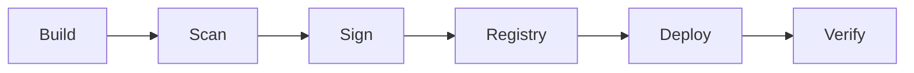

# Deployment Security

> AI Social OS Deployment Layer

Version: 2.0.0

Status: Stable

Last Updated: 2026-07-25

---

# Table of Contents

- Overview
- Objectives
- Secure Deployment Pipeline
- Identity & Access
- Artifact Security
- Supply Chain Security
- Environment Protection
- Secret Protection
- Policy Enforcement
- Audit Logging
- Compliance
- Design Principles
- Summary

---

# Overview

Deployment Security bảo vệ toàn bộ quy trình phát hành phần mềm của AI Social OS.

Security được áp dụng từ Source Code đến Production.

---

# Objectives

Deployment Security hướng tới.

- Trusted Builds
- Secure Delivery
- Supply Chain Integrity
- Least Privilege
- Complete Audit Trail

---

# Secure Deployment Pipeline



Mỗi bước đều được xác minh.

---

# Identity & Access

Pipeline sử dụng.

- Service Accounts
- OIDC
- Short-lived Tokens
- RBAC

Không sử dụng tài khoản cá nhân để Deploy.

---

# Artifact Security

Artifact phải.

- Immutable
- Signed
- Versioned
- Verified

Không Deploy Artifact chưa được ký số.

---

# Supply Chain Security

Kiểm tra.

- Dependency Vulnerabilities
- SBOM
- Provenance
- Image Signature
- License Compliance

---

# Environment Protection

Production yêu cầu.

- Approval Workflow
- Protected Branch
- Protected Environment
- Deployment Policy

---

# Secret Protection

Pipeline lấy Secret từ.

- Vault
- Secret Manager

Secret không xuất hiện trong.

- Logs
- Source Code
- Build Artifact

---

# Policy Enforcement

Ví dụ.

- Image Signature Required
- Security Scan Passed
- Test Coverage ≥ Threshold
- Critical CVE = 0

Nếu vi phạm.

```text
Deployment Blocked
```

---

# Audit Logging

Lưu.

- Who Deployed
- What Version
- When
- Target Environment
- Approval History

---

# Compliance

Hỗ trợ.

- SOC 2
- ISO 27001
- GDPR
- Internal Security Policy

---

# Design Principles

- Zero Trust
- Secure by Default
- Least Privilege
- Immutable Artifacts
- Full Traceability

---

# Summary

Deployment Security đảm bảo mọi phiên bản của AI Social OS đều được xây dựng, xác minh và triển khai thông qua một chuỗi cung ứng phần mềm an toàn, có thể kiểm toán và chống giả mạo.