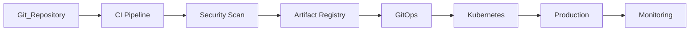

# Deployment Layer Summary

> AI Social OS Deployment Layer

Version: 2.0.0

Status: Stable

Last Updated: 2026-07-25

---

# Components

## Deployment

- Deployment Overview
- Deployment Strategy
- CI/CD Pipeline
- GitOps

---

## Release Management

- Release Management
- Environment Management
- Rollback Strategy

---

## Security

- Deployment Security
- Supply Chain Security
- Artifact Verification
- Policy Enforcement

---

# High-Level Deployment Flow



---

# Deployment Responsibilities

Deployment Layer chịu trách nhiệm.

- Build
- Test
- Package
- Publish
- Deploy
- Rollback
- Verification
- Release Management

---

# Deployment Lifecycle

```mermaid
flowchart LR
```

---

# Supported Deployment Strategies

| Strategy | Use Case |
|-----------|----------|
| Rolling Update | API Services |
| Blue-Green | Critical Services |
| Canary | AI Runtime |
| Shadow | Validation |
| Feature Flags | Progressive Features |

---

# Security Controls

Bao gồm.

- Signed Artifacts
- SBOM
- Secret Management
- RBAC
- Policy as Code
- Supply Chain Verification

---

# Quality Gates

Mỗi Release phải vượt qua.

- Build Success
- Unit Tests
- Integration Tests
- Security Scan
- Vulnerability Scan
- Health Checks
- Policy Validation

---

# Deployment Metrics

Theo dõi.

- Deployment Frequency
- Lead Time for Changes
- Change Failure Rate
- Mean Time to Recovery (MTTR)
- Rollback Frequency

---

# Technology Stack

| Category | Recommended Technologies |
|----------|--------------------------|
| CI | GitHub Actions, GitLab CI, Jenkins |
| CD | Argo CD, Flux CD |
| Build | Docker Buildx, Kaniko |
| Registry | GHCR, Amazon ECR, Harbor |
| IaC | Terraform |
| Package | Helm, Kustomize |
| Security | Trivy, Syft, Cosign, Snyk |

---

# Design Principles

- Continuous Delivery
- GitOps
- Immutable Artifacts
- Progressive Delivery
- Security First
- Infrastructure as Code
- Everything as Code

---

# Future Evolution

Deployment Layer có thể mở rộng thêm.

- Multi-cluster Progressive Delivery
- AI-assisted Deployment Approval
- Automated Root Cause Analysis
- Self-healing Deployment
- Policy-based Autonomous Release
- Continuous Verification with AI

---

# Summary

Deployment Layer cung cấp quy trình phát hành phần mềm hiện đại cho AI Social OS, từ xây dựng, kiểm thử, bảo mật, triển khai đến giám sát sau phát hành. Thông qua GitOps, CI/CD và Progressive Delivery, hệ thống có thể phát hành nhanh, an toàn, có khả năng kiểm toán và dễ dàng khôi phục khi xảy ra sự cố.