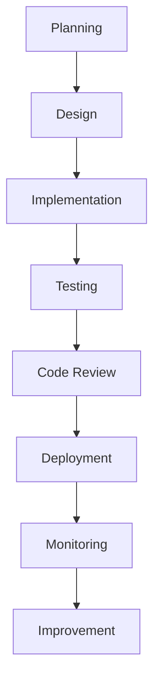
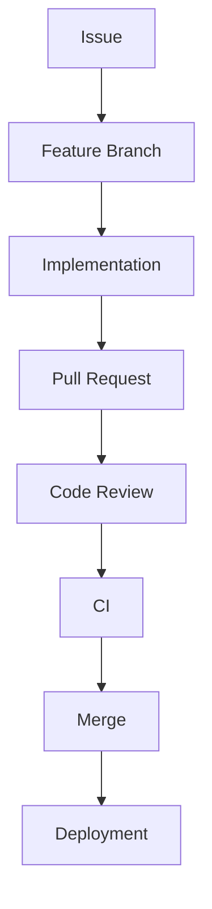

# Development Overview

> AI Social OS Engineering Handbook

Version: 2.0.0

Status: Stable

Last Updated: 2026-07-25

---

# Table of Contents

- Overview
- Vision
- Objectives
- Engineering Culture
- Software Development Lifecycle
- Engineering Principles
- Development Workflow
- Team Roles
- Technology Philosophy
- Continuous Improvement
- Summary

---

# Overview

Development Layer định nghĩa toàn bộ quy trình phát triển phần mềm của AI Social OS.

Tài liệu này đóng vai trò là Engineering Handbook cho toàn bộ đội ngũ phát triển.

---

# Vision

Xây dựng một nền tảng AI-first với khả năng phát triển nhanh, chất lượng cao và dễ mở rộng thông qua các quy trình kỹ thuật chuẩn hóa.

---

# Objectives

Engineering hướng tới.

- High Quality
- Fast Delivery
- Automation
- Reliability
- Scalability
- Collaboration

---

# Engineering Culture

Toàn bộ đội ngũ tuân theo.

- Ownership
- Simplicity
- Transparency
- Documentation First
- Continuous Learning
- Continuous Improvement

---

# Software Development Lifecycle

---

# Engineering Principles

Mọi hệ thống được xây dựng theo.

- API First
- AI First
- Cloud Native
- Secure by Design
- Observable by Default
- Automation First

---

# Development Workflow

Luồng phát triển.

---

# Team Roles

Bao gồm.

- Product Manager
- Tech Lead
- Backend Engineer
- Frontend Engineer
- AI Engineer
- DevOps Engineer
- QA Engineer
- Security Engineer

---

# Technology Philosophy

Ưu tiên.

- Open Standards
- Open Source
- Automation
- Simplicity
- Long-term Maintainability

---

# Continuous Improvement

Sau mỗi Sprint.

- Retrospective
- Performance Review
- Architecture Review
- Technical Debt Review

---

# Summary

Development Layer chuẩn hóa toàn bộ quy trình phát triển AI Social OS nhằm đảm bảo chất lượng, khả năng mở rộng và tốc độ phát triển lâu dài.