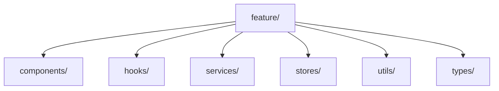

# Coding Standards

> AI Social OS Engineering Handbook

Version: 2.0.0

Status: Stable

---

# Table of Contents

- Overview
- Objectives
- General Rules
- Naming Conventions
- File Organization
- Code Style
- Error Handling
- Logging
- Documentation
- Security Rules
- Design Principles
- Summary

---

# Overview

Coding Standards đảm bảo toàn bộ Source Code của AI Social OS nhất quán và dễ bảo trì.

---

# Objectives

Coding Standards hướng tới.

- Readability
- Consistency
- Maintainability
- Security
- Simplicity

---

# General Rules

Mỗi đoạn code phải.

- Đơn giản
- Dễ đọc
- Có thể kiểm thử
- Có thể mở rộng

---

# Naming Conventions

Ví dụ.

| Type | Convention |
|-------|------------|
| Variable | camelCase |
| Function | camelCase |
| Class | PascalCase |
| Interface | PascalCase |
| Constant | UPPER_SNAKE_CASE |
| File | kebab-case |

---

# File Organization

Ví dụ.



---

# Code Style

Quy định.

- ESLint
- Prettier
- TypeScript Strict Mode
- No Dead Code
- No Magic Numbers

---

# Error Handling

Không.

```text
catch {

}
```

Luôn.

- Log
- Wrap
- Return Typed Errors

---

# Logging

Log phải.

- Structured
- Searchable
- Correlated

Không log.

- Password
- Secrets
- Tokens

---

# Documentation

Public API phải có.

- Description
- Parameters
- Return Values
- Examples

---

# Security Rules

Không được.

- Hardcode Secrets
- Disable Validation
- Ignore Errors
- Commit Credentials

---

# Design Principles

- Readability First
- Explicit over Implicit
- Composition over Inheritance
- Small Functions
- Single Responsibility

---

# Summary

Coding Standards giúp toàn bộ mã nguồn AI Social OS đồng nhất, dễ đọc, dễ kiểm thử và giảm thiểu Technical Debt.