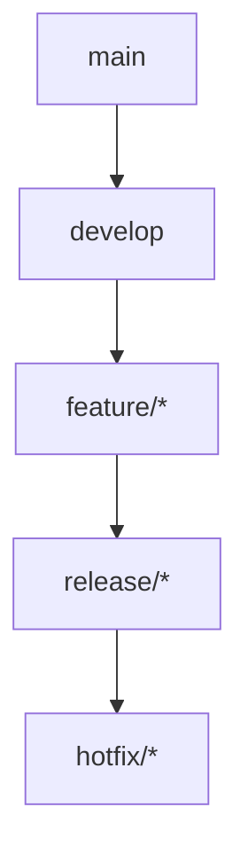
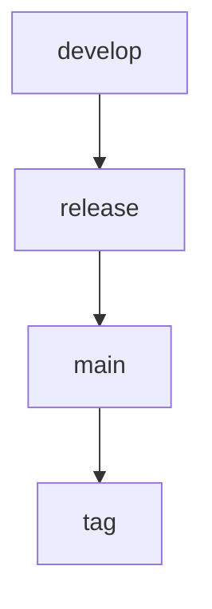
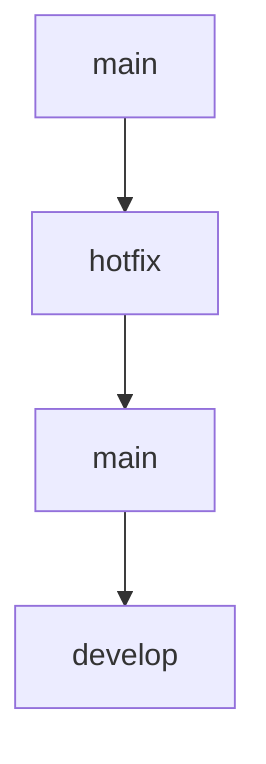

# Git Workflow

> AI Social OS Engineering Handbook

Version: 2.0.0

Status: Stable

---

# Table of Contents

- Overview
- Objectives
- Branch Strategy
- Branch Naming
- Commit Convention
- Pull Requests
- Merge Strategy
- Releases
- Hotfixes
- Best Practices
- Summary

---

# Overview

Git Workflow định nghĩa quy trình quản lý Source Code và cộng tác giữa các nhóm phát triển.

---

# Objectives

Git Workflow hướng tới.

- Stable Main Branch
- Parallel Development
- Easy Review
- Safe Releases

---

# Branch Strategy



---

# Branch Naming

Ví dụ.

```text
feature/user-profile

feature/ai-chat

bugfix/login

release/v2.0

hotfix/oauth
```

---

# Commit Convention

Sử dụng Conventional Commits.

Ví dụ.

```text
feat:

fix:

refactor:

docs:

test:

ci:

chore:
```

---

# Pull Requests

Mỗi Pull Request phải.

- Pass CI
- Linked Issue
- Description
- Screenshots (nếu có UI)
- Reviewer

---

# Merge Strategy

Ưu tiên.

```text
Squash Merge
```

Giữ lịch sử Git gọn gàng.

---

# Releases



---

# Hotfixes



---

# Best Practices

- Commit nhỏ
- PR nhỏ
- Rebase thường xuyên
- Không commit binary lớn
- Không force push lên main

---

# Summary

Git Workflow đảm bảo quá trình phát triển song song diễn ra an toàn, có kiểm soát và hỗ trợ phát hành phần mềm ổn định.