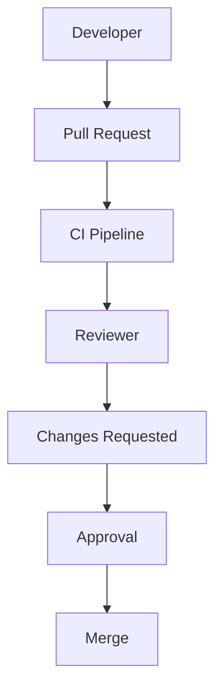

# Code Review

> AI Social OS Engineering Handbook

Version: 2.0.0

Status: Stable

Last Updated: 2026-07-25

---

# Table of Contents

- Overview
- Objectives
- Review Philosophy
- Review Workflow
- Review Checklist
- Security Review
- Performance Review
- Architecture Review
- AI-generated Code Review
- Review Metrics
- Best Practices
- Summary

---

# Overview

Code Review là bước bắt buộc trước khi bất kỳ thay đổi nào được hợp nhất vào nhánh chính.

Review tập trung vào chất lượng hệ thống, không đánh giá cá nhân.

---

# Objectives

Code Review hướng tới.

- Improve Code Quality
- Prevent Bugs
- Share Knowledge
- Maintain Architecture
- Reduce Technical Debt

---

# Review Philosophy

Code Review cần.

- Constructive
- Respectful
- Objective
- Consistent
- Educational

---

# Review Workflow

---

# Review Checklist

Reviewer kiểm tra.

- Correctness
- Readability
- Maintainability
- Security
- Performance
- Error Handling
- Logging
- Documentation
- Test Coverage

---

# Security Review

Kiểm tra.

- Authentication
- Authorization
- Input Validation
- Secret Management
- Dependency Security

---

# Performance Review

Đánh giá.

- Time Complexity
- Memory Usage
- Database Queries
- Network Calls
- Rendering Performance

---

# Architecture Review

Xác minh.

- SOLID Principles
- Clean Architecture
- Module Boundaries
- Dependency Direction
- API Contracts

---

# AI-generated Code Review

Mọi mã sinh bởi AI phải được.

- Human Reviewed
- Security Checked
- Performance Evaluated
- Tested
- Documented

Không merge trực tiếp mã AI sinh ra mà chưa được kiểm tra.

---

# Review Metrics

Theo dõi.

- Review Time
- Review Size
- Approval Rate
- Defect Density
- Review Coverage

---

# Best Practices

- Review sớm
- Review thường xuyên
- PR nhỏ (<500 dòng thay đổi)
- Đưa ra góp ý cụ thể
- Giải thích lý do thay vì chỉ yêu cầu sửa

---

# Summary

Code Review giúp AI Social OS duy trì chất lượng mã nguồn, giảm lỗi, lan tỏa kiến thức trong nhóm và đảm bảo mọi thay đổi đều đáp ứng tiêu chuẩn kỹ thuật.