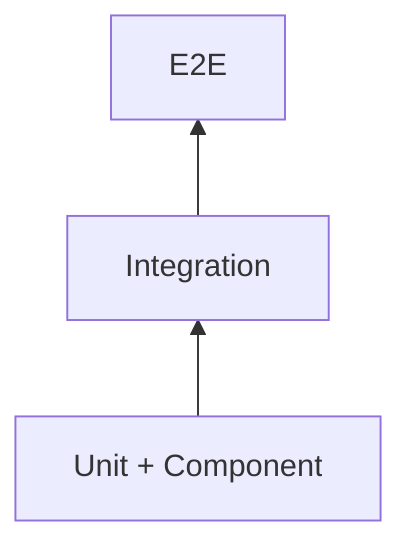

# Testing Strategy

> AI Social OS Engineering Handbook

Version: 2.0.0

Status: Stable

Last Updated: 2026-07-25

---

# Table of Contents

- Overview
- Objectives
- Testing Pyramid
- Unit Testing
- Integration Testing
- End-to-End Testing
- Performance Testing
- Security Testing
- AI Testing
- Test Automation
- Quality Gates
- Summary

---

# Overview

Testing Strategy định nghĩa chiến lược kiểm thử toàn diện cho AI Social OS.

Kiểm thử được thực hiện xuyên suốt vòng đời phát triển.

---

# Objectives

Testing hướng tới.

- Prevent Regression
- Improve Reliability
- Validate Business Logic
- Increase Deployment Confidence

---

# Testing Pyramid

---

# Unit Testing

Kiểm thử.

- Business Logic
- Utilities
- Domain Models
- AI Helpers

Yêu cầu.

- Fast
- Isolated
- Repeatable

---

# Integration Testing

Kiểm thử.

- API Integration
- Database
- Cache
- Event Bus
- External Services

---

# End-to-End Testing

Mô phỏng hành vi người dùng.

Ví dụ.

- Login
- AI Conversation
- Publish Post
- Install Plugin
- Execute Workflow

---

# Performance Testing

Bao gồm.

- Load Testing
- Stress Testing
- Spike Testing
- Endurance Testing

---

# Security Testing

Thực hiện.

- Dependency Scanning
- SAST
- DAST
- Secret Detection
- Container Scanning

---

# AI Testing

Đánh giá.

- Prompt Quality
- Tool Calls
- Hallucination Rate
- Latency
- Deterministic Outputs

---

# Test Automation

CI Pipeline tự động chạy.

- Unit Tests
- Integration Tests
- E2E Tests
- Security Tests
- Performance Benchmarks

---

# Quality Gates

Merge chỉ được phép khi.

- Tests Passed
- Coverage Threshold Met
- No Critical Vulnerabilities
- Code Review Approved

---

# Summary

Testing Strategy đảm bảo AI Social OS đạt chất lượng cao thông qua nhiều cấp độ kiểm thử và tự động hóa toàn bộ quy trình xác minh.