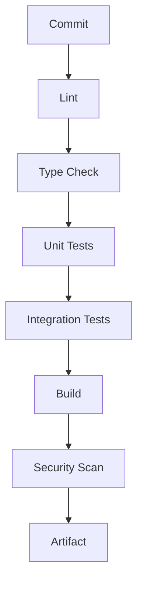
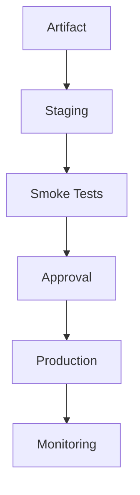
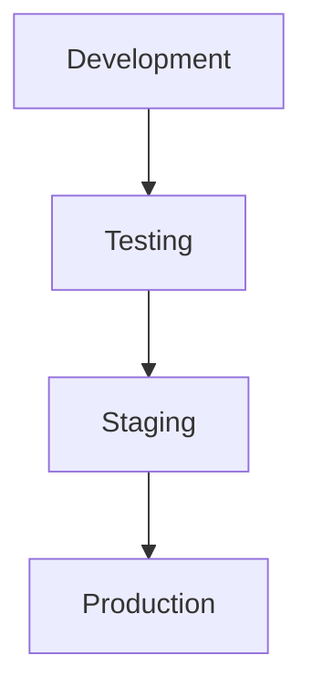

# Continuous Integration & Continuous Delivery

> AI Social OS Engineering Handbook

Version: 2.0.0

Status: Stable

Last Updated: 2026-07-25

---

# Table of Contents

- Overview
- Objectives
- CI Pipeline
- CD Pipeline
- Build Process
- Artifact Management
- Deployment Strategy
- Rollback
- Environment Promotion
- Monitoring
- Summary

---

# Overview

CI/CD tự động hóa quá trình xây dựng, kiểm thử và triển khai AI Social OS.

Mục tiêu là giảm thời gian phát hành và hạn chế lỗi thủ công.

---

# Objectives

CI/CD hướng tới.

- Fast Feedback
- Automated Validation
- Safe Deployment
- Reliable Releases

---

# CI Pipeline

---

# CD Pipeline

---

# Build Process

Bao gồm.

- Dependency Installation
- Compilation
- Asset Optimization
- Docker Image Build
- SBOM Generation

---

# Artifact Management

Artifacts được lưu.

- Docker Images
- Build Packages
- Release Notes
- Test Reports

---

# Deployment Strategy

Hỗ trợ.

- Rolling Update
- Blue-Green Deployment
- Canary Release

Lựa chọn chiến lược phụ thuộc mức độ rủi ro của từng dịch vụ.

---

# Rollback

Rollback được kích hoạt khi.

- Health Check Failed
- Error Rate Increased
- Manual Approval

Quá trình rollback phải tự động và có thể kiểm chứng.

---

# Environment Promotion

---

# Monitoring

Sau triển khai theo dõi.

- Error Rate
- Latency
- Resource Usage
- Deployment Success
- User Impact

---

# Summary

CI/CD giúp AI Social OS tự động hóa toàn bộ quy trình từ Commit đến Production, đảm bảo phát hành nhanh, ổn định và có khả năng khôi phục khi xảy ra sự cố.