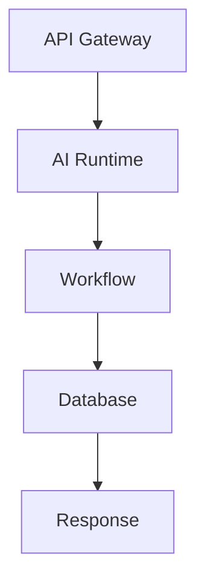
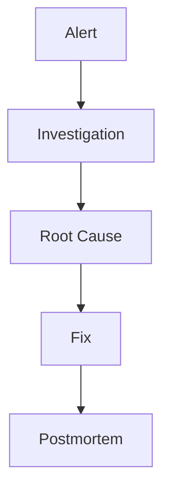

# Observability

> AI Social OS Engineering Handbook

Version: 2.0.0

Status: Stable

Last Updated: 2026-07-25

---

# Table of Contents

- Overview
- Objectives
- Three Pillars
- Logging
- Metrics
- Tracing
- Alerting
- Dashboards
- Incident Detection
- SLO & SLA
- Best Practices
- Summary

---

# Overview

Observability giúp đội ngũ Engineering hiểu trạng thái hệ thống theo thời gian thực và nhanh chóng xác định nguyên nhân khi xảy ra sự cố.

Observability không chỉ là Monitoring mà còn hỗ trợ phân tích nguyên nhân gốc (Root Cause Analysis).

---

# Objectives

Observability hướng tới.

- System Visibility
- Faster Debugging
- Proactive Detection
- Operational Excellence
- Reliability

---

# Three Pillars

Observability dựa trên ba thành phần.

```text
Logs

+

Metrics

+

Distributed Tracing
```

---

# Logging

Logging phải.

- Structured
- Searchable
- Correlated
- Centralized

Ví dụ thông tin log.

- Timestamp
- Service
- Request ID
- User ID
- Severity
- Message

---

# Metrics

Theo dõi.

- CPU
- Memory
- Latency
- Request Rate
- Error Rate
- Queue Length
- AI Token Usage

---

# Distributed Tracing

Tracing theo dõi.



Mỗi Request có Trace ID duy nhất.

---

# Alerting

Thiết lập cảnh báo khi.

- Error Rate tăng
- Latency vượt ngưỡng
- CPU cao
- Queue đầy
- AI Service lỗi

---

# Dashboards

Dashboard hiển thị.

- System Health
- AI Metrics
- API Metrics
- Infrastructure
- Business Metrics

---

# Incident Detection

Quy trình.



---

# SLO & SLA

Ví dụ.

| Metric | Target |
|----------|---------|
| Availability | 99.9% |
| API Latency | <200ms |
| Error Rate | <1% |

---

# Best Practices

- Log có cấu trúc
- Không log Secrets
- Dùng Correlation ID
- Theo dõi SLO
- Dashboard theo Service

---

# Summary

Observability giúp AI Social OS đạt khả năng giám sát toàn diện thông qua Logs, Metrics và Distributed Tracing, từ đó nâng cao độ tin cậy và khả năng vận hành hệ thống.