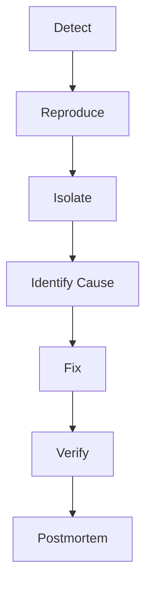

# Debugging

> AI Social OS Engineering Handbook

Version: 2.0.0

Status: Stable

Last Updated: 2026-07-25

---

# Table of Contents

- Overview
- Objectives
- Debugging Workflow
- Local Debugging
- Remote Debugging
- Production Debugging
- AI System Debugging
- Root Cause Analysis
- Debugging Checklist
- Best Practices
- Summary

---

# Overview

Debugging là quá trình xác định và khắc phục lỗi trong hệ thống một cách có hệ thống.

Mục tiêu không chỉ là sửa lỗi mà còn ngăn lỗi tái diễn.

---

# Objectives

Debugging hướng tới.

- Fast Diagnosis
- Root Cause Identification
- Safe Fixes
- Knowledge Sharing

---

# Debugging Workflow

---

# Local Debugging

Sử dụng.

- IDE Debugger
- Breakpoints
- Unit Tests
- Local Logs
- Mock Services

---

# Remote Debugging

Áp dụng.

- SSH
- Remote IDE
- Container Debugging
- Kubernetes Exec
- Port Forwarding

---

# Production Debugging

Ưu tiên.

- Logs
- Metrics
- Traces
- Feature Flags
- Safe Rollback

Không debug trực tiếp bằng cách sửa dữ liệu trên Production nếu chưa có quy trình phê duyệt.

---

# AI System Debugging

Kiểm tra.

- Prompt
- Context
- Memory
- Tool Calls
- Model Output
- Token Usage

---

# Root Cause Analysis

Áp dụng.

- Five Whys
- Fishbone Diagram
- Timeline Analysis

Mục tiêu là tìm nguyên nhân gốc thay vì chỉ xử lý triệu chứng.

---

# Debugging Checklist

Kiểm tra.

- Reproducible
- Logs
- Stack Trace
- Configuration
- Dependencies
- Environment
- Recent Changes

---

# Best Practices

- Không đoán nguyên nhân
- Thu thập bằng chứng
- Sửa tối thiểu
- Viết Regression Test
- Cập nhật tài liệu nếu cần

---

# Summary

Debugging trong AI Social OS là quy trình có cấu trúc nhằm phát hiện, phân tích và khắc phục lỗi nhanh chóng, đồng thời giảm khả năng tái diễn thông qua kiểm thử và tài liệu hóa.