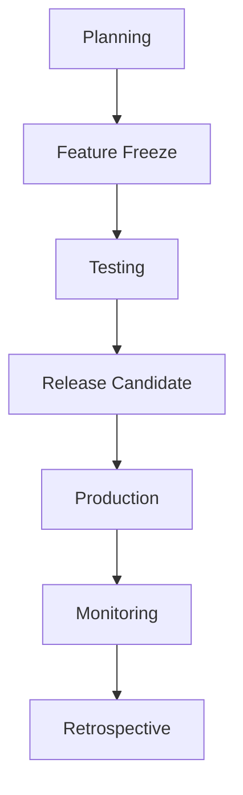

# Release Management

> AI Social OS Engineering Handbook

Version: 2.0.0

Status: Stable

Last Updated: 2026-07-25

---

# Table of Contents

- Overview
- Objectives
- Release Types
- Release Workflow
- Versioning
- Release Checklist
- Rollback Strategy
- Release Notes
- Post-release Monitoring
- Best Practices
- Summary

---

# Overview

Release Management quản lý quá trình phát hành phiên bản mới của AI Social OS từ giai đoạn chuẩn bị đến sau khi triển khai.

---

# Objectives

Release Management hướng tới.

- Predictable Releases
- Stable Deployments
- Risk Reduction
- Traceability

---

# Release Types

Bao gồm.

- Major Release
- Minor Release
- Patch Release
- Hotfix

---

# Release Workflow



---

# Versioning

Áp dụng Semantic Versioning.

```text
MAJOR.MINOR.PATCH

Ví dụ:

2.1.5
```

---

# Release Checklist

Trước khi phát hành.

- CI Passed
- Tests Passed
- Security Scan Completed
- Documentation Updated
- Release Notes Prepared
- Rollback Plan Available

---

# Rollback Strategy

Rollback được thực hiện khi.

- Critical Bugs
- Performance Regression
- Security Issues
- Failed Health Checks

---

# Release Notes

Bao gồm.

- New Features
- Improvements
- Bug Fixes
- Breaking Changes
- Migration Guide

---

# Post-release Monitoring

Theo dõi.

- Error Rate
- Latency
- User Feedback
- Crash Reports
- Business Metrics

---

# Best Practices

- Phát hành nhỏ và thường xuyên
- Tự động hóa quy trình
- Chuẩn bị Rollback
- Theo dõi sau phát hành
- Ghi nhận bài học sau mỗi Release

---

# Summary

Release Management đảm bảo các phiên bản AI Social OS được phát hành an toàn, có thể truy vết, dễ khôi phục và giảm thiểu rủi ro trong quá trình vận hành.