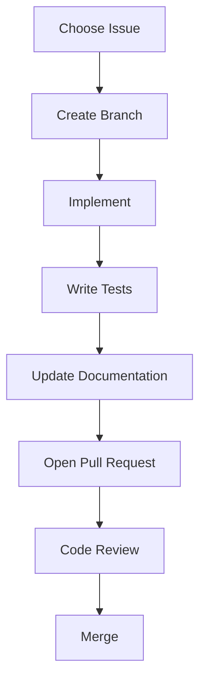

# Contributing Guide

> AI Social OS Engineering Handbook

Version: 2.0.0

Status: Stable

Last Updated: 2026-07-25

---

# Table of Contents

- Overview
- Objectives
- Contribution Workflow
- Before You Start
- Development Process
- Pull Request Process
- Documentation Requirements
- Code Quality Requirements
- Community Guidelines
- Best Practices
- Summary

---

# Overview

Contributing Guide mô tả quy trình chuẩn để đóng góp vào AI Social OS.

Mọi thành viên trong nhóm hoặc cộng tác viên đều phải tuân thủ tài liệu này.

---

# Objectives

Contributing hướng tới.

- Consistency
- High Quality
- Collaboration
- Transparency
- Maintainability

---

# Contribution Workflow

---

# Before You Start

Trước khi phát triển.

- Đọc Architecture Documents
- Đọc Coding Standards
- Đồng bộ Source Code mới nhất
- Thiết lập Development Environment
- Chạy toàn bộ Test Suite

---

# Development Process

Quy trình phát triển.

1. Chọn Issue.
2. Tạo Feature Branch.
3. Thực hiện thay đổi.
4. Viết Test.
5. Cập nhật Documentation.
6. Tạo Pull Request.

---

# Pull Request Process

Mỗi Pull Request cần.

- Mô tả mục đích
- Liên kết Issue
- Danh sách thay đổi
- Kết quả kiểm thử
- Reviewer được chỉ định

---

# Documentation Requirements

Mọi thay đổi ảnh hưởng tới.

- API
- Workflow
- AI Models
- Infrastructure
- UI

đều phải cập nhật tài liệu liên quan.

---

# Code Quality Requirements

Yêu cầu.

- Pass Lint
- Pass Tests
- No Critical Vulnerabilities
- Type-safe
- Reviewed

---

# Community Guidelines

Khuyến khích.

- Tôn trọng ý kiến
- Thảo luận dựa trên dữ liệu
- Chia sẻ kiến thức
- Hỗ trợ thành viên mới

---

# Best Practices

- Pull Request nhỏ
- Commit rõ ràng
- Documentation đầy đủ
- Test trước khi gửi Review
- Phản hồi Review nhanh

---

# Summary

Contributing Guide chuẩn hóa quy trình đóng góp vào AI Social OS nhằm đảm bảo chất lượng, tính minh bạch và khả năng cộng tác hiệu quả.