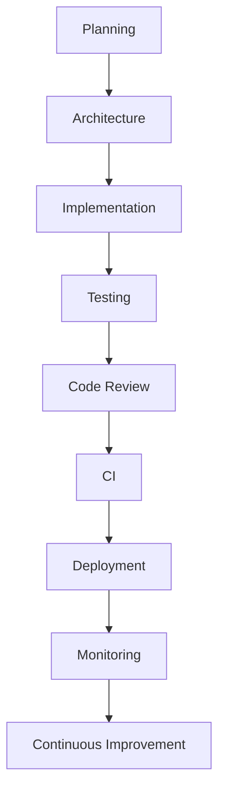
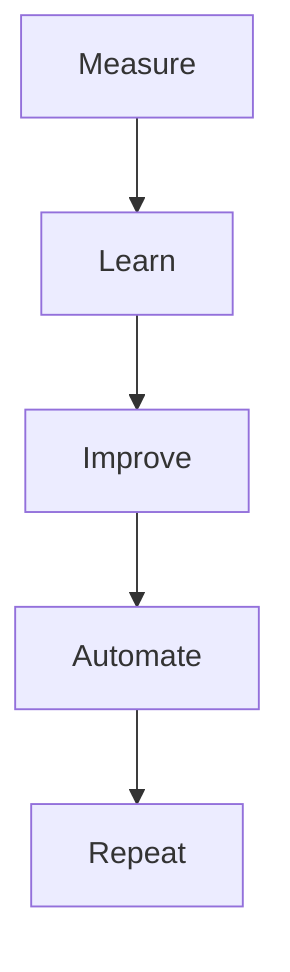

# Development Layer Summary

> AI Social OS Engineering Handbook

Version: 2.0.0

Status: Stable

Last Updated: 2026-07-25

---

# Engineering Lifecycle

---

# Engineering Standards

Toàn bộ đội ngũ tuân thủ.

- Coding Standards
- Git Workflow
- Code Review
- Testing Strategy
- CI/CD
- Security Guidelines
- Documentation First

---

# Quality Gates

Một thay đổi chỉ được Merge khi.

- CI Passed
- Tests Passed
- Security Scan Passed
- Code Review Approved
- Documentation Updated

---

# Core Practices

| Practice | Purpose |
|----------|---------|
| Architecture Review | Maintain Design Quality |
| Code Review | Prevent Defects |
| Automated Testing | Ensure Reliability |
| CI/CD | Accelerate Delivery |
| Observability | Improve Operations |
| Documentation | Preserve Knowledge |

---

# Engineering Metrics

Theo dõi.

- Deployment Frequency
- Lead Time
- Mean Time to Recovery (MTTR)
- Change Failure Rate
- Test Coverage
- Code Review Time
- Technical Debt

---

# Toolchain

| Category | Recommended Tools |
|----------|-------------------|
| Version Control | Git + GitHub |
| CI/CD | GitHub Actions / ArgoCD |
| Package Management | pnpm / uv |
| Containerization | Docker |
| Orchestration | Kubernetes |
| Infrastructure | Terraform |
| Monitoring | Prometheus + Grafana |
| Logging | Loki / ELK |
| Tracing | OpenTelemetry + Jaeger |

---

# Engineering Principles

Toàn bộ hệ thống được xây dựng theo.

- AI First
- API First
- Cloud Native
- Secure by Design
- Observable by Default
- Infrastructure as Code
- Automation First
- Documentation First

---

# Continuous Improvement

Engineering là một quá trình liên tục.

---

# Future Evolution

Development Layer có thể mở rộng với.

- AI-assisted Code Review
- AI-generated Test Cases
- Autonomous CI Optimization
- Intelligent Deployment Analysis
- Self-healing Infrastructure
- AI-powered Technical Documentation

---

# Summary

Development Layer là nền tảng kỹ thuật của AI Social OS, chuẩn hóa toàn bộ quy trình từ lập kế hoạch, phát triển, kiểm thử, triển khai đến vận hành. Thông qua các tiêu chuẩn thống nhất, tự động hóa và văn hóa cải tiến liên tục, hệ thống có thể phát triển bền vững, mở rộng dễ dàng và duy trì chất lượng ở quy mô doanh nghiệp.