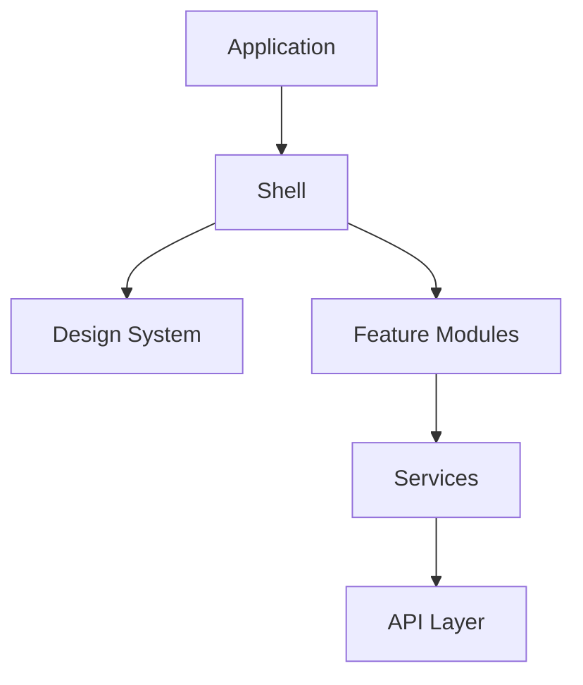

# Frontend Overview

> AI Social OS Frontend Layer

Version: 2.0.0

Status: Stable

Last Updated: 2026-07-25

---

# Table of Contents

- Overview
- Vision
- Objectives
- Design Philosophy
- Frontend Architecture
- Core Modules
- Technology Stack
- Rendering Strategy
- Cross Platform
- Observability
- Design Principles
- Summary

---

# Overview

Frontend Layer là giao diện tương tác giữa người dùng và toàn bộ AI Social OS.

Frontend không chỉ hiển thị dữ liệu mà còn là môi trường cộng tác giữa.

- Users
- AI Agents
- Workflows
- Plugins
- Realtime Collaboration

---

# Vision

Xây dựng một AI-native Workspace nơi AI trở thành thành phần giao diện đầu tiên (First-class UI Component).

AI không chỉ là chatbot mà là một thành viên trong giao diện.

---

# Objectives

Frontend hướng tới.

- Fast
- Responsive
- AI-first
- Realtime
- Accessible
- Extensible

---

# Design Philosophy

Frontend được xây dựng theo nguyên tắc.

- Component First
- Design System First
- Accessibility First
- Performance First
- AI First

---

# Frontend Architecture

---

# Core Modules

Frontend bao gồm.

- Workspace
- Dashboard
- AI Chat
- AI Studio
- Social Studio
- Workflow Builder
- Plugin Marketplace
- Settings
- Admin Console

---

# Technology Stack

| Category | Technology |
|----------|------------|
| Framework | Next.js |
| UI | React |
| Styling | Tailwind CSS |
| Components | shadcn/ui |
| Animation | Framer Motion |
| State | Zustand |
| Data Fetching | TanStack Query |
| Forms | React Hook Form |
| Validation | Zod |

---

# Rendering Strategy

Kết hợp.

- SSR
- SSG
- ISR
- CSR
- Streaming Rendering

---

# Cross Platform

Frontend hỗ trợ.

- Desktop
- Mobile
- Tablet
- PWA

Có thể mở rộng sang.

- Electron
- React Native

---

# Observability

Theo dõi.

- Web Vitals
- Rendering Time
- Bundle Size
- User Interaction
- Frontend Errors

---

# Design Principles

- AI Native
- Component Driven
- Responsive
- Accessible
- Performant

---

# Summary

Frontend Layer cung cấp trải nghiệm AI-native hiện đại, nơi người dùng, AI Agent và Workflow cùng hoạt động trong một giao diện thống nhất, nhanh, mở rộng và thân thiện.