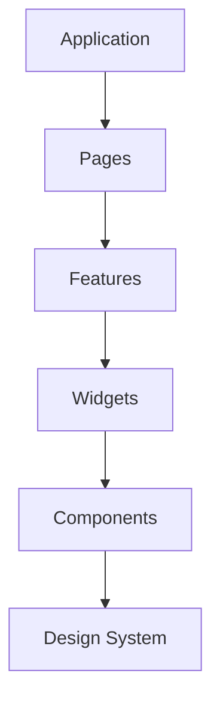
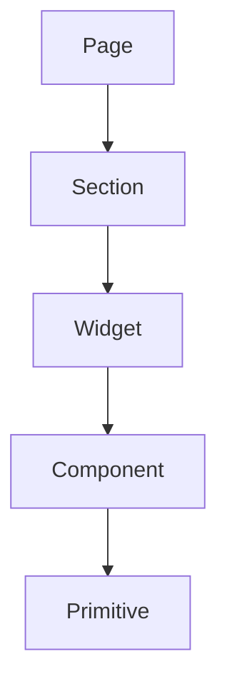

# UI Architecture

> AI Social OS Frontend Layer

Version: 2.0.0

Status: Stable

---

# Table of Contents

- Overview
- Objectives
- Layered Architecture
- Application Shell
- Feature Modules
- Component Hierarchy
- Shared Components
- Layout System
- Error Boundaries
- Micro Frontend Considerations
- Design Principles
- Summary

---

# Overview

UI Architecture tổ chức giao diện của AI Social OS theo mô hình phân lớp nhằm tăng khả năng mở rộng và bảo trì.

---

# Objectives

UI Architecture hướng tới.

- Modular
- Scalable
- Reusable
- Testable
- Maintainable

---

# Layered Architecture

---

# Application Shell

Application Shell chịu trách nhiệm.

- Navigation
- Authentication
- Theme
- Layout
- Notifications
- Global State

---

# Feature Modules

Ví dụ.

- AI Workspace
- Social Studio
- Workflow Builder
- Plugin Marketplace
- Analytics Dashboard

Mỗi Feature độc lập.

---

# Component Hierarchy

---

# Shared Components

Bao gồm.

- Button
- Dialog
- Modal
- Table
- Charts
- Forms
- AI Components

---

# Layout System

Các Layout chuẩn.

- Dashboard
- Workspace
- Settings
- Landing
- Admin

---

# Error Boundaries

Error được cô lập theo.

- Page
- Feature
- Widget

Không làm sập toàn bộ ứng dụng.

---

# Micro Frontend Considerations

Hỗ trợ mở rộng.

- Module Federation
- Independent Deployment
- Shared Design System

Chỉ áp dụng khi quy mô hệ thống yêu cầu.

---

# Design Principles

- Composition over Inheritance
- Feature Isolation
- Reusable Components
- Separation of Concerns
- Progressive Enhancement

---

# Summary

UI Architecture giúp AI Social OS tổ chức giao diện thành các module độc lập, dễ mở rộng, dễ kiểm thử và tái sử dụng, đồng thời duy trì tính nhất quán trên toàn bộ ứng dụng.