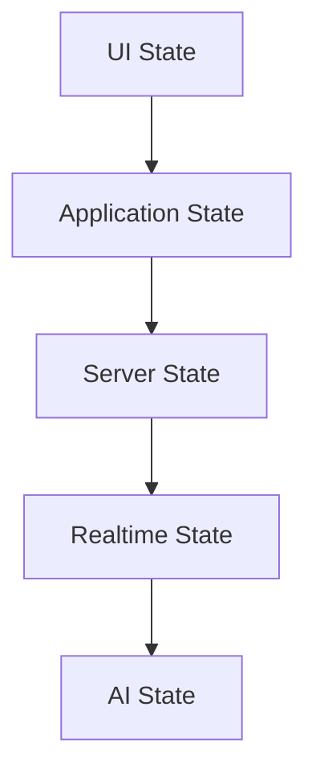
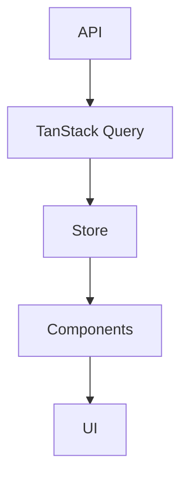

# State Management

> AI Social OS Frontend Layer

Version: 2.0.0

Status: Stable

Last Updated: 2026-07-25

---

# Table of Contents

- Overview
- Objectives
- State Categories
- Global State
- Server State
- Local State
- URL State
- Form State
- AI State
- Realtime State
- State Synchronization
- Design Principles
- Summary

---

# Overview

State Management chịu trách nhiệm quản lý toàn bộ trạng thái của ứng dụng Frontend.

Không phải mọi dữ liệu đều thuộc Global State.

Mỗi loại State được quản lý bởi công cụ phù hợp.

---

# Objectives

State Management hướng tới.

- Predictable
- Reactive
- Minimal
- Scalable
- Easy Debugging

---

# State Categories

Frontend chia State thành.



---

# Global State

Global State lưu.

- Current User
- Workspace
- Theme
- Language
- Notifications
- Feature Flags

Sử dụng.

```text
Zustand
```

---

# Server State

Server State bao gồm.

- API Responses
- Cached Queries
- Infinite Lists
- Pagination
- Mutations

Sử dụng.

```text
TanStack Query
```

---

# Local State

Local State chỉ tồn tại trong Component.

Ví dụ.

- Modal Open
- Dropdown
- Input Focus
- Hover State

Sử dụng.

```text
React useState
```

---

# URL State

URL phản ánh.

- Filters
- Search
- Pagination
- Tabs
- Workspace

Ví dụ.

```text
/posts

?page=2

&status=published
```

---

# Form State

Quản lý.

- Validation
- Dirty Fields
- Errors
- Submission
- Reset

Sử dụng.

```text
React Hook Form

+

Zod
```

---

# AI State

AI State bao gồm.

- Current Conversation
- AI Context
- Streaming Tokens
- Tool Execution
- Agent Status

AI State được cập nhật theo thời gian thực.

---

# Realtime State

Bao gồm.

- Notifications
- Presence
- Live Cursor
- Workflow Progress
- AI Streaming

Được đồng bộ qua WebSocket hoặc SSE.

---

# State Synchronization



---

# Design Principles

- Keep State Minimal
- Server State ≠ Global State
- Single Source of Truth
- Immutable Updates
- Derived State over Duplicated State

---

# Summary

State Management giúp AI Social OS quản lý hiệu quả nhiều loại trạng thái khác nhau bằng cách sử dụng đúng công cụ cho từng mục đích, đảm bảo hiệu năng và khả năng mở rộng.