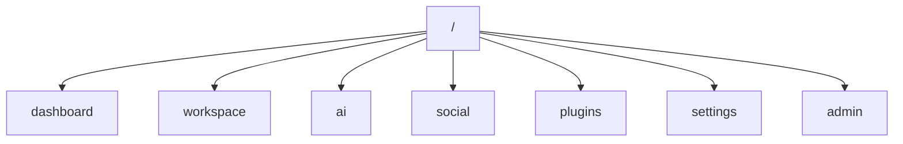
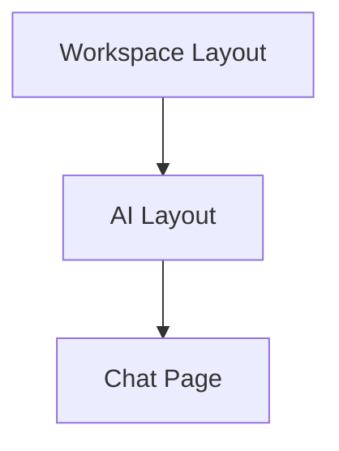

# Routing

> AI Social OS Frontend Layer

Version: 2.0.0

Status: Stable

Last Updated: 2026-07-25

---

# Table of Contents

- Overview
- Objectives
- Routing Strategy
- Route Structure
- Nested Routing
- Protected Routes
- Dynamic Routes
- Route Groups
- Navigation
- Error Routes
- Design Principles
- Summary

---

# Overview

Routing quản lý điều hướng trong AI Social OS.

Hệ thống sử dụng File-based Routing của Next.js App Router.

---

# Objectives

Routing hướng tới.

- Fast Navigation
- Nested Layouts
- SEO Friendly
- Predictable URLs
- Code Splitting

---

# Routing Strategy

Ví dụ.



---

# Route Structure

Ví dụ.

```text
/workspace

/workspace/{id}

/workspace/{id}/chat

/workspace/{id}/workflow
```

---

# Nested Routing

Cho phép.



Shared Layout không bị render lại.

---

# Protected Routes

Yêu cầu.

- Authentication
- Authorization
- Workspace Access
- Tenant Validation

---

# Dynamic Routes

Ví dụ.

```text
/users/[id]

/posts/[slug]

/workspace/[workspaceId]
```

---

# Route Groups

Sử dụng Route Groups để.

- Public Pages
- Auth Pages
- Dashboard
- Admin

---

# Navigation

Hỗ trợ.

- Breadcrumbs
- Sidebar
- Global Search
- Command Palette
- Recent Pages

---

# Error Routes

Bao gồm.

- 404
- 403
- 500
- Maintenance

Có giao diện thống nhất.

---

# Design Principles

- File-based Routing
- Nested Layouts
- Lazy Loading
- Predictable URLs
- Fast Navigation

---

# Summary

Routing của AI Social OS sử dụng kiến trúc App Router hiện đại, hỗ trợ Nested Layouts, Protected Routes và điều hướng hiệu quả cho các ứng dụng quy mô lớn.