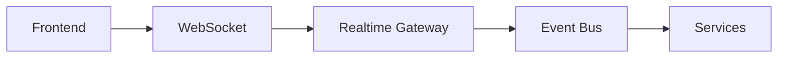

# Realtime UI

> AI Social OS Frontend Layer

Version: 2.0.0

Status: Stable

Last Updated: 2026-07-25

---

# Table of Contents

- Overview
- Objectives
- Realtime Architecture
- Live Updates
- Presence
- Collaborative Editing
- AI Streaming
- Notifications
- Offline Synchronization
- Conflict Resolution
- Performance
- Design Principles
- Summary

---

# Overview

Realtime UI mang lại trải nghiệm tương tác theo thời gian thực giữa người dùng, AI Agents và hệ thống.

Mọi thay đổi quan trọng được phản ánh ngay lập tức mà không cần tải lại trang.

---

# Objectives

Realtime UI hướng tới.

- Instant Feedback
- Live Collaboration
- AI Streaming
- Low Latency
- Smooth User Experience

---

# Realtime Architecture

---

# Live Updates

Realtime UI cập nhật.

- Dashboard
- Notifications
- Workflow Status
- AI Execution
- Social Feed
- Analytics

---

# Presence

Hiển thị.

- Online Users
- Current Workspace
- Active Editors
- Viewing Users
- Cursor Presence

---

# Collaborative Editing

Hỗ trợ.

- Shared Documents
- Workflow Editing
- Whiteboard
- Prompt Editing
- AI Workspace

---

# AI Streaming

Hiển thị.

- Token Streaming
- Reasoning Status
- Tool Progress
- Partial Results
- Final Results

Người dùng không cần chờ AI hoàn thành toàn bộ.

---

# Notifications

Bao gồm.

- In-app Notifications
- Toast Messages
- Activity Feed
- Mention Alerts
- Workflow Updates

---

# Offline Synchronization

Khi mất kết nối.

- Cache Actions
- Queue Requests
- Auto Sync
- Conflict Detection

Sau khi kết nối lại.

---

# Conflict Resolution

Áp dụng.

- Last Write Wins
- Merge Strategy
- Manual Resolution
- CRDT (Optional)

---

# Performance

Tối ưu.

- Batched Updates
- Virtual Lists
- Selective Rendering
- Event Debouncing

---

# Design Principles

- Low Latency
- Event Driven
- Optimistic UI
- Offline Friendly
- Graceful Recovery

---

# Summary

Realtime UI mang đến trải nghiệm cộng tác và AI Streaming theo thời gian thực, giúp AI Social OS phản hồi nhanh, đồng bộ và mượt mà ngay cả trong môi trường nhiều người dùng.