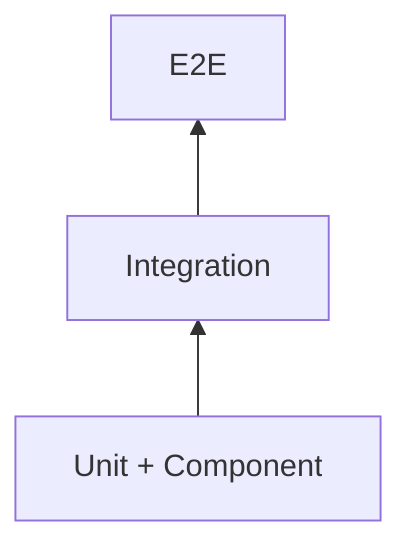

# Frontend Testing

> AI Social OS Frontend Layer

Version: 2.0.0

Status: Stable

Last Updated: 2026-07-25

---

# Table of Contents

- Overview
- Objectives
- Testing Pyramid
- Unit Testing
- Component Testing
- Integration Testing
- End-to-End Testing
- Accessibility Testing
- Performance Testing
- Visual Regression Testing
- Continuous Testing
- Summary

---

# Overview

Frontend Testing đảm bảo mọi giao diện của AI Social OS hoạt động chính xác, ổn định và nhất quán trong suốt vòng đời phát triển.

---

# Objectives

Frontend Testing hướng tới.

- Reliability
- Maintainability
- Regression Prevention
- Accessibility
- Confidence in Deployment

---

# Testing Pyramid

---

# Unit Testing

Kiểm thử.

- Utility Functions
- Hooks
- Business Logic
- Formatters
- Validators

Công cụ.

- Vitest
- Jest

---

# Component Testing

Kiểm thử.

- Buttons
- Forms
- Cards
- Dialogs
- AI Components

Công cụ.

- React Testing Library

---

# Integration Testing

Kiểm tra.

- API Integration
- State Management
- Routing
- Authentication Flow

---

# End-to-End Testing

Bao phủ.

- Login
- Workspace
- AI Chat
- Workflow
- Plugin Installation
- Social Publishing

Công cụ.

- Playwright

---

# Accessibility Testing

Bao gồm.

- Keyboard Navigation
- Screen Reader
- WCAG Validation
- Color Contrast

Công cụ.

- axe-core
- Lighthouse

---

# Performance Testing

Theo dõi.

- Core Web Vitals
- Bundle Size
- Render Time
- Memory Usage

---

# Visual Regression Testing

Kiểm tra.

- Layout
- Typography
- Components
- Theme
- Responsive UI

Công cụ.

- Chromatic
- Playwright Snapshot

---

# Continuous Testing

Pipeline CI tự động chạy.

- Lint
- Type Check
- Unit Tests
- Component Tests
- E2E Tests
- Accessibility Tests

---

# Summary

Frontend Testing đảm bảo AI Social OS duy trì chất lượng giao diện cao thông qua nhiều cấp độ kiểm thử từ Unit đến End-to-End, kết hợp với Accessibility và Visual Regression Testing.