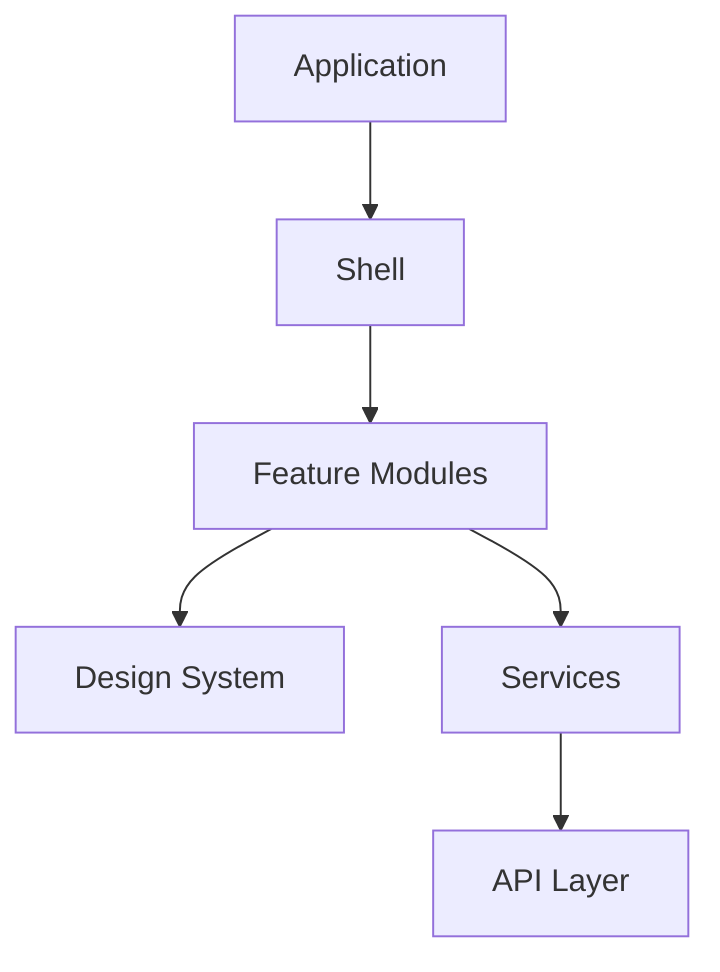

# Frontend Layer Summary

> AI Social OS Frontend Layer

Version: 2.0.0

Status: Stable

Last Updated: 2026-07-25

---

# Frontend Architecture

---

# Core Modules

Frontend bao gồm.

- Dashboard
- AI Workspace
- Social Studio
- Workflow Builder
- Plugin Marketplace
- Analytics
- Settings
- Admin Console

---

# Core Technologies

| Category | Technology |
|----------|------------|
| Framework | Next.js |
| UI | React |
| Styling | Tailwind CSS |
| Components | shadcn/ui |
| State | Zustand |
| Data Fetching | TanStack Query |
| Forms | React Hook Form |
| Validation | Zod |
| Testing | Playwright + Vitest |

---

# UI Principles

Toàn bộ giao diện tuân theo.

- AI First
- Component First
- Responsive Design
- Accessibility First
- Performance First

---

# Rendering Strategy

Hỗ trợ.

- Server Components
- Client Components
- Streaming Rendering
- Static Generation
- Incremental Static Regeneration

---

# State Strategy

| State Type | Technology |
|------------|------------|
| Local State | React Hooks |
| Global State | Zustand |
| Server State | TanStack Query |
| Form State | React Hook Form |
| URL State | Next.js Router |

---

# Security

Frontend áp dụng.

- CSP
- HTTPS
- OAuth 2.1
- Secure Cookies
- XSS Protection
- CSRF Protection

---

# Performance

Theo dõi.

- Core Web Vitals
- Bundle Size
- Rendering Time
- Streaming Latency
- User Interaction

---

# Testing Strategy

Bao gồm.

- Unit Testing
- Component Testing
- Integration Testing
- E2E Testing
- Accessibility Testing
- Visual Regression Testing

---

# Future Evolution

Frontend có thể mở rộng.

- AI-generated UI
- Voice-first Interaction
- Spatial Computing
- AR/VR Workspace
- Offline-first Collaboration
- AI-assisted Interface Customization

---

# Design Principles

- AI Native
- Human Centered
- Fast by Default
- Accessible
- Secure
- Observable
- Extensible

---

# Summary

Frontend Layer là lớp trải nghiệm người dùng của AI Social OS, được thiết kế theo triết lý AI-native, kết hợp Design System, Realtime UI, hiệu năng cao và khả năng mở rộng để hỗ trợ các ứng dụng AI, Social và Workflow ở quy mô doanh nghiệp.