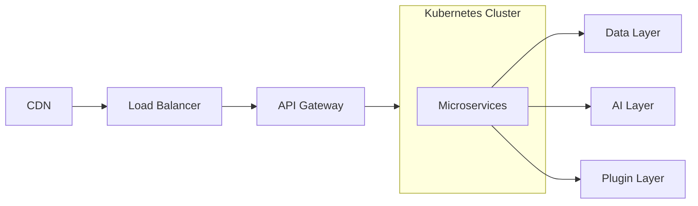

# Infrastructure Overview

> AI Social OS Infrastructure Layer

Version: 2.0.0

Status: Stable

Last Updated: 2026-07-25

---

# Table of Contents

- Overview
- Objectives
- Infrastructure Philosophy
- High-Level Architecture
- Infrastructure Components
- Runtime Environment
- Multi-Cloud Strategy
- Scalability
- Availability
- Security
- Automation
- Design Principles
- Summary

---

# Overview

Infrastructure Layer cung cấp nền tảng vận hành toàn bộ AI Social OS.

Layer này chịu trách nhiệm triển khai, mở rộng, giám sát và bảo vệ mọi thành phần của hệ thống.

Infrastructure không chứa Business Logic.

Infrastructure chỉ cung cấp các năng lực cần thiết để Platform hoạt động.

---

# Objectives

Infrastructure hướng tới.

- Cloud Native
- High Availability
- Elastic Scaling
- Fault Tolerance
- Zero Downtime
- Infrastructure as Code
- Multi Region
- Enterprise Ready

---

# Infrastructure Philosophy

Infrastructure được xây dựng theo các nguyên tắc.

- Immutable Infrastructure
- Declarative Configuration
- Everything as Code
- Automated Provisioning
- Self Healing
- Observability First

---

# High-Level Architecture

---

# Infrastructure Components

Infrastructure bao gồm.

- Cloud Platform
- Kubernetes
- Compute
- Networking
- Storage
- Messaging
- Observability
- Security
- Configuration
- Secret Management

---

# Runtime Environment

Các Runtime.

- Containers
- Kubernetes Pods
- Serverless Functions
- AI GPU Runtime
- Batch Workers

---

# Multi-Cloud Strategy

Infrastructure hỗ trợ.

- AWS
- Azure
- Google Cloud
- On-premise
- Hybrid Cloud

Không phụ thuộc Cloud Vendor.

---

# Scalability

Infrastructure hỗ trợ.

- Horizontal Scaling
- Vertical Scaling
- Auto Scaling
- Multi Cluster
- Multi Region

---

# Availability

Mục tiêu.

| Component | Target |
|------------|---------|
| API | 99.99% |
| AI Runtime | 99.9% |
| Database | 99.99% |
| Messaging | 99.99% |

---

# Security

Infrastructure áp dụng.

- Zero Trust
- IAM
- TLS Everywhere
- Encryption
- Network Policies
- Secret Management

---

# Automation

Mọi thành phần được quản lý thông qua.

- Terraform
- Helm
- GitOps
- CI/CD

Không thao tác thủ công trên Production.

---

# Design Principles

- Cloud Native
- Immutable
- Observable
- Secure
- Automated
- Vendor Neutral

---

# Summary

Infrastructure Layer cung cấp nền tảng Cloud Native hiện đại giúp AI Social OS vận hành ổn định, có khả năng mở rộng và đáp ứng yêu cầu doanh nghiệp ở quy mô lớn.