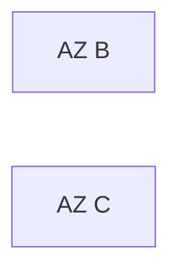
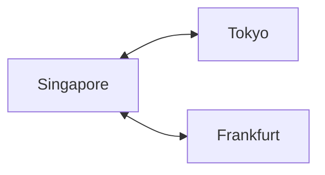

# Cloud Architecture

> AI Social OS Infrastructure Layer

Version: 2.0.0

Status: Stable

---

# Table of Contents

- Overview
- Objectives
- Cloud Model
- Regions
- Availability Zones
- Multi Region
- Networking
- Services
- Hybrid Cloud
- Vendor Independence
- Disaster Recovery
- Summary

---

# Overview

Cloud Architecture mô tả cách AI Social OS triển khai trên hạ tầng Cloud.

Thiết kế theo hướng Cloud Native và Multi Cloud.

---

# Objectives

Cloud Architecture hướng tới.

- High Availability
- Disaster Recovery
- Elastic Scaling
- Low Latency
- Vendor Independence

---

# Cloud Model

```mermaid
flowchart LR
```

---

# Regions

Ví dụ.

- Singapore
- Tokyo
- Frankfurt
- Virginia

Mỗi Region hoạt động độc lập.

---

# Availability Zones

Mỗi Region có nhiều AZ.



Service được phân phối trên nhiều AZ.

---

# Multi Region



Hỗ trợ.

- Disaster Recovery
- Global Routing
- Data Replication

---

# Networking

Cloud sử dụng.

- VPC
- Subnets
- NAT Gateway
- Internet Gateway
- Private Network

---

# Managed Services

Ưu tiên sử dụng.

- Managed Database
- Managed Kubernetes
- Managed Cache
- Managed Storage

Khi phù hợp với yêu cầu hệ thống.

---

# Hybrid Cloud

Có thể kết hợp.

- Public Cloud
- Private Cloud
- On-premise

---

# Vendor Independence

Infrastructure được mô tả bằng.

- Terraform
- Kubernetes
- Helm

Giảm phụ thuộc vào nhà cung cấp.

---

# Disaster Recovery

Chiến lược.

```mermaid
flowchart LR
```

---

# Summary

Cloud Architecture đảm bảo AI Social OS có thể triển khai trên nhiều nền tảng Cloud khác nhau với khả năng mở rộng, chịu lỗi và khôi phục sau thảm họa.