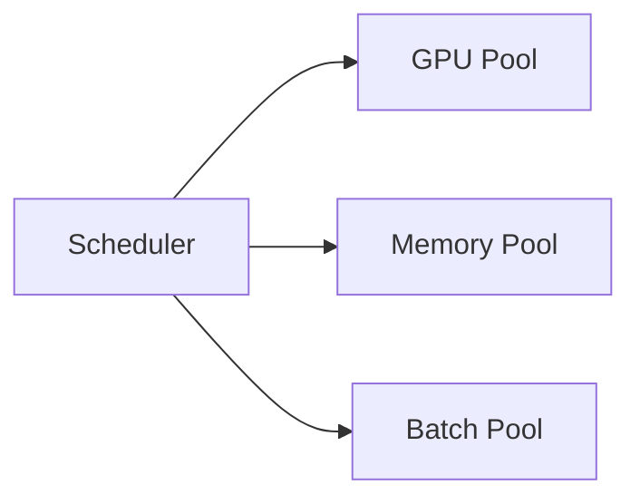

# Compute Platform

> AI Social OS Infrastructure Layer

Version: 2.0.0

Status: Stable

---

# Table of Contents

- Overview
- Objectives
- Compute Types
- Compute Architecture
- CPU Workloads
- GPU Workloads
- Batch Compute
- Autoscaling
- Scheduling
- Resource Management
- Monitoring
- Summary

---

# Overview

Compute Platform cung cấp tài nguyên tính toán cho toàn bộ AI Social OS.

Hệ thống hỗ trợ nhiều loại Compute khác nhau tùy theo workload.

---

# Objectives

Compute Platform hướng tới.

- Elastic Compute
- GPU Native
- Cost Efficient
- High Utilization
- Automatic Scaling

---

# Compute Types

## CPU Nodes

Dành cho.

- API
- Backend
- Worker
- Gateway

---

## GPU Nodes

Dành cho.

- LLM Inference
- Embedding
- Vision Models
- AI Training

---

## Memory Optimized

Dành cho.

- Vector Search
- Graph Processing
- Analytics

---

# Compute Architecture

---

# CPU Workloads

Ví dụ.

- REST API
- Workflow Engine
- Authentication
- Plugin Runtime

---

# GPU Workloads

Ví dụ.

- Llama
- Qwen
- DeepSeek
- CLIP
- Whisper
- Stable Diffusion

---

# Batch Compute

Batch Cluster xử lý.

- ETL
- AI Dataset
- Report Generation
- Index Building

---

# Autoscaling

Compute tự động mở rộng dựa trên.

- CPU
- GPU
- Memory
- Queue Length
- Requests

---

# Scheduling

Scheduler cân bằng.

- Resources
- Priority
- Affinity
- GPU Availability

---

# Resource Management

Quản lý.

- Requests
- Limits
- Quotas
- Reservations

---

# Monitoring

Theo dõi.

- CPU Usage
- GPU Usage
- Memory
- Queue
- Cost

---

# Summary

Compute Platform cung cấp môi trường thực thi linh hoạt cho cả Backend và AI Workloads, tối ưu hiệu năng và chi phí thông qua Autoscaling và Resource Scheduling.