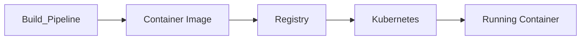

# Container Platform

> AI Social OS Infrastructure Layer

Version: 2.0.0

Status: Stable

Last Updated: 2026-07-25

---

# Table of Contents

- Overview
- Objectives
- Why Containers
- Container Architecture
- Image Lifecycle
- Image Registry
- Runtime
- Container Standards
- Resource Isolation
- Security
- Best Practices
- Summary

---

# Overview

Container Platform là nền tảng đóng gói và thực thi toàn bộ services của AI Social OS.

Mọi thành phần đều được triển khai dưới dạng OCI Container.

Ví dụ.

- API Services
- AI Runtime
- Workers
- Plugin Runtime
- MCP Runtime
- Gateway

---

# Objectives

Container Platform hướng tới.

- Immutable Deployment
- Fast Startup
- Lightweight
- Portable
- Cloud Native
- Secure

---

# Why Containers

Containers cung cấp.

- Isolation
- Portability
- Reproducibility
- Fast Deployment
- Efficient Resource Usage

---

# High-Level Architecture



---

# Image Lifecycle

```mermaid
flowchart LR
```

---

# Image Registry

Registry lưu trữ.

- Backend Images
- Frontend Images
- AI Runtime Images
- Worker Images
- Plugin Images

Ví dụ.

- GitHub Container Registry
- Amazon ECR
- Google Artifact Registry
- Harbor

---

# Runtime

Container Runtime hỗ trợ.

- containerd
- CRI-O

Docker chỉ dùng trong Development.

Production sử dụng CRI Runtime.

---

# Image Standards

Base Image.

- Debian Slim
- Alpine (nếu phù hợp)
- Distroless (Production)

Không sử dụng Image không rõ nguồn gốc.

---

# Multi-stage Build

Ví dụ.

```mermaid
flowchart LR
```

Giảm kích thước Image.

---

# Resource Isolation

Container được giới hạn.

- CPU
- Memory
- Disk
- Network
- Process

---

# Security

Container bắt buộc.

- Non-root User
- Read-only Filesystem
- Image Signing
- Vulnerability Scan
- Minimal Base Image

---

# Image Versioning

Ví dụ.

```text
backend:v2.0.0

backend:v2.1.0

backend:latest
```

Production không sử dụng `latest`.

---

# Best Practices

- Immutable Image
- One Process per Container
- Stateless
- Health Check
- Graceful Shutdown

---

# Summary

Container Platform cung cấp môi trường đóng gói thống nhất cho toàn bộ AI Social OS, đảm bảo khả năng triển khai nhanh, nhất quán và an toàn trên mọi môi trường.