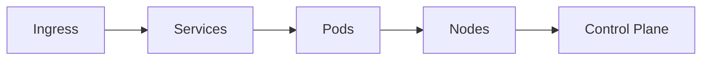

# Kubernetes Architecture

> AI Social OS Infrastructure Layer

Version: 2.0.0

Status: Stable

Last Updated: 2026-07-25

---

> **Giai đoạn áp dụng:** Giai đoạn sau — cân nhắc khi có nhu cầu scale thực tế, dự kiến Phase 3+/Enterprise. Lý do: Deliverables Phase 0 của docs/ROADMAP.md chỉ liệt kê Docker (không có Kubernetes) — Docker Compose là đủ cho Phase 0-1; Kubernetes (HPA/VPA/Cluster Autoscaler) là nâng cấp khi cần Auto Scaling và Self Healing ở quy mô nhiều Service, và xuất hiện rõ trong Deliverables Phase 6 — Enterprise.

---

# Table of Contents

- Overview
- Objectives
- Cluster Architecture
- Namespaces
- Workloads
- Scheduling
- Autoscaling
- Networking
- Storage
- Security
- Monitoring
- Design Principles
- Summary

---

# Overview

Kubernetes là nền tảng điều phối (Orchestration) toàn bộ Container trong AI Social OS.

Mọi service đều được triển khai trên Kubernetes.

---

# Objectives

Kubernetes hướng tới.

- High Availability
- Self Healing
- Auto Scaling
- Rolling Update
- Zero Downtime

---

# Cluster Architecture



---

# Namespaces

Cluster được chia theo Namespace.

Ví dụ.

```text
system

api

ai

social

plugin

monitoring

development
```

---

# Workloads

Hỗ trợ.

- Deployment
- StatefulSet
- DaemonSet
- Job
- CronJob

---

# Scheduling

Scheduler lựa chọn Node dựa trên.

- CPU
- Memory
- GPU
- Affinity
- Taints
- Tolerations

---

# Autoscaling

Hỗ trợ.

## HPA

Horizontal Pod Autoscaler

Theo.

- CPU
- Memory
- Custom Metrics

---

## VPA

Vertical Pod Autoscaler

Điều chỉnh Resource Request.

---

## Cluster Autoscaler

Tự động thêm hoặc giảm Node.

---

# Networking

Sử dụng.

- CNI
- Ingress Controller
- Service Discovery
- Network Policy

---

# Storage

Persistent Storage.

- Persistent Volume
- Persistent Volume Claim
- Storage Class

---

# Security

Áp dụng.

- RBAC
- Network Policy
- Pod Security
- Admission Controller
- Secret Management

---

# Monitoring

Theo dõi.

- Pod Status
- Restart Count
- CPU
- Memory
- Events

---

# Design Principles

- Declarative
- Self Healing
- Auto Scaling
- Immutable
- Cloud Native

---

# Summary

Kubernetes là nền tảng điều phối trung tâm của AI Social OS, đảm bảo các dịch vụ luôn sẵn sàng, có khả năng tự phục hồi và mở rộng tự động theo tải hệ thống.