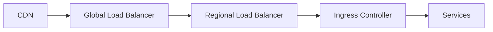

# Network Architecture

> AI Social OS Infrastructure Layer

Version: 2.0.0

Status: Stable

Last Updated: 2026-07-25

---

# Table of Contents

- Overview
- Objectives
- Network Principles
- Global Architecture
- VPC Design
- Subnets
- Routing
- Load Balancing
- Service Discovery
- DNS
- Network Policies
- Edge Network
- Monitoring
- Summary

---

# Overview

Network Architecture định nghĩa cách toàn bộ thành phần trong AI Social OS giao tiếp với nhau.

Network được thiết kế theo mô hình.

- Zero Trust
- Cloud Native
- Software Defined
- Multi Region

---

# Objectives

Network hướng tới.

- Low Latency
- High Availability
- Secure Communication
- Multi Region
- Service Isolation

---

# Network Principles

Nguyên tắc.

- Private by Default
- Least Privilege
- Encrypted Traffic
- Internal Service Discovery
- Public Access only through Gateway

---

# Global Architecture



---

# VPC Design

Mỗi Region có VPC riêng.

```mermaid
flowchart LR
```

---

# Subnets

## Public

- Load Balancer
- NAT Gateway

---

## Private

- API
- Workers
- AI Runtime
- Plugin Runtime

---

## Isolated

- Database
- Cache
- Vector DB
- Graph DB

---

# Routing

Traffic.

```mermaid
flowchart LR
```

---

# Load Balancing

Các tầng.

- Global Load Balancer
- Regional Load Balancer
- Kubernetes Service
- Service Mesh

---

# Service Discovery

Service giao tiếp bằng.

```text
service.namespace.svc.cluster.local
```

Không sử dụng IP tĩnh.

---

# DNS

DNS nội bộ.

- CoreDNS

DNS công khai.

- Route53
- Cloud DNS
- Cloudflare DNS

---

# Network Policies

Policy kiểm soát.

- Namespace
- Egress
- Ingress

Mặc định.

```mermaid
flowchart LR
```

---

# Edge Network

Bao gồm.

- CDN
- WAF
- API Gateway
- DDoS Protection

---

# Monitoring

Theo dõi.

- Latency
- Packet Loss
- Throughput
- DNS Errors
- Network Policies

---

# Design Principles

- Zero Trust
- Private First
- Least Privilege
- Encrypted Traffic
- Multi Region

---

# Summary

Network Architecture cung cấp nền tảng kết nối an toàn, hiệu năng cao và có khả năng mở rộng cho toàn bộ AI Social OS, từ Internet Edge đến từng Pod trong Kubernetes.