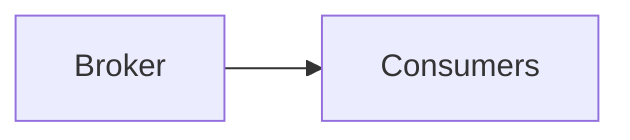

# Message Infrastructure

> AI Social OS Infrastructure Layer

Version: 2.0.0

Status: Stable

Last Updated: 2026-07-25

---

# Table of Contents

- Overview
- Objectives
- Messaging Model
- Event Streaming
- Queue Processing
- Pub/Sub
- Dead Letter Queue
- Retry Strategy
- Ordering
- Monitoring
- Technologies
- Summary

---

# Overview

Message Infrastructure chịu trách nhiệm truyền tải dữ liệu bất đồng bộ giữa các Services.

Đây là nền tảng của kiến trúc Event-driven.

---

# Objectives

Message Infrastructure hướng tới.

- Loose Coupling
- Scalability
- Reliability
- High Throughput
- Fault Tolerance

---

# Messaging Model



---

# Event Streaming

Streaming được dùng cho.

- Domain Events
- AI Events
- Analytics
- Notifications

---

# Queue Processing

Queue xử lý.

- Email
- Image Processing
- AI Jobs
- Workflow Execution

---

# Pub/Sub

Một Event có thể được nhiều Service tiêu thụ.

Ví dụ.

```mermaid
flowchart LR
```

---

# Dead Letter Queue

Message lỗi sẽ được chuyển tới.

```mermaid
flowchart LR
```

---

# Retry Strategy

Retry áp dụng.

- Exponential Backoff
- Maximum Retry Count
- Idempotency

---

# Ordering

Một số Queue yêu cầu.

- FIFO
- Partition Ordering

---

# Monitoring

Theo dõi.

- Queue Length
- Consumer Lag
- Throughput
- Retry Count
- Failed Messages

---

# Recommended Technologies

- Apache Kafka
- RabbitMQ
- NATS
- Redpanda

---

# Design Principles

- Event Driven
- Reliable Delivery
- Loose Coupling
- Horizontal Scaling

---

# Summary

Message Infrastructure là xương sống của kiến trúc bất đồng bộ trong AI Social OS, cho phép các thành phần giao tiếp hiệu quả, đáng tin cậy và dễ mở rộng.