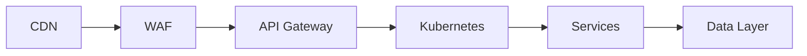

# Infrastructure Security

> AI Social OS Infrastructure Layer

Version: 2.0.0

Status: Stable

Last Updated: 2026-07-25

---

# Table of Contents

- Overview
- Objectives
- Security Architecture
- Identity & Access Management
- Network Security
- Compute Security
- Container Security
- Kubernetes Security
- Supply Chain Security
- Compliance
- Incident Response
- Security Monitoring
- Design Principles
- Summary

---

# Overview

Infrastructure Security bảo vệ toàn bộ hạ tầng của AI Social OS.

Phạm vi bao gồm.

- Cloud
- Kubernetes
- Containers
- Network
- Storage
- Compute
- CI/CD
- Supply Chain

Security được áp dụng theo nguyên tắc Defense in Depth.

---

# Objectives

Infrastructure Security hướng tới.

- Zero Trust
- Least Privilege
- Continuous Verification
- Secure by Default
- Compliance
- Defense in Depth

---

# Security Architecture



Mỗi tầng đều có cơ chế bảo vệ riêng.

---

# Identity & Access Management

Toàn bộ tài nguyên được quản lý thông qua IAM.

Bao gồm.

- Human Users
- Service Accounts
- AI Agents
- CI/CD Pipelines

Nguyên tắc.

- Least Privilege
- Short-lived Credentials
- MFA
- Role Separation

---

# Network Security

Network áp dụng.

- Private Subnets
- Network Policies
- Security Groups
- Firewalls
- mTLS
- Zero Trust

Không cho phép Service giao tiếp nếu không được cấp quyền.

---

# Compute Security

Node được bảo vệ bằng.

- Hardened OS
- Automatic Security Updates
- Secure Boot
- Disk Encryption
- Host Firewall

GPU Nodes áp dụng chính sách bảo mật tương tự CPU Nodes.

---

# Container Security

Container phải đáp ứng.

- Non-root User
- Read-only Root Filesystem
- Dropped Linux Capabilities
- Signed Images
- Vulnerability Scan

Không sử dụng Privileged Container nếu không thật sự cần thiết.

---

# Kubernetes Security

Cluster áp dụng.

- RBAC
- Admission Controllers
- Pod Security Standards
- Network Policies
- Secret Encryption
- Audit Logging

Namespaces được cô lập hoàn toàn.

---

# Supply Chain Security

Pipeline Build phải hỗ trợ.

- Image Signing
- SBOM
- Dependency Scanning
- Vulnerability Scanning
- Provenance Verification

Toàn bộ Artifact đều có khả năng truy xuất nguồn gốc.

---

# Compliance

Infrastructure hỗ trợ.

- ISO 27001
- SOC 2
- GDPR
- CCPA

Có thể mở rộng thêm các tiêu chuẩn doanh nghiệp khác.

---

# Incident Response

Quy trình.

```mermaid
flowchart LR
```

---

# Security Monitoring

Theo dõi.

- Unauthorized Access
- Failed Login
- Privilege Escalation
- Container Escape
- Network Anomalies
- Secret Access
- Malware Detection

---

# Design Principles

- Zero Trust
- Defense in Depth
- Least Privilege
- Secure by Default
- Continuous Monitoring
- Immutable Infrastructure

---

# Summary

Infrastructure Security cung cấp nhiều lớp bảo vệ cho AI Social OS, từ Cloud đến Kubernetes và Container Runtime, đảm bảo hệ thống đáp ứng các yêu cầu bảo mật doanh nghiệp, có khả năng phát hiện sớm và phản ứng nhanh trước các mối đe dọa.