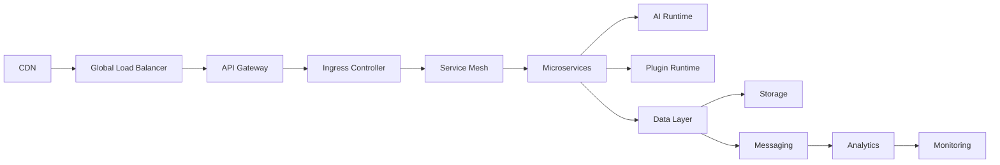

# Infrastructure Layer Summary

> AI Social OS Infrastructure Layer

Version: 2.0.0

Status: Stable

Last Updated: 2026-07-25

---

# Components

## Core Infrastructure

- Infrastructure Overview
- Cloud Architecture
- Compute Platform
- Container Platform
- Kubernetes Architecture
- Service Mesh

---

## Networking

- Network Architecture
- API Gateway
- Ingress
- Service Discovery
- Load Balancing
- DNS

---

## Storage & Messaging

- Storage Infrastructure
- Message Infrastructure
- Object Storage
- Persistent Volumes
- Event Streaming

---

## Platform Operations

- Observability Stack
- Configuration Management
- Secret Management
- Infrastructure Security

---

# High-Level Architecture

---

# Infrastructure Responsibilities

Infrastructure chịu trách nhiệm.

- Compute Resources
- Container Orchestration
- Networking
- Storage
- Event Transport
- Security
- Observability
- Configuration
- Disaster Recovery
- Auto Scaling

---

# Operational Capabilities

Infrastructure hỗ trợ.

- Rolling Update
- Blue-Green Deployment
- Canary Release
- Auto Scaling
- Self Healing
- Automatic Recovery
- Multi-region Deployment

---

# Security Capabilities

Bao gồm.

- IAM
- RBAC
- Network Policies
- mTLS
- Secret Management
- Image Signing
- Audit Logging
- Zero Trust

---

# Observability

Toàn bộ Infrastructure được theo dõi bằng.

- Metrics
- Logs
- Traces
- Dashboards
- Alerts
- Incident Response

---

# Technology Stack

| Layer | Recommended Technologies |
|--------|--------------------------|
| Cloud | AWS / Azure / GCP |
| Containers | OCI, containerd |
| Orchestration | Kubernetes |
| Service Mesh | Istio / Linkerd |
| Networking | Cilium, CoreDNS |
| Storage | CSI, S3, MinIO |
| Messaging | Kafka, RabbitMQ |
| Monitoring | Prometheus, Grafana |
| Logging | Loki |
| Tracing | OpenTelemetry, Tempo |
| Configuration | ConfigMap, GitOps |
| Secrets | Vault, AWS Secrets Manager |

---

# Quality Attributes

Infrastructure được thiết kế để đạt.

- High Availability
- Horizontal Scalability
- Fault Tolerance
- Security
- Reliability
- Observability
- Cloud Native
- Cost Efficiency

---

# Design Principles

- Everything as Code
- GitOps
- Immutable Infrastructure
- Zero Trust
- Cloud Native
- Self Healing
- Vendor Neutral

---

# Future Evolution

Infrastructure có thể mở rộng thêm.

- Multi-cluster Federation
- Edge Computing
- AI GPU Autoscheduler
- Serverless Runtime
- WASM Runtime
- eBPF-based Networking
- Autonomous Operations (AIOps)

---

# Summary

Infrastructure Layer là nền tảng vận hành của AI Social OS, cung cấp môi trường Cloud Native hiện đại với khả năng triển khai tự động, mở rộng linh hoạt, quan sát toàn diện và bảo mật nhiều lớp.

Thông qua Kubernetes, Service Mesh, Event-driven Infrastructure và GitOps, toàn bộ hệ thống có thể vận hành ổn định ở quy mô từ một cụm máy chủ đến hạ tầng đa vùng (Multi-region) và đa đám mây (Multi-cloud), đáp ứng các yêu cầu của một nền tảng AI Social Enterprise hiện đại.