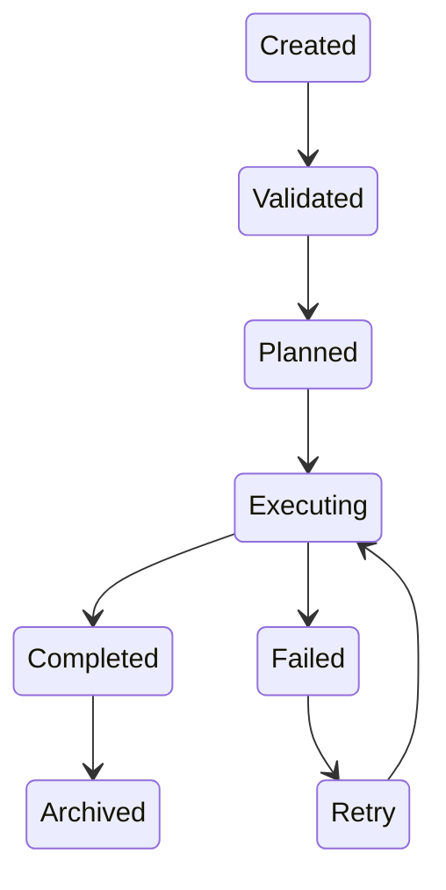
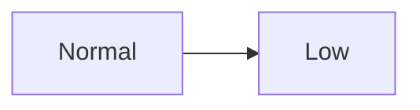
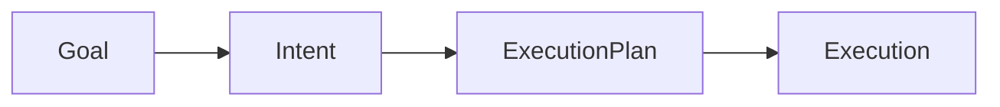
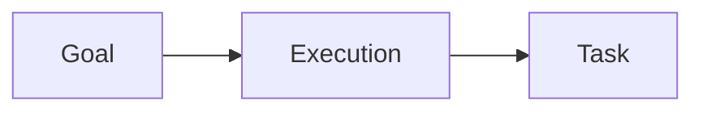
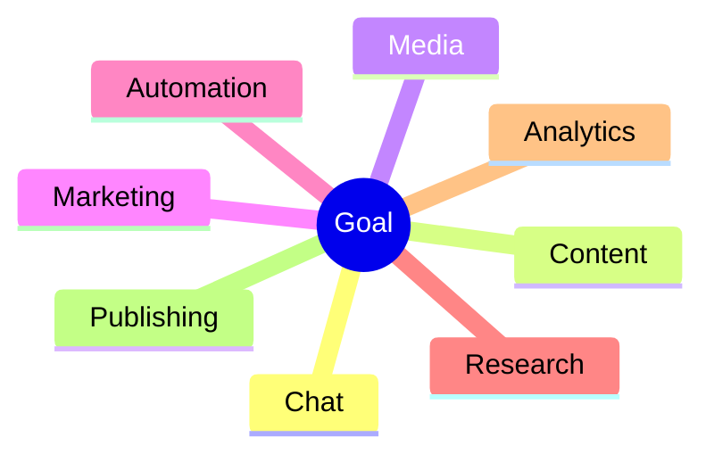

# Goal Model

> AI Social OS Runtime Kernel

Version: 2.0.0

Status: Draft

Last Updated: 2026-07-25

---

# Table of Contents

- Overview
- Goal Definition
- Goal Lifecycle
- Goal Structure
- Goal Types
- Goal Priority
- Goal Planning
- Goal Context
- Goal Constraints
- Goal Outputs
- Goal Examples

---

# Overview

Goal là điểm bắt đầu của mọi Execution trong AI Social OS.

Khác với n8n, nơi người dùng phải tự thiết kế Workflow, AI Social OS chỉ yêu cầu người dùng mô tả mục tiêu.

Ví dụ:

> Viết 5 bài Facebook về AI Agent và đăng lúc 8h sáng mỗi ngày.

Runtime sẽ tự:

- phân tích Goal
- sinh Execution Plan
- lựa chọn Capability
- điều phối Worker
- theo dõi tiến trình
- lưu Memory

---

# Goal Definition

Goal là mô tả **điều người dùng muốn đạt được**, không phải **cách thực hiện**.

Ví dụ

❌ Workflow

```mermaid
flowchart LR
```

✅ Goal

```
Đăng bài AI Agent lúc 8h sáng
```

---

# Goal Lifecycle



---

# Goal Structure

```typescript
Goal

├── id

├── workspaceId

├── ownerId

├── title

├── description

├── objective

├── priority

├── constraints

├── inputs

├── outputs

├── schedule

├── metadata

└── status
```

---

# Goal Properties

| Property | Description |
|------------|-------------|
| id | Goal ID |
| workspaceId | Workspace |
| ownerId | Creator |
| objective | Business Objective |
| priority | Execution Priority |
| constraints | Runtime Constraint |
| schedule | Cron hoặc Manual |
| outputs | Expected Result |

---

# Goal Types

## Chat Goal

Ví dụ

```
Tóm tắt tài liệu này
```

---

## Content Goal

Ví dụ

```
Viết bài Facebook
```

---

## Campaign Goal

Ví dụ

```
Chuẩn bị Campaign AI Week
```

---

## Research Goal

Ví dụ

```
Tìm xu hướng AI hôm nay
```

---

## Automation Goal

Ví dụ

```
Mỗi sáng 8h tạo báo cáo
```

---

## Publishing Goal

Ví dụ

```
Đăng bài lên Facebook
```

---

## Multi-step Goal

Ví dụ

```mermaid
flowchart LR
```

---

# Goal Priority

Runtime luôn xử lý theo Priority.



---

| Priority | Description |
|-----------|-------------|
| Critical | Chạy ngay |
| High | Ưu tiên |
| Normal | Mặc định |
| Low | Chạy khi rảnh |

---

# Goal Context

Goal không chứa toàn bộ Context.

Context sẽ được Runtime xây dựng.

Nguồn Context:

- Conversation
- Workspace
- Brand
- Prompt
- Memory
- Knowledge
- Uploaded Files
- User Profile

---

# Goal Constraints

Ví dụ:

```yaml
max_cost: $5

timeout: 10m

approval: true

provider: claude

language: vi

retry: 3
```

Constraint giúp Runtime ra quyết định.

---

# Expected Outputs

Một Goal có thể sinh nhiều Output.

Ví dụ

```text
Content

Image

Video

PDF

Post

Notification

Analytics
```

---

# Goal Metadata

Ví dụ

```yaml
workspace: marketing

campaign: ai-week

brand: company-a

tags:

- ai

- facebook

- automation

createdBy: admin
```

---

# Goal Planning

Goal không có Workflow.

Runtime sẽ tự Planning.

Ví dụ

```mermaid
flowchart LR
```

---

# Goal to Execution



---

# Goal Ownership

Mỗi Goal thuộc đúng một Workspace.



---

# Goal Validation

Runtime sẽ kiểm tra:

- Permission
- AI Provider
- Required Connector
- Required Plugin
- Required MCP
- Required Knowledge
- Required Budget

Nếu thiếu sẽ trả lỗi trước khi Planning.

---

# Goal Categories



---

# Example 1

Goal

```
Viết bài Facebook về GPT-6
```

Execution Plan

```mermaid
flowchart LR
```

---

# Example 2

Goal

```
Mỗi ngày 8h đăng bài AI
```

Execution Plan

```mermaid
flowchart LR
```

---

# Example 3

Goal

```
Theo dõi xu hướng TikTok và gửi báo cáo lên Lark
```

Execution Plan

```mermaid
flowchart LR
```

---

# Goal vs Workflow

| Goal | Workflow |
|--------|----------|
| Business Objective | Technical Flow |
| AI lập kế hoạch | Người dùng lập kế hoạch |
| Dynamic | Static |
| Có thể tối ưu | Khó thay đổi |
| Runtime Driven | Node Driven |

---

# Design Decisions

| Decision | Reason |
|------------|--------|
| Goal không chứa Workflow | Runtime tự Planning |
| Goal chỉ mô tả Objective | Dễ dùng |
| Context tách riêng | Reusable |
| Constraint độc lập | Runtime tối ưu |
| Output không cố định | Hỗ trợ AI Agent |

---

# Summary

Goal là đơn vị đầu vào cao nhất của AI Social OS.

Người dùng chỉ mô tả mục tiêu cần đạt được.

Execution Runtime sẽ chịu trách nhiệm:

- phân tích Goal
- xây dựng Context
- lập kế hoạch
- lựa chọn Capability
- điều phối Worker
- quản lý Execution

Goal chính là nền tảng giúp AI Social OS chuyển từ mô hình Workflow Automation sang Goal-driven AI Runtime.