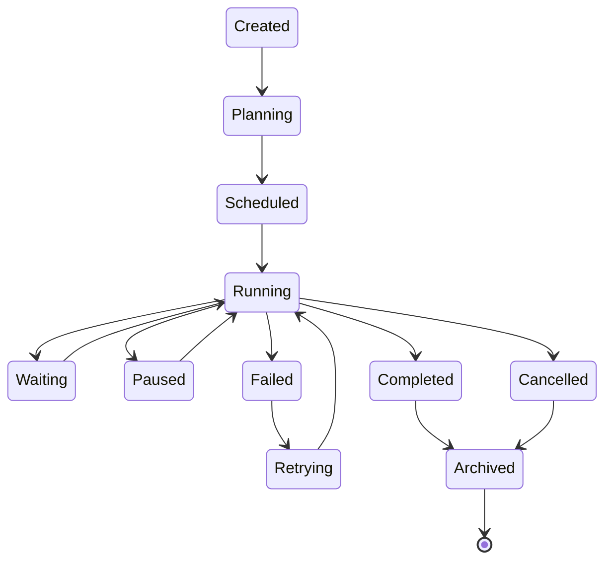
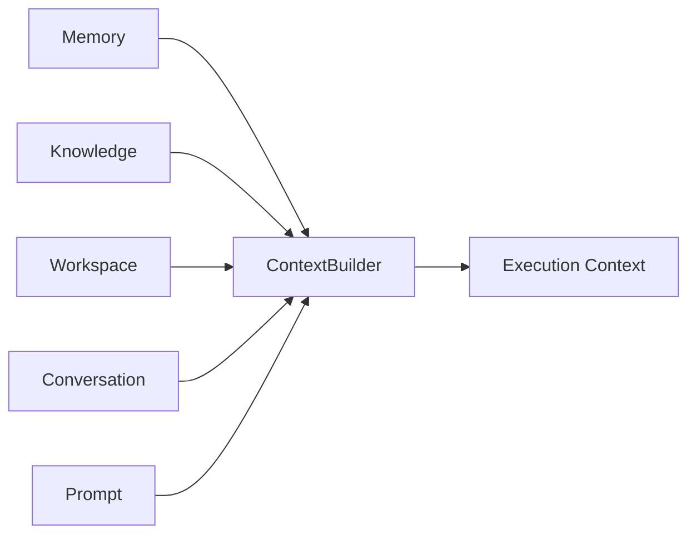
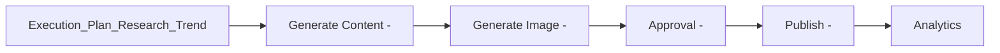
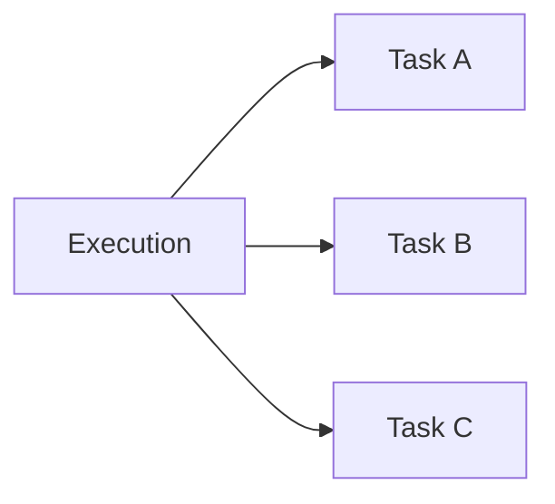
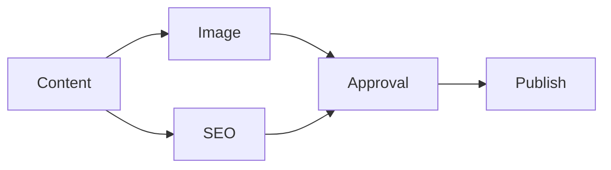
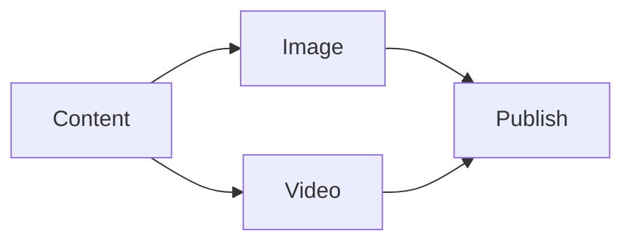
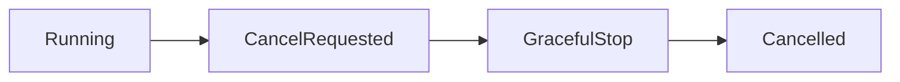
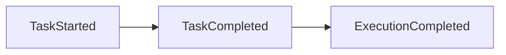
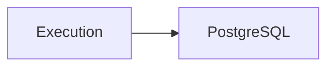
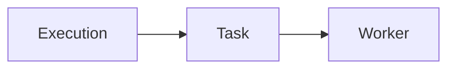

# Execution Model

> AI Social OS Runtime Kernel

Version: 2.0.0

Status: Draft

Last Updated: 2026-07-25

---

# Table of Contents

- Overview
- Execution Definition
- Execution Lifecycle
- Execution Hierarchy
- Execution Structure
- Execution State
- Execution Context
- Task Model
- Resource Allocation
- Retry Strategy
- Cancellation
- Execution Events
- Design Decisions

---

# Overview

Execution là một phiên thực thi (runtime instance) được tạo ra từ một Goal.

Nếu Goal mô tả **muốn đạt được điều gì**, thì Execution mô tả **AI đang thực hiện điều đó như thế nào**.

Một Goal có thể được thực thi nhiều lần.

Ví dụ:

- Execution #2
- Execution #3
- ...

---

# Execution Definition

Execution là Aggregate Root của Runtime.

Execution chịu trách nhiệm quản lý:

- Plan
- Context
- State
- Task
- Resource
- Result
- Event

Execution không trực tiếp gọi AI Provider.

---

# Execution Lifecycle



---

# Execution Hierarchy

```text
Goal

└── Execution

    ├── Execution Plan

    ├── Execution Context

    ├── Task List

    │     ├── Task

    │     ├── Task

    │     └── Task

    ├── Resource

    ├── Result

    └── Events
```

---

# Execution Structure

```typescript
Execution

├── id

├── goalId

├── workspaceId

├── ownerId

├── status

├── priority

├── plan

├── context

├── tasks

├── resources

├── outputs

├── startedAt

├── finishedAt

└── metadata
```

---

# Execution States

| State | Description |
|---------|-------------|
| Created | Đã tạo |
| Planning | Đang lập kế hoạch |
| Scheduled | Chờ Scheduler |
| Running | Đang thực thi |
| Waiting | Đợi tác vụ khác |
| Paused | Tạm dừng |
| Retrying | Đang retry |
| Completed | Thành công |
| Failed | Thất bại |
| Cancelled | Đã hủy |
| Archived | Đã lưu lịch sử |

---

# Execution Context

Execution có Context riêng.



Execution Context là immutable trong quá trình một Task đang chạy.

---

# Execution Plan

Planning Engine tạo ra Plan.

Ví dụ



Plan có thể thay đổi trong Runtime nếu AI cần điều chỉnh.

---

# Task Model

Execution gồm nhiều Task.



Mỗi Task:

- có Capability
- có Worker
- có Input
- có Output
- có Retry Policy
- có Timeout

---

# Task Dependencies



Task chỉ chạy khi Dependency hoàn thành.

---

# Parallel Execution

Runtime hỗ trợ thực thi song song.



Image và Video có thể chạy đồng thời.

---

# Resource Allocation

Execution sử dụng Resource Manager để cấp phát:

- Worker
- CPU
- Memory
- AI Token
- Budget
- Connector Session

---

# Retry Strategy

Mỗi Task có Retry Policy riêng.

Ví dụ

```yaml
retry:

max_attempts: 3

delay: exponential

timeout: 60s
```

Runtime tự Retry mà không ảnh hưởng các Task khác.

---

# Timeout

Execution có thể có:

- Global Timeout
- Task Timeout

Ví dụ

```yaml
execution_timeout: 30m

task_timeout: 2m
```

---

# Cancellation

Execution có thể bị hủy bởi:

- User
- Admin
- Budget Limit
- Policy
- Fatal Error



---

# Outputs

Execution có thể sinh nhiều Output.

Ví dụ

```text
Markdown

Facebook Post

Image

Video

Notification

Analytics

Knowledge

Memory
```

---

# Execution Events

Trong suốt vòng đời, Runtime phát Event.



Ví dụ Event:

- ExecutionCreated
- ExecutionScheduled
- ExecutionRunning
- ExecutionPaused
- ExecutionCancelled
- ExecutionCompleted
- ExecutionFailed

---

# Persistence

Execution được lưu vào PostgreSQL.

Runtime State được cache trên Redis.



Redis phục vụ Runtime.

PostgreSQL lưu trạng thái lâu dài.

---

# Execution Metrics

Runtime theo dõi:

- Duration
- Success Rate
- Retry Count
- AI Cost
- Token Usage
- Queue Time
- Worker Time

---

# Execution Ownership



Execution luôn thuộc:

- một Workspace
- một Goal
- một Owner

---

# Execution vs Workflow

| Execution | Workflow |
|------------|----------|
| Runtime Instance | Static Graph |
| Dynamic Planning | Fixed Nodes |
| AI quyết định | Người dùng quyết định |
| Có State | Chủ yếu là Flow |
| Có Context | Context hạn chế |
| Có Memory | Không có Memory Runtime |

---

# Design Decisions

| Decision | Reason |
|----------|--------|
| Execution tách khỏi Goal | Một Goal chạy nhiều lần |
| Plan sinh động | AI có thể tối ưu |
| Context độc lập | Tái sử dụng |
| Task độc lập | Parallel Execution |
| Event cho mọi thay đổi | Audit & Observability |
| Retry theo Task | Không ảnh hưởng toàn bộ Execution |

---

# Summary

Execution là đơn vị thực thi cốt lõi của Runtime.

Mỗi Execution được sinh ra từ một Goal và chịu trách nhiệm quản lý toàn bộ vòng đời của quá trình thực hiện, bao gồm Planning, Context, Task, Resource, State và Result.

Thiết kế này giúp AI Social OS hỗ trợ:

- Dynamic Planning
- Parallel Execution
- Retry độc lập
- Runtime Recovery
- Event Sourcing
- AI-driven Execution

Execution chính là trái tim của Execution Runtime và là nền tảng để xây dựng một AI Operating System.