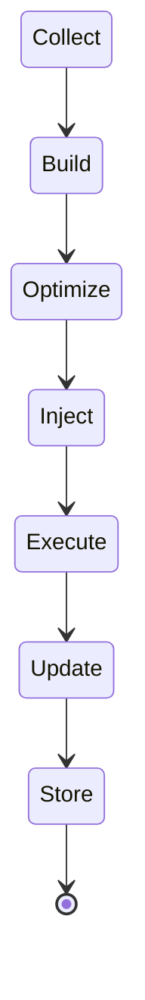
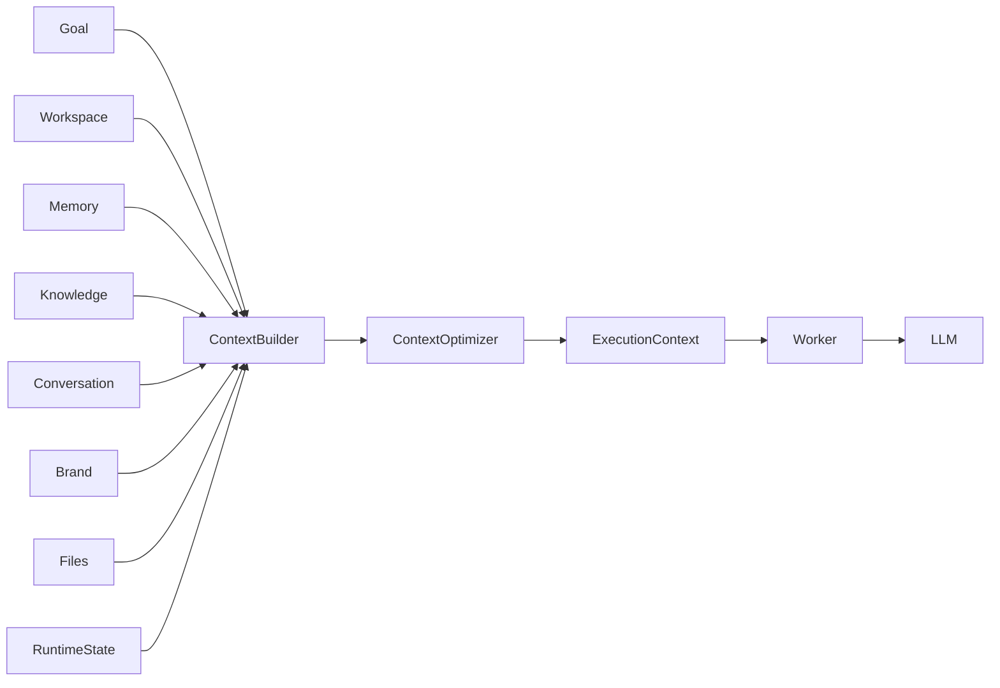
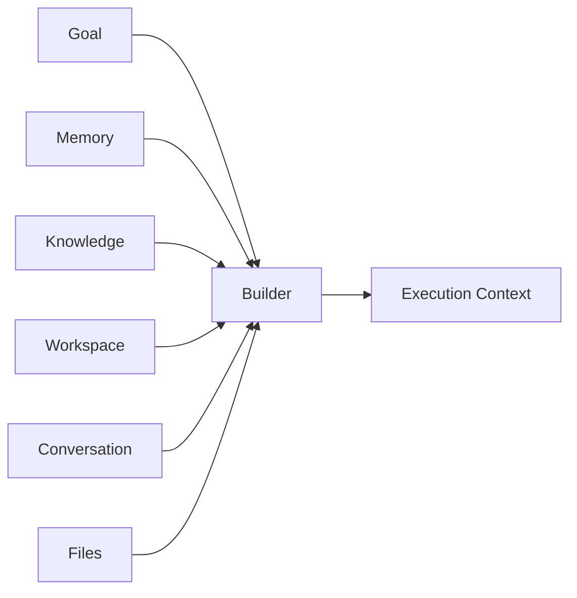
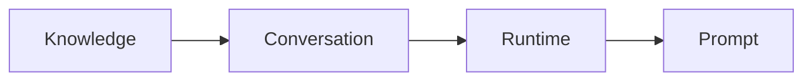
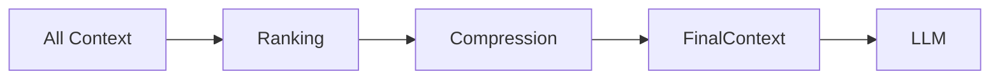
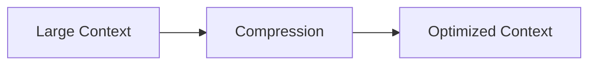
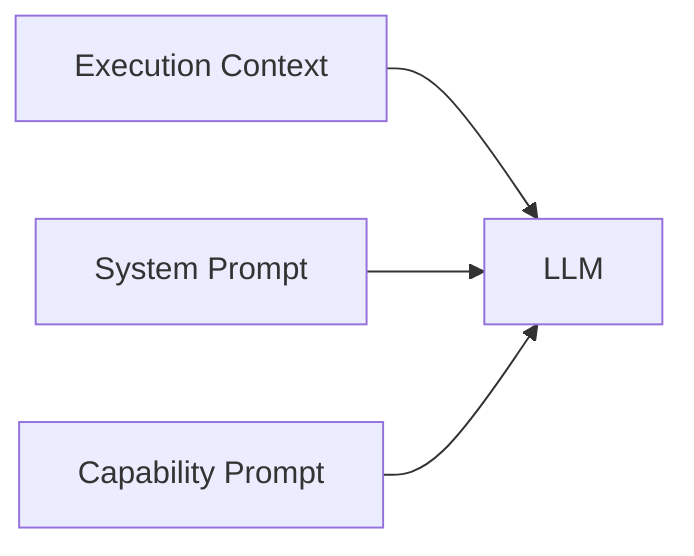
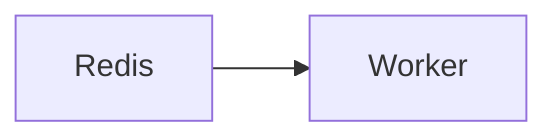
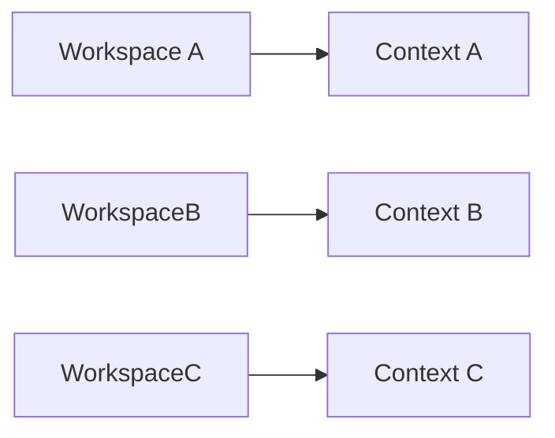
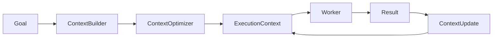

# Execution Context

> AI Social OS Runtime Kernel

Version: 2.0.0

Status: Draft

Last Updated: 2026-07-25

---

# Table of Contents

- Overview
- Why Context
- Context Lifecycle
- Context Architecture
- Context Sources
- Context Builder
- Context Layers
- Context Window Management
- Context Compression
- Context Isolation
- Context Injection
- Context Versioning
- Context Cache
- Design Decisions

---

# Overview

Execution Context là toàn bộ thông tin mà Runtime cung cấp cho AI trong suốt quá trình thực thi.

Context không chỉ là Prompt.

Context bao gồm:

- User Information
- Workspace
- Goal
- Memory
- Knowledge
- Brand
- Files
- Previous Results
- Runtime State

Execution Context được xây dựng bởi Context Engine.

Worker chỉ được phép đọc Context.

Worker không được tự xây dựng Context.

---

# Why Context

LLM chỉ có thể đưa ra quyết định tốt nếu nhận đủ thông tin.

Runtime chịu trách nhiệm tổng hợp Context.

Ví dụ

```mermaid
flowchart LR
```

---

# Context Lifecycle



---

# Context Architecture



---

# Context Sources

Execution Context có thể lấy dữ liệu từ nhiều nguồn.

## Goal

Mục tiêu người dùng.

Ví dụ

```
Viết bài Facebook về AI Agent.
```

---

## Workspace

Thông tin Workspace.

Ví dụ

- Brand
- Timezone
- Language
- Permission
- Team

---

## User Profile

Thông tin người dùng.

Ví dụ

- Preferred Language
- Tone
- Writing Style
- Role

---

## Conversation

Lịch sử hội thoại.

Ví dụ

```mermaid
flowchart LR
```

---

## Memory

Thông tin AI đã ghi nhớ.

Ví dụ

- Brand Voice
- Customer Preference
- Frequently Used Prompt

---

## Knowledge

Thông tin RAG.

Ví dụ

- PDF
- Website
- Internal Docs
- FAQ
- SOP

---

## Files

Người dùng upload.

Ví dụ

- PDF
- DOCX
- CSV
- Excel
- Image

---

## Runtime State

Thông tin Execution.

Ví dụ

- Previous Task Result
- Current Task
- Retry Count
- Budget
- Token Usage

---

# Context Builder

Context Builder tổng hợp dữ liệu.



---

# Context Layers

Execution Context được chia thành nhiều Layer.

```text
Execution Context

├── Goal Layer

├── Workspace Layer

├── User Layer

├── Conversation Layer

├── Memory Layer

├── Knowledge Layer

├── Runtime Layer

├── Tool Layer

└── Prompt Layer
```

---

# Layer Priority



Goal luôn có mức ưu tiên cao nhất.

---

# Context Window

LLM có giới hạn Token.

Runtime phải quản lý Context Window.



---

# Context Ranking

Runtime đánh giá mức độ liên quan.

Ví dụ

| Source | Score |
|----------|------|
| Goal | 100 |
| Previous Task | 95 |
| Knowledge | 92 |
| Memory | 88 |
| Conversation | 80 |
| Uploaded File | 75 |

Context có điểm cao sẽ được ưu tiên.

---

# Context Compression

Nếu Context quá lớn.

Runtime sẽ:

- Summarize
- Remove Duplicate
- Remove Low Score
- Compress Conversation



---

# Context Injection

Worker không tự tạo Prompt.

Worker chỉ nhận:



---

# Dynamic Context

Execution Context có thể thay đổi sau mỗi Task.

Ví dụ

```mermaid
flowchart LR
```

Task B sẽ nhận Context mới.

---

# Context Version

Execution Context có Version.

```mermaid
flowchart LR
```

Điều này giúp Runtime:

- Replay
- Debug
- Audit

---

# Context Cache

Context được cache trong Redis.



Giúp tránh Build lại nhiều lần.

---

# Context Isolation

Mỗi Workspace có Context riêng.



Không được phép chia sẻ Context giữa các Workspace.

---

# Context Security

Execution Context có thể chứa:

- API Key
- Customer Data
- Business Information

Runtime phải:

- Mask Secret
- Encrypt Sensitive Data
- Remove Internal Metadata
- Audit Context Access

---

# Context Update Strategy

Runtime chỉ cập nhật Context khi:

- Task hoàn thành
- Memory thay đổi
- Knowledge thay đổi
- User gửi thêm dữ liệu
- Plugin trả kết quả mới

Không rebuild toàn bộ Context sau mỗi bước nếu không cần thiết.

---

# Context Flow



---

# Design Decisions

| Decision | Reason |
|-----------|--------|
| Context tách khỏi Prompt | Có thể tái sử dụng |
| Context Builder độc lập | Dễ mở rộng |
| Layer hóa Context | Quản lý dễ hơn |
| Context Versioning | Replay & Audit |
| Context Cache | Tăng hiệu năng |
| Dynamic Update | AI phản ứng theo tiến trình |
| Workspace Isolation | Multi-tenant |

---

# Summary

Execution Context là nguồn dữ liệu duy nhất mà Worker sử dụng trong quá trình thực thi.

Runtime chịu trách nhiệm:

- thu thập dữ liệu
- xây dựng Context
- tối ưu Token
- quản lý Version
- cập nhật theo từng Task
- đảm bảo bảo mật và cô lập giữa các Workspace

Việc tách Context thành một thành phần độc lập giúp AI Social OS có thể hỗ trợ nhiều AI Provider, nhiều Capability và nhiều loại Agent mà không cần thay đổi cách Runtime hoạt động.