# State Machine

> AI Social OS Runtime Kernel

Version: 2.0.0

Status: Draft

Last Updated: 2026-07-25

---

# Table of Contents

- Overview
- Why State Machine
- State Hierarchy
- Execution State Machine
- Task State Machine
- State Transition
- Event Mapping
- Persistence
- Recovery
- Timeout
- Pause & Resume
- Failure Handling
- Design Decisions

---

# Overview

State Machine quản lý toàn bộ vòng đời của Runtime.

Mọi Execution và Task đều phải có State rõ ràng.

Runtime không bao giờ dựa vào việc "đang chạy ở đâu" trong code để xác định trạng thái.

Thay vào đó, State được lưu trữ và có thể khôi phục.

---

# Why State Machine

State Machine giúp Runtime:

- Resume sau khi restart
- Retry chính xác
- Audit
- Monitoring
- Replay
- Distributed Execution

Không có State Machine thì Runtime chỉ là một Worker thông thường.

---

# Runtime Hierarchy

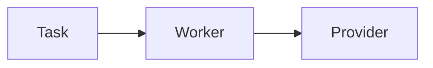

Mỗi tầng đều có State riêng.

---

# Execution State Machine

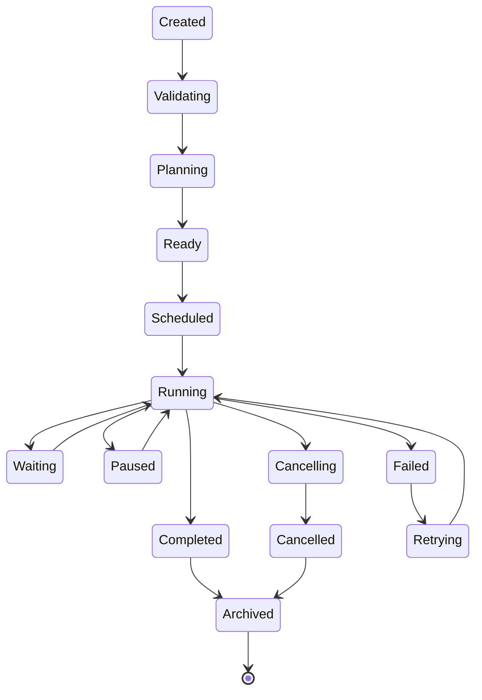

---

# State Definitions

| State | Description |
|---------|-------------|
| Created | Execution vừa được tạo |
| Validating | Kiểm tra Permission, Provider, Plugin |
| Planning | Sinh Execution Plan |
| Ready | Sẵn sàng chạy |
| Scheduled | Đợi Scheduler |
| Running | Đang thực thi |
| Waiting | Chờ Dependency |
| Paused | Tạm dừng |
| Cancelling | Đang hủy |
| Cancelled | Đã hủy |
| Failed | Lỗi |
| Retrying | Retry |
| Completed | Thành công |
| Archived | Lưu lịch sử |

---

# Task State Machine

Mỗi Task cũng có State riêng.

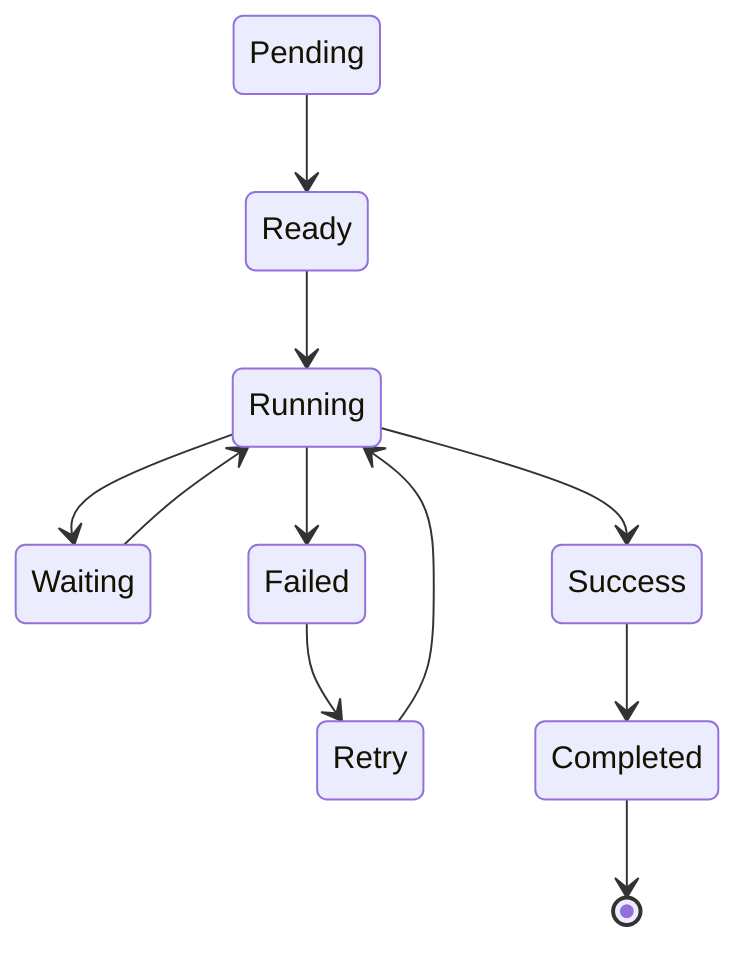

---

# Task States

| State | Description |
|---------|-------------|
| Pending | Chưa sẵn sàng |
| Ready | Có thể chạy |
| Running | Đang chạy |
| Waiting | Đợi kết quả Task khác |
| Failed | Lỗi |
| Retry | Đang retry |
| Success | Worker trả kết quả |
| Completed | Đã ghi Result |

---

# Transition Rules

Execution chỉ được chuyển theo các Transition hợp lệ.

Ví dụ

```mermaid
flowchart LR
```

Không được phép

```mermaid
flowchart LR
```

---

# Transition Validation

Runtime kiểm tra:

- Current State
- Target State
- Policy
- Permission

Nếu Transition không hợp lệ sẽ bị từ chối.

---

# Parallel Tasks

Một Execution có thể có nhiều Task.
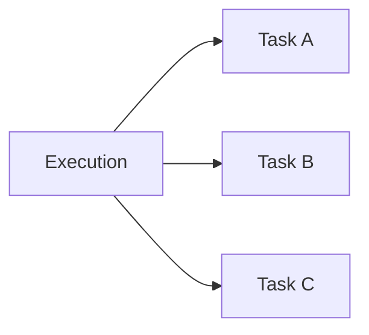

Mỗi Task có State độc lập.

---

# Dependency

Ví dụ

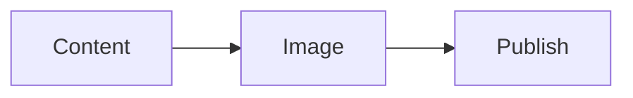

Publish chỉ chuyển sang Ready khi Image Completed.

---

# Event Mapping

Mỗi lần đổi State đều phát Event.

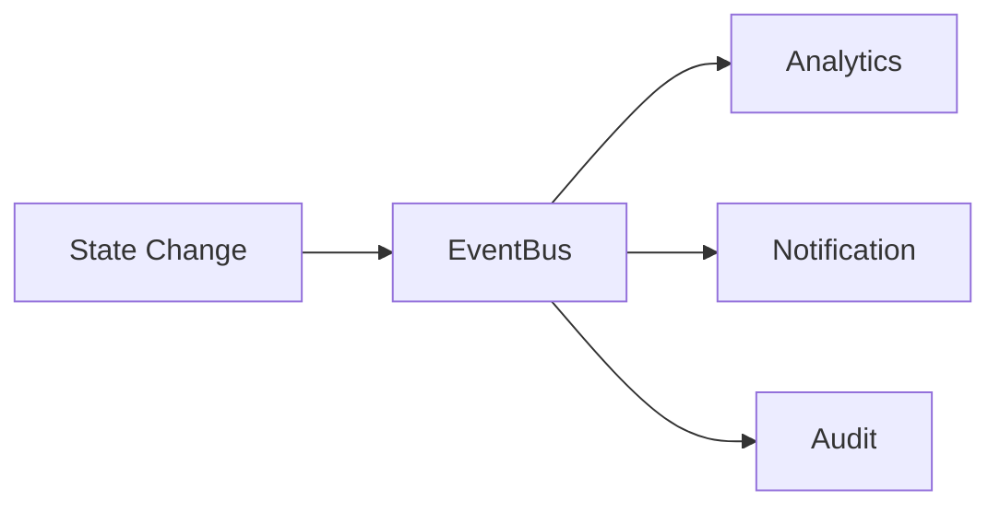

Ví dụ

| State | Event |
|----------|-------------------------|
| Running | ExecutionStarted |
| Completed | ExecutionCompleted |
| Failed | ExecutionFailed |
| Retry | ExecutionRetry |

---

# Persistence

State luôn được lưu.

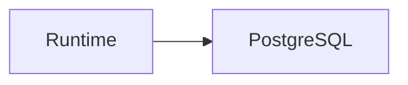

Redis:

- Runtime State

PostgreSQL:

- Long-term State

---

# Recovery

Sau khi Runtime restart.

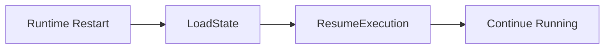

Execution không cần chạy lại từ đầu.

---

# Pause

Execution có thể Pause.

Ví dụ

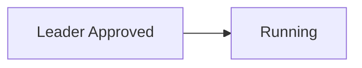

---

# Timeout

Có hai loại Timeout.

## Execution Timeout

```
30 phút
```

---

## Task Timeout

```
60 giây
```

Timeout sẽ tạo Event.

```
ExecutionTimeout
```

---

# Retry

Retry không tạo Execution mới.

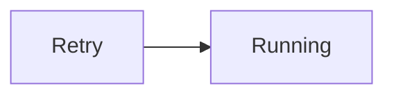

Retry Count được lưu.

---

# Cancellation

Execution có thể bị hủy.

Nguồn hủy:

- User
- Admin
- Policy
- Budget
- Fatal Error

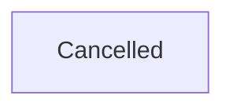

---

# State Snapshot

Runtime định kỳ tạo Snapshot.

```mermaid
flowchart LR
```

Giúp Resume nhanh.

---

# State Versioning

Mỗi lần thay đổi State đều tăng Version.

```mermaid
flowchart LR
```

Giúp:

- Replay
- Debug
- Audit

---

# Observability

Theo dõi:

- State Duration
- Waiting Time
- Retry Count
- Queue Time
- Failure Rate

---

# Example

Goal

```
Đăng bài Facebook
```

Execution

```mermaid
flowchart LR
```

---

# Design Decisions

| Decision | Reason |
|-----------|--------|
| Execution và Task có State riêng | Quản lý độc lập |
| State lưu vào DB | Recovery |
| State Versioning | Replay |
| Event trên mọi Transition | Monitoring |
| Snapshot | Resume nhanh |
| Transition Validation | Tránh trạng thái không hợp lệ |

---

# Summary

State Machine là nền tảng giúp Execution Runtime hoạt động ổn định trong môi trường phân tán.

Mọi Execution và Task đều được quản lý bằng các trạng thái rõ ràng, có khả năng lưu trữ, khôi phục, retry và replay.

Nhờ State Machine, AI Social OS có thể:

- Resume sau khi Runtime khởi động lại
- Retry từng Task thay vì toàn bộ Execution
- Theo dõi tiến trình theo thời gian thực
- Audit toàn bộ vòng đời của mỗi Execution
- Hỗ trợ mở rộng sang nhiều Runtime Node mà vẫn đảm bảo tính nhất quán của trạng thái