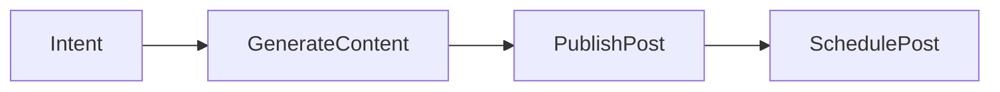
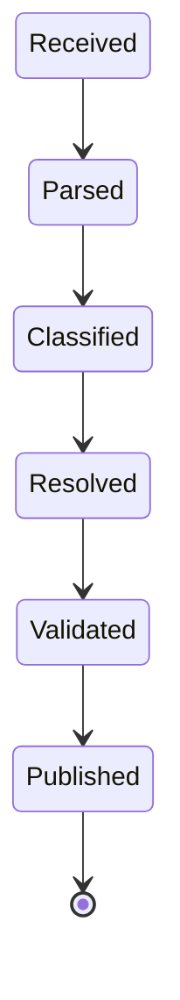
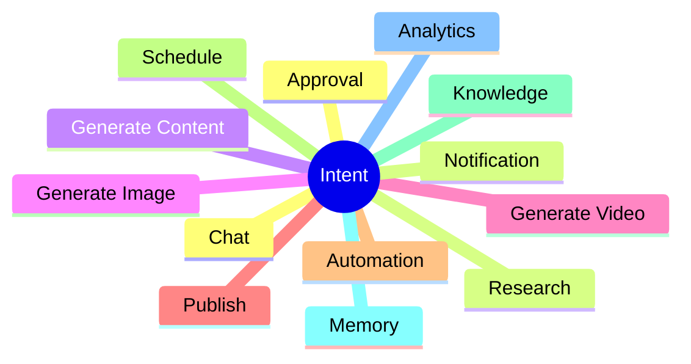
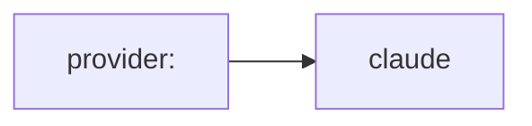
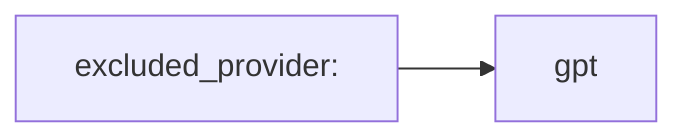
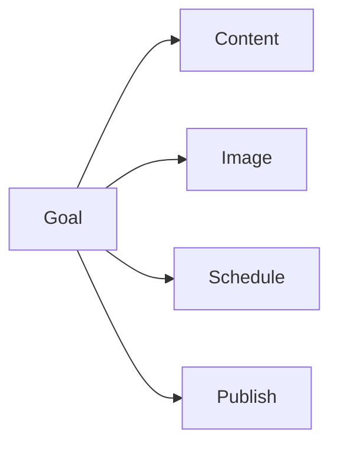
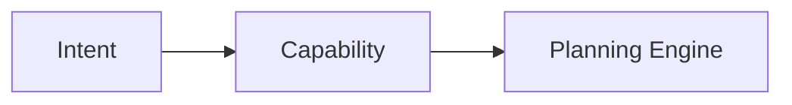

# Intent Engine

> AI Social OS Runtime Kernel

Version: 2.0.0

Status: Draft

Last Updated: 2026-07-25

---

# Table of Contents

- Overview
- Purpose
- Architecture
- Intent Lifecycle
- Intent Model
- Intent Classification
- Entity Extraction
- Goal Normalization
- Confidence Score
- Intent Resolution
- Failure Handling
- Design Decisions

---

# Overview

Intent Engine là thành phần đầu tiên của Runtime.

Nhiệm vụ của Intent Engine là chuyển yêu cầu tự nhiên của người dùng thành một **Intent** mà Runtime có thể hiểu và xử lý.

Ví dụ



Intent Engine không sinh Workflow.

Intent Engine chỉ xác định:

- người dùng muốn làm gì
- đối tượng nào liên quan
- cần Capability nào

---

# Why Intent Engine

Người dùng không phải lúc nào cũng mô tả đúng.

Ví dụ

```
Viết giúp mình vài bài AI.
```

```
Đăng lên fanpage.
```

```
Làm thành campaign luôn.
```

Ba câu trên thực chất là một Goal.

Intent Engine chịu trách nhiệm hợp nhất chúng.

---

# Architecture

```mermaid
flowchart LR
    UserGoal[User Goal]
    GoalParser[Goal Parser]
    IntentClassifier[Intent Classifier]
    EntityExtractor[Entity Extractor]
    ConstraintParser[Constraint Parser]
    IntentResolver[Intent Resolver]
    NormalizedIntent[Normalized Intent]
    UserGoal --> GoalParser
    GoalParser --> IntentClassifier
    IntentClassifier --> EntityExtractor
    EntityExtractor --> ConstraintParser
    ConstraintParser --> IntentResolver
    IntentResolver --> NormalizedIntent
```



---

# Intent Lifecycle



---

# Intent Structure

```typescript
Intent

├── id

├── executionId

├── type

├── action

├── entities

├── constraints

├── confidence

├── metadata

└── timestamp
```

---

# Intent Types



---

# Intent Classification

Một Goal có thể tạo nhiều Intent.

Ví dụ


---

# Intent Granularity

Intent phải đủ nhỏ để Runtime có thể Planning.

Không nên tạo Intent quá lớn.

Ví dụ

❌

```
Marketing
```

Đúng

```
Research Trend

Generate Content

Generate Image

Publish
```

---

# Entity Extraction

Intent Engine trích xuất Entity.

Ví dụ

Goal

```
Đăng bài Facebook về AI Agent lúc 8h.

```
```mermaid
flowchart LR
```

```yaml
platform:

- facebook

topic:

- ai agent

schedule:

08:00

language:

vi

timezone:

Asia/Ho_Chi_Minh
```

---

# Constraint Extraction

Ví dụ



---

Ví dụ



---

Ví dụ


---

# Goal Normalization

Intent Engine chuẩn hóa Goal.

Ví dụ

Input

```
Đăng bài FB.

```
```mermaid
flowchart LR
```

```yaml
platform:

facebook

action:

publish_post
```

---

# Multi Intent

Một Goal có thể sinh nhiều Intent.



---

# Confidence Score

Mỗi Intent có Confidence.

```yaml
intent:

publish_post

confidence:

0.97
```

Nếu Confidence thấp.

Runtime có thể:

- hỏi lại người dùng
- chọn Intent mặc định
- chuyển sang Human Approval

---

# Intent Resolution

Intent Resolver chịu trách nhiệm:

- gộp Intent trùng
- loại bỏ Intent dư
- chuẩn hóa tên
- gắn Capability

Ví dụ

```mermaid
flowchart LR
```

---

# Intent Mapping



Ví dụ

| Intent | Capability |
|---------|------------|
| GenerateContent | Content Capability |
| GenerateImage | Media Capability |
| PublishFacebook | Social Capability |
| SendLark | Notification Capability |
| ResearchTrend | Research Capability |

---

# Context Usage

Intent Engine chỉ sử dụng Context cần thiết.

Nguồn Context

- Goal
- Conversation
- Workspace
- User Profile

Intent Engine không truy cập:

- Memory dài hạn
- Knowledge Base

Việc này sẽ do Context Engine thực hiện.

---

# Failure Handling

Nếu Intent không xác định được.

Runtime tạo Event.

```
IntentResolutionFailed
```

Có thể xử lý theo các cách:

- hỏi người dùng
- fallback sang Chat
- Human Approval
- hủy Execution

---

# Example 1

Goal

```
Viết bài Facebook về AI Agent.
```

Intent

```yaml
intent:

generate_content

platform:

facebook

topic:

ai agent
```

---

# Example 2

Goal

```
Tìm video AI đang hot rồi viết bài và đăng lên fanpage.
```

Intent

```yaml
research_trend

generate_content

publish_facebook
```

---

# Example 3

Goal

```
Mỗi sáng 8h gửi báo cáo lên Lark.
```

Intent

```yaml
schedule

generate_report

send_lark
```

---

# Design Decisions

| Decision | Reason |
|-----------|--------|
| Intent độc lập với Goal | Runtime linh hoạt |
| Intent nhỏ | Planning dễ hơn |
| Hỗ trợ Multi Intent | AI Task phức tạp |
| Có Confidence Score | Giảm lỗi phân loại |
| Chuẩn hóa Intent | Capability thống nhất |
| Không truy cập Memory | Tách trách nhiệm với Context Engine |

---

# Summary

Intent Engine là cổng vào của Execution Runtime.

Thành phần này chịu trách nhiệm chuyển yêu cầu tự nhiên của người dùng thành các Intent chuẩn hóa để Runtime có thể lập kế hoạch.

Intent Engine không sinh Workflow, không gọi AI Provider và không thực thi Task.

Kết quả của Intent Engine là tập hợp các Intent có cấu trúc rõ ràng, được dùng làm đầu vào cho Planning Engine để xây dựng Execution Plan.