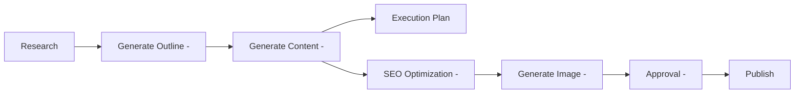
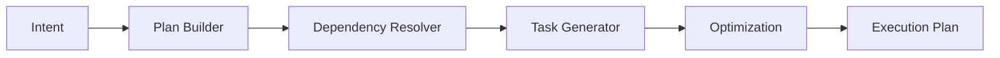
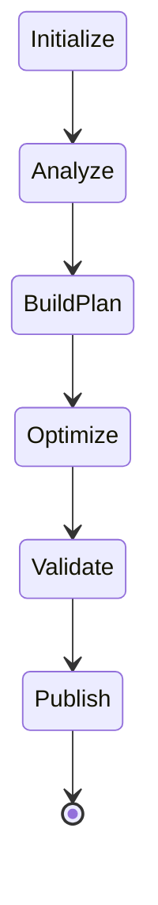
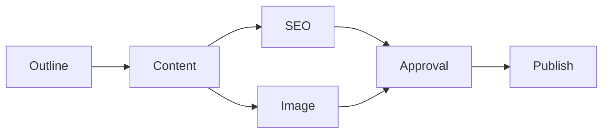
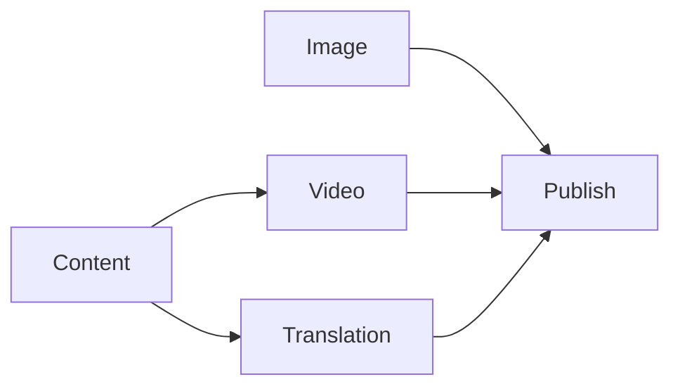
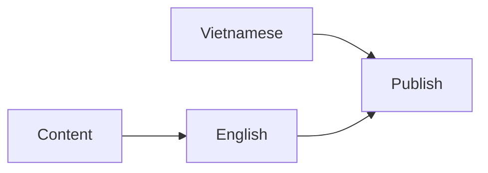

# Planning Engine

> AI Social OS Runtime Kernel

Version: 2.0.0

Status: Draft

Last Updated: 2026-07-25

---

# Table of Contents

- Overview
- Purpose
- Architecture
- Planning Lifecycle
- Planning Inputs
- Planning Outputs
- Execution Plan
- Task Graph
- Dependency Resolution
- Parallel Planning
- Dynamic Planning
- Replanning
- Failure Recovery
- Design Decisions

---

# Overview

Planning Engine chịu trách nhiệm chuyển các Intent thành một **Execution Plan** hoàn chỉnh.

Planning Engine không trực tiếp thực thi Task.

Nó chỉ quyết định:

- cần làm gì
- theo thứ tự nào
- có thể chạy song song hay không
- Worker nào sẽ phù hợp
- Capability nào sẽ được sử dụng

Execution Plan sau đó sẽ được Runtime Scheduler thực thi.

---

# Why Planning Engine

Intent chỉ mô tả **người dùng muốn làm gì**.

Planning Engine quyết định **Runtime sẽ làm như thế nào**.

Ví dụ



---

# Architecture



---

# Planning Lifecycle



---

# Planning Inputs

Planning Engine nhận các dữ liệu sau.

- Intent
- Execution Context
- Workspace Policy
- Capability Registry
- Resource Status
- Plugin Registry

Planning Engine không truy cập trực tiếp AI Provider.

---

# Planning Outputs

Planning Engine sinh ra:

```text
Execution Plan

├── Tasks

├── Dependencies

├── Parallel Groups

├── Retry Policy

├── Timeout

├── Estimated Cost

├── Estimated Duration

└── Execution Metadata
```

---

# Execution Plan Structure

```typescript
ExecutionPlan

├── id

├── executionId

├── tasks

├── dependencyGraph

├── estimatedDuration

├── estimatedCost

├── metadata
```

---

# Task Structure

```typescript
Task

├── id

├── capability

├── worker

├── inputs

├── outputs

├── timeout

├── retryPolicy

├── dependencies

├── priority

└── metadata
```

---

# Task Graph

Execution Plan được biểu diễn bằng Directed Acyclic Graph (DAG).



Planning Engine luôn đảm bảo không tạo Circular Dependency.

---

# Dependency Resolution

Planning Engine tự xác định Dependency.

Ví dụ

```
Generate Image
```

phụ thuộc

```
Generate Content
```

Không cần người dùng khai báo.

---

# Parallel Planning

Planning Engine tối ưu để chạy song song khi có thể.

Ví dụ



Ba Task có thể chạy đồng thời.

---

# Task Priority

Planning Engine gán Priority.

| Priority | Description |
|-----------|-------------|
| Critical | Chạy ngay |
| High | Ưu tiên |
| Normal | Mặc định |
| Low | Chờ tài nguyên |

---

# Resource Awareness

Planning Engine biết trạng thái Runtime.

Ví dụ

```mermaid
flowchart LR
```

Planning không cứng nhắc.

---

# Dynamic Planning

Execution Plan có thể thay đổi trong Runtime.

Ví dụ

```mermaid
flowchart LR
```

Runtime không cần tạo Execution mới.

---

# Replanning

Planning Engine có thể tạo lại Plan khi:

- Plugin mới được cài
- Worker bị lỗi
- Provider thay đổi
- Policy thay đổi
- User cập nhật Goal


---

# Cost Estimation

Planning Engine ước lượng chi phí.

Ví dụ

```yaml
provider:

claude

estimated_tokens:

12000

estimated_cost:

0.42
```

Nếu vượt Budget.

Planning sẽ bị từ chối.

---

# Duration Estimation

Planning Engine ước lượng thời gian.

Ví dụ

| Task | Estimated |
|-------|-----------|
| Research | 20s |
| Content | 35s |
| Image | 45s |
| Publish | 5s |

Tổng thời gian được dùng để theo dõi SLA.

---

# Capability Resolution

Planning Engine chưa chọn Worker cụ thể.

Nó chỉ gắn Capability.

Ví dụ

```mermaid
flowchart LR
```

Worker Dispatcher sẽ chọn Worker phù hợp sau.

---

# Failure Recovery

Nếu Planning thất bại.

Runtime có thể:

- Retry Planning
- Rebuild Plan
- Chuyển sang Human Approval
- Huỷ Execution

Event

```
PlanningFailed
```

---

# Example 1

Goal

```
Viết bài Facebook.
```

Execution Plan

```mermaid
flowchart LR
```

---

# Example 2

Goal

```
Viết bài bằng tiếng Việt và tiếng Anh.
```

Execution Plan



Translation chạy song song.

---

# Example 3

Goal

```
Theo dõi TikTok Trend mỗi ngày và gửi báo cáo lên Lark.
```

Execution Plan

```mermaid
flowchart LR
```

---

# Design Decisions

| Decision | Reason |
|-----------|--------|
| Plan sinh động | AI có thể tối ưu |
| DAG thay vì Workflow tĩnh | Hỗ trợ Parallel |
| Dependency tự động | Đơn giản cho người dùng |
| Dynamic Replanning | Runtime linh hoạt |
| Cost Estimation | Quản lý Budget |
| Duration Estimation | Theo dõi SLA |
| Capability thay vì Worker | Giảm Coupling |

---

# Summary

Planning Engine là bộ não lập kế hoạch của Execution Runtime.

Dựa trên Intent và Context, Planning Engine xây dựng một Execution Plan tối ưu dưới dạng DAG, tự xác định Dependency, hỗ trợ Parallel Execution và Dynamic Replanning.

Execution Plan sau khi được tạo sẽ trở thành đầu vào cho Runtime Scheduler và Worker Dispatcher để thực thi trong các bước tiếp theo của vòng đời Runtime.