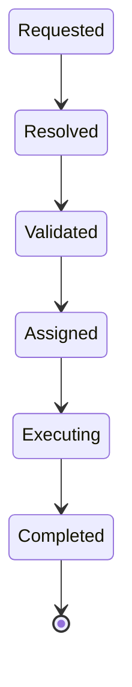
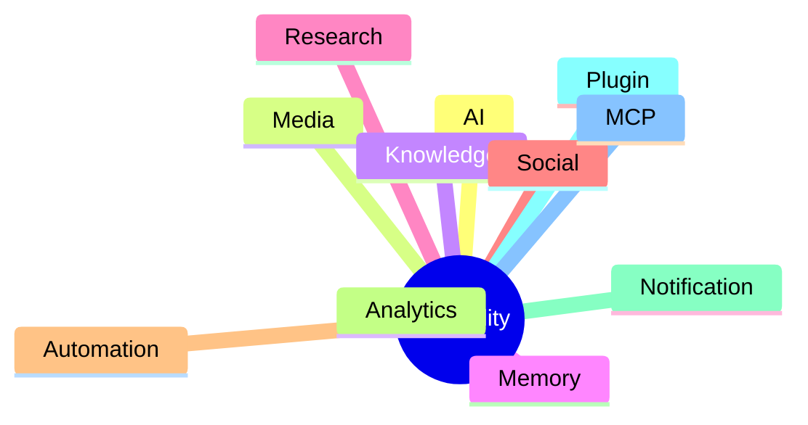
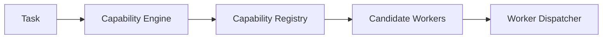
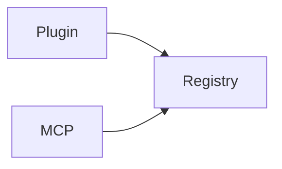

# Capability Engine

> AI Social OS Runtime Kernel

Version: 2.0.0

Status: Draft

Last Updated: 2026-07-25

---

# Table of Contents

- Overview
- Why Capability
- Capability Architecture
- Capability Lifecycle
- Capability Registry
- Capability Resolution
- Capability Discovery
- Capability Selection
- Capability Composition
- Capability Versioning
- Plugin Integration
- MCP Integration
- Failure Handling
- Design Decisions

---

# Overview

Capability Engine là thành phần chịu trách nhiệm xác định **hệ thống có thể làm gì**.

Capability không phải là Worker.

Capability cũng không phải là AI Provider.

Capability là lớp trừu tượng mô tả **một khả năng nghiệp vụ (business capability)** của AI Social OS.

Ví dụ

```
Generate Content

Publish Facebook

Generate Image

Research Trend

Search Knowledge

Send Notification
```

Planning Engine chỉ sinh Capability.

Capability Engine chịu trách nhiệm ánh xạ Capability sang implementation phù hợp.

---

# Why Capability

Nếu Runtime gọi trực tiếp Worker hoặc AI Provider:

```mermaid
flowchart LR
```

thì toàn bộ Runtime sẽ phụ thuộc vào implementation.

Thay vào đó

```mermaid
flowchart LR
```

Capability giúp Runtime hoàn toàn độc lập với AI Provider.

---

# Capability Architecture


Capability Engine không trực tiếp thực thi Task.

---

# Capability Lifecycle



---

# Capability Registry

Tất cả Capability đều được đăng ký trong Registry.

```text
Capability Registry

├── GenerateContent

├── GenerateImage

├── GenerateVideo

├── PublishSocial

├── CrawlWebsite

├── SearchKnowledge

├── TrendResearch

├── SendNotification

├── OCR

├── Translation

├── SpeechToText

└── TextToSpeech
```

Registry chỉ lưu metadata.

Không chứa Business Logic.

---

# Capability Model

```typescript
Capability

├── id

├── name

├── version

├── category

├── inputs

├── outputs

├── supportedWorkers

├── permissions

├── constraints

└── metadata
```

---

# Capability Categories



---

# AI Capabilities

Ví dụ

- Chat Completion
- Text Generation
- Translation
- Summarization
- Classification
- Embedding
- Reranking

---

# Media Capabilities

Ví dụ

- Image Generation
- Video Generation
- Image Editing
- Thumbnail
- OCR
- Audio Generation

---

# Social Capabilities

Ví dụ

- Publish Post
- Reply Comment
- Reply Message
- Get Insights
- Schedule Post
- Delete Post

---

# Knowledge Capabilities

Ví dụ

- Search
- Index
- Retrieve
- Embed
- Upload Document

---

# Research Capabilities

Ví dụ

- Crawl Website
- Trend Detection
- Competitor Analysis
- SEO Analysis
- Keyword Research

---

# Notification Capabilities

Ví dụ

- Send Email
- Send Telegram
- Send Lark
- Send Slack
- Send Discord

---

# Capability Resolution

Planning Engine chỉ biết:

```
Generate Image
```

Capability Engine sẽ tìm:

```mermaid
flowchart LR
```

---

# Resolution Flow



---

# Capability Discovery

Capability có thể đến từ:

- Core System
- Plugin
- MCP Server



Capability Engine không phân biệt nguồn gốc.

---

# Capability Selection

Một Capability có thể có nhiều Worker.

Ví dụ

```
Generate Image

```
```mermaid
flowchart LR
```

```
OpenAI Image

Flux

Stable Diffusion

ComfyUI
```

Worker Dispatcher sẽ chọn Worker phù hợp dựa trên:

- Availability
- Cost
- Latency
- Policy
- User Preference

---

# Capability Composition

Một Capability có thể được xây dựng từ nhiều Capability nhỏ hơn.

Ví dụ

```mermaid
flowchart LR
```

Capability Engine hỗ trợ Capability lồng nhau.

---

# Plugin Integration

Plugin có thể đăng ký Capability mới.

Ví dụ

```mermaid
flowchart LR
```

Sau khi cài Plugin.

Capability sẽ xuất hiện trong Registry.

Không cần sửa Runtime.

---

# MCP Integration

MCP Server cũng có thể cung cấp Capability.

Ví dụ

```mermaid
flowchart LR
```

```mermaid
flowchart LR
```

Runtime xem chúng như Capability bình thường.

---

# Capability Versioning

Capability có Version.

Ví dụ

```yaml
GenerateContent

version:

2.1.0
```

Cho phép Runtime:

- Rollback
- Upgrade
- Compatibility Check

---

# Capability Constraints

Capability có thể yêu cầu:

```yaml
requires:

provider

permissions

connector

plugin

budget
```

Ví dụ

```
Publish Facebook
```

yêu cầu:

- Facebook Connector
- OAuth Token
- Publish Permission

---

# Failure Handling

Nếu không tìm thấy Capability.

Runtime phát Event.

```
CapabilityNotFound
```

Các lựa chọn:

- Retry
- Plugin Discovery
- MCP Discovery
- Human Approval
- Cancel Execution

---

# Example 1

Goal

```
Viết bài Facebook.

```
```mermaid
flowchart LR
```

```mermaid
flowchart LR
```

---

# Example 2

Goal

```
Tạo video TikTok.

```
```mermaid
flowchart LR
```

```mermaid
flowchart LR
```

---

# Example 3

Goal

```
Trả lời bình luận Facebook.

```
```mermaid
flowchart LR
```

```mermaid
flowchart LR
```

---

# Capability vs Worker

| Capability | Worker |
|------------|--------|
| Business Ability | Runtime Implementation |
| Stable | Replaceable |
| Platform Independent | Provider Dependent |
| Declared by Registry | Executed by Runtime |
| Used in Planning | Used in Execution |

---

# Capability vs Plugin

| Capability | Plugin |
|------------|--------|
| Chức năng | Gói mở rộng |
| Có thể thuộc Core | Luôn là Extension |
| Runtime sử dụng | Runtime nạp |
| Có Version | Có Manifest |

---

# Design Decisions

| Decision | Reason |
|-----------|--------|
| Capability độc lập Worker | Giảm Coupling |
| Registry tập trung | Discovery nhanh |
| Plugin có thể thêm Capability | Dễ mở rộng |
| MCP có thể đăng ký Capability | Chuẩn hóa Tool |
| Versioning | Tương thích lâu dài |
| Composition | Hỗ trợ Agent phức tạp |

---

# Summary

Capability Engine là lớp trừu tượng giữa Planning Engine và Worker Dispatcher.

Thay vì phụ thuộc trực tiếp vào AI Provider, Social API hoặc Plugin, Runtime chỉ làm việc với các Capability.

Thiết kế này giúp AI Social OS:

- hỗ trợ nhiều AI Provider
- thay thế Worker mà không ảnh hưởng Runtime
- mở rộng bằng Plugin và MCP
- tái sử dụng Capability giữa nhiều Agent
- xây dựng các Agent phức tạp từ những Capability nhỏ hơn

Capability Engine chính là nền tảng giúp Runtime trở thành một hệ điều hành AI có khả năng mở rộng lâu dài.