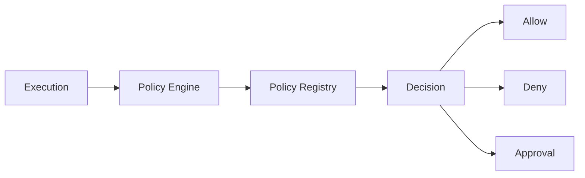
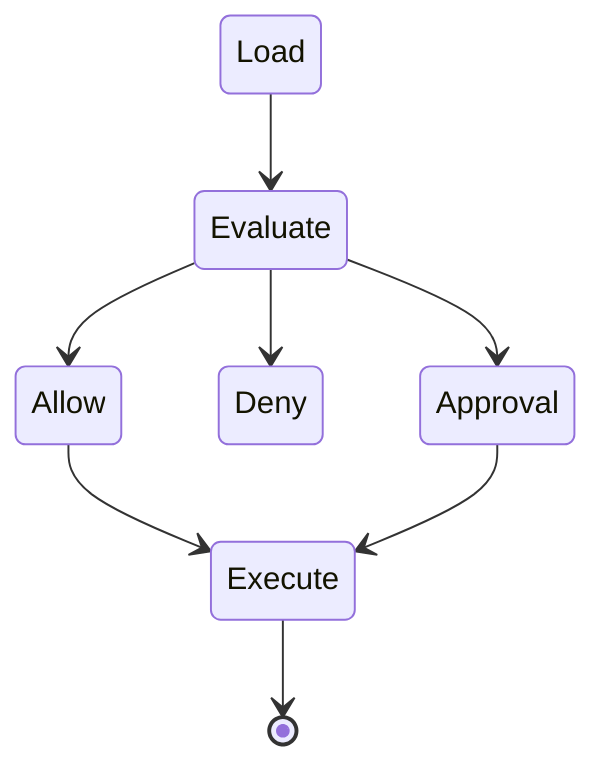
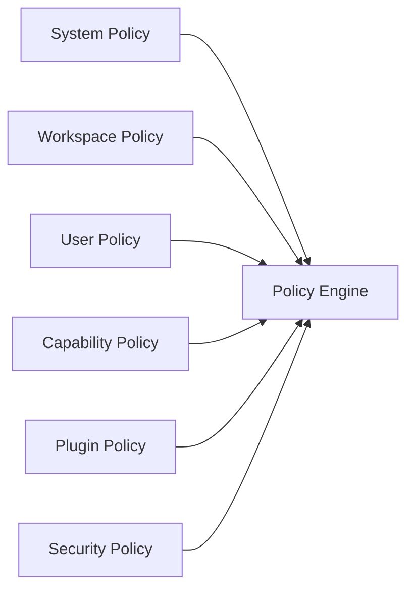
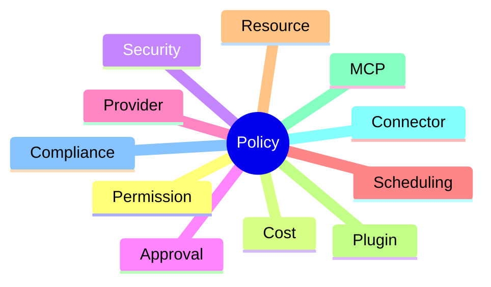
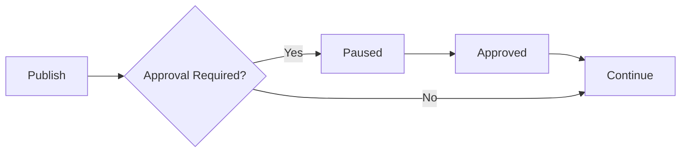
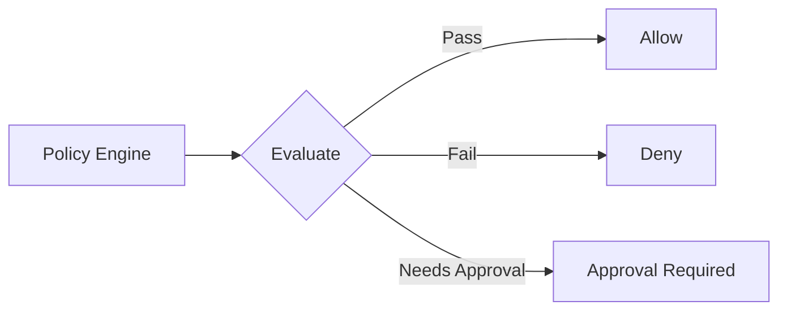
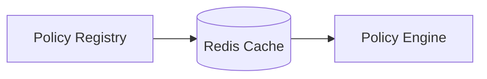

# Policy Engine

> AI Social OS Runtime Kernel

Version: 2.0.0

Status: Draft

Last Updated: 2026-07-25

---

# Table of Contents

- Overview
- Why Policy Engine
- Policy Architecture
- Policy Lifecycle
- Policy Sources
- Policy Evaluation
- Policy Types
- Permission Policy
- Cost Policy
- Provider Policy
- Security Policy
- Approval Policy
- Execution Policy
- Design Decisions

---

# Overview

Policy Engine chịu trách nhiệm kiểm soát toàn bộ hành vi của Runtime.

Planning Engine quyết định **nên làm gì**.

Capability Engine quyết định **có thể làm gì**.

Policy Engine quyết định **được phép làm gì**.

Mọi Execution đều phải đi qua Policy Engine trước khi được thực thi.

---

# Why Policy Engine

Nếu Runtime không có Policy.

```mermaid
flowchart LR
```

AI có thể:

- vượt Budget
- dùng sai AI Provider
- đăng sai Social Account
- truy cập Plugin không được cấp quyền
- gửi dữ liệu nhạy cảm ra ngoài

Policy Engine ngăn các tình huống này.

---

# Architecture



---

# Policy Lifecycle



---

# Policy Sources

Policy có thể đến từ nhiều nơi.



---

# Policy Evaluation Order

Runtime đánh giá Policy theo thứ tự.

```mermaid
flowchart LR
```

Policy ở tầng trên có ưu tiên cao hơn.

---

# Policy Types



---

# Permission Policy

Kiểm tra quyền.

Ví dụ

```yaml
role:

marketing

allow:

publish_post

deny:

delete_workspace
```

---

# Workspace Policy

Ví dụ

```yaml
workspace:

marketing

allowed_providers:

claude

gemini
```

Không cho phép GPT.

---

# Provider Policy

Ví dụ

```yaml
provider:

claude

max_tokens:

20000

temperature:

0.7
```

Runtime sẽ áp dụng mặc định.

---

# Budget Policy

Ví dụ

```yaml
daily_budget:

$20

execution_budget:

$2
```

Nếu Planning ước lượng vượt Budget.

Execution sẽ bị từ chối.

---

# Rate Limit Policy

Ví dụ

```yaml
facebook:

100 posts/day

youtube:

20 uploads/day
```

Runtime Scheduler sẽ trì hoãn Execution nếu vượt giới hạn.

---

# Scheduling Policy

Ví dụ

```yaml
working_hours:

08:00

18:00

timezone:

Asia/Ho_Chi_Minh
```

Execution chỉ chạy trong khoảng thời gian này.

---

# Approval Policy

Ví dụ

```yaml
publish:

approval_required:

true
```

Execution sẽ Pause.



---

# Plugin Policy

Ví dụ

```yaml
plugin:

browser

allow:

false
```

Plugin sẽ không được Runtime nạp.

---

# MCP Policy

Ví dụ

```yaml
mcp:

filesystem

read:

true

write:

false
```

Chỉ cho phép đọc.

---

# Security Policy

Ví dụ

```yaml
allow_external_api:

false

allow_secret_access:

false
```

Ngăn AI gửi dữ liệu nội bộ ra ngoài.

---

# Compliance Policy

Ví dụ

```yaml
store_chat_history:

365 days

mask_customer_email:

true

encrypt_memory:

true
```

---

# Policy Decision

Policy Engine chỉ trả về ba kết quả.



---

# Policy Conflict

Ví dụ

Workspace

```
Allow GPT
```

User

```
Deny GPT
```

System

```
Allow GPT
```

Resolution

```mermaid
flowchart LR
```

User Policy thắng Workspace Policy.

---

# Policy Context

Policy Engine sử dụng:

- Workspace
- User
- Execution
- Capability
- Connector
- Provider
- Plugin

Không sử dụng LLM để ra quyết định.

Policy luôn deterministic.

---

# Policy Cache

Policy được cache trong Redis.



Giảm thời gian đánh giá.

---

# Example 1

Goal

```
Đăng Facebook.
```

Policy

```
Approval Required
```

```mermaid
flowchart LR
```

```
Paused
```

---

# Example 2

Goal

```
Generate Video
```

Budget

```
$1
```

Estimated Cost

```
$2.8
```

```mermaid
flowchart LR
```

```
Denied
```

---

# Example 3

Goal

```
Sử dụng GPT.
```

Workspace

```
Only Claude
```

```mermaid
flowchart LR
```

```
Denied
```

---

# Policy Events

Mỗi Decision đều phát Event.

Ví dụ

- PolicyEvaluated
- PolicyDenied
- PolicyApproved
- BudgetExceeded
- PermissionDenied
- ApprovalRequested

---

# Design Decisions

| Decision | Reason |
|-----------|--------|
| Policy Engine độc lập | Tách Business Rule khỏi Runtime |
| Deterministic | Dễ Audit |
| Hỗ trợ nhiều tầng Policy | Multi-tenant |
| Cache Policy | Tăng hiệu năng |
| Approval là Policy | Không hard-code vào Runtime |
| Không dùng AI để đánh giá Policy | Đảm bảo tính nhất quán |

---

# Summary

Policy Engine là lớp kiểm soát trung tâm của AI Social OS.

Mọi Execution đều phải được Policy Engine đánh giá trước khi thực thi.

Policy Engine chịu trách nhiệm:

- kiểm tra Permission
- giới hạn Budget
- áp dụng Security Rule
- kiểm soát AI Provider
- yêu cầu Approval
- thực thi Compliance

Nhờ Policy Engine, Runtime luôn hoạt động trong các giới hạn do tổ chức và người dùng định nghĩa, đảm bảo an toàn, nhất quán và dễ kiểm toán.