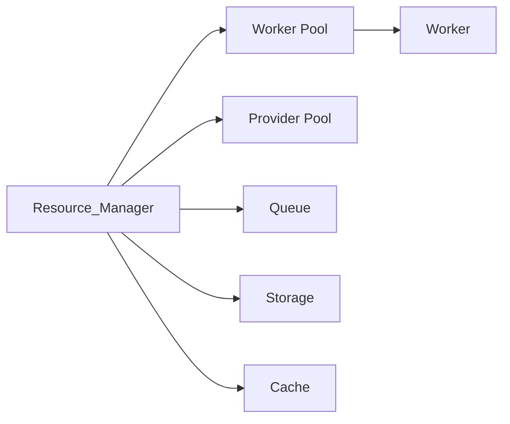
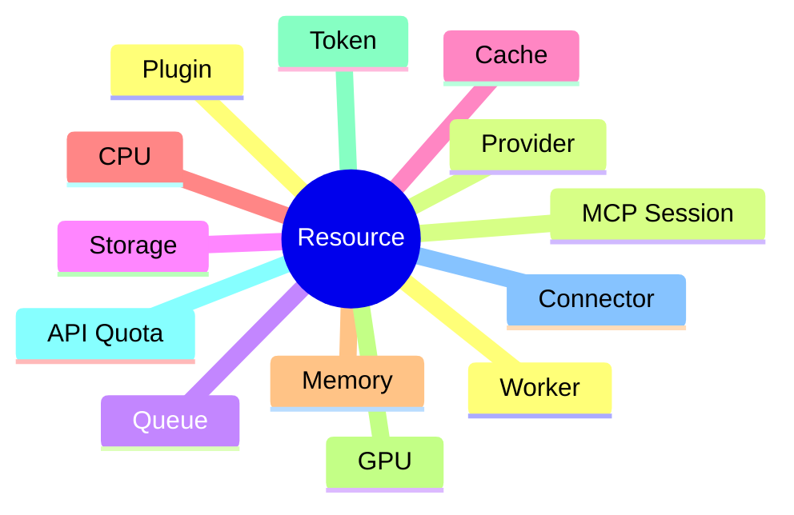
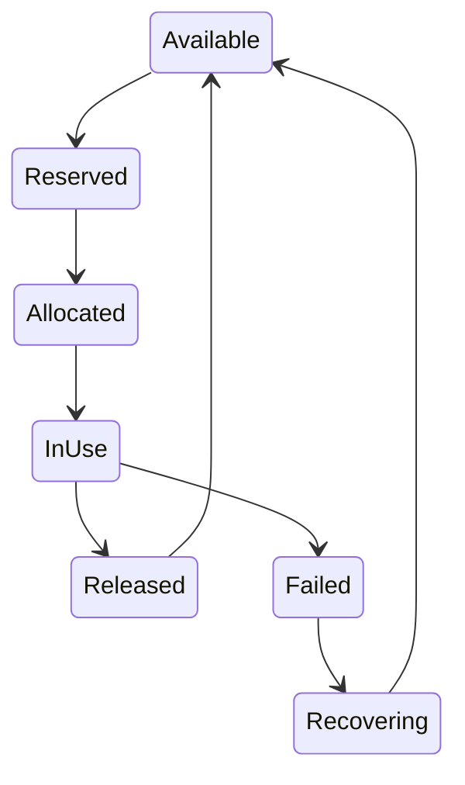
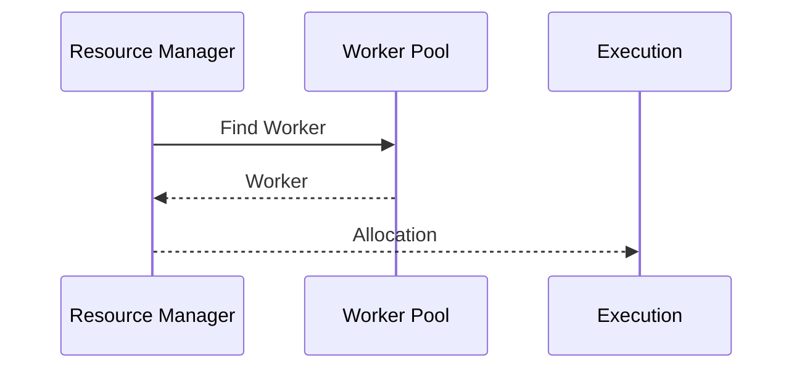
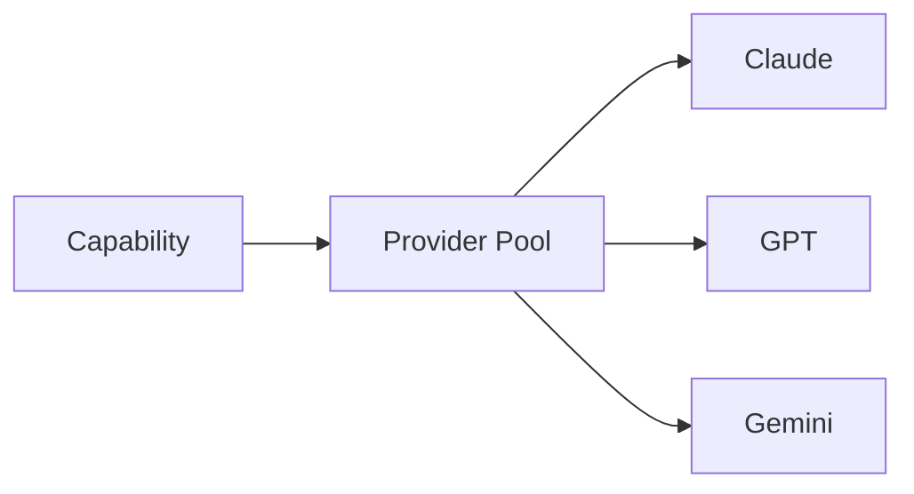
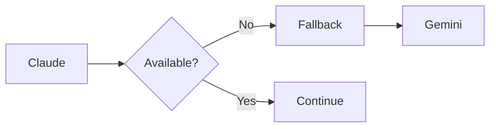
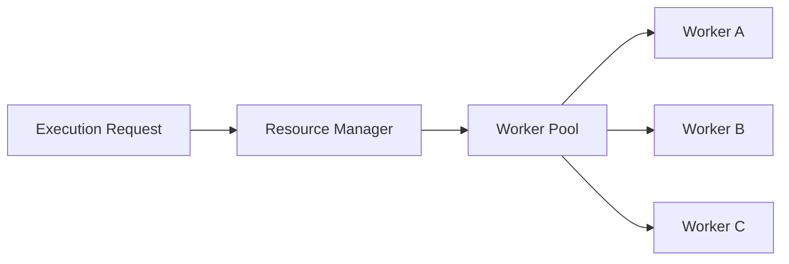
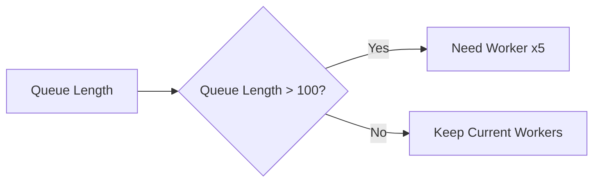
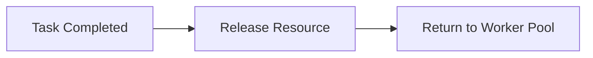

# Resource Manager

> AI Social OS Runtime Kernel

Version: 2.0.0

Status: Draft

Last Updated: 2026-07-25

---

# Table of Contents

- Overview
- Why Resource Manager
- Responsibilities
- Architecture
- Resource Types
- Resource Lifecycle
- Allocation
- Reservation
- Scheduling
- Quota Management
- Cost Management
- Health Monitoring
- Failover
- Autoscaling
- Design Decisions

---

# Overview

Resource Manager chịu trách nhiệm quản lý toàn bộ tài nguyên mà Runtime sử dụng.

Runtime không trực tiếp sử dụng:

- AI Provider
- Worker
- Queue
- CPU
- Memory
- API Token

Thay vào đó, Runtime sẽ yêu cầu Resource Manager cấp phát tài nguyên phù hợp.

---

# Why Resource Manager

Nếu Runtime gọi trực tiếp Worker.

```mermaid
flowchart LR
```

sẽ xảy ra:

- Worker quá tải
- AI Provider vượt Rate Limit
- Hết Budget
- Không cân bằng tải
- Không thể Scale

Resource Manager giải quyết toàn bộ các vấn đề này.

---

# Responsibilities

Resource Manager chịu trách nhiệm:

- Worker Allocation
- Resource Reservation
- Cost Tracking
- Quota Management
- Health Monitoring
- Provider Selection
- Load Balancing
- Autoscaling Hint
- Resource Release

---

# Architecture



---

# Resource Types



---

# Worker Pool

Worker được quản lý dưới dạng Pool.

```text
Worker Pool

├── LLM Worker

├── Browser Worker

├── Media Worker

├── Python Worker

├── Connector Worker

└── Plugin Worker
```

Runtime không biết Worker nào đang chạy.

---

# Provider Pool

AI Provider cũng được quản lý như Resource.

Ví dụ

```
Claude

GPT

Gemini

OpenRouter

Ollama
```

Mỗi Provider có:

- Status
- Cost
- Rate Limit
- Latency
- Token Usage

---

# Resource Lifecycle



---

# Allocation

Execution yêu cầu Resource.



---

# Reservation

Đối với Task quan trọng.

Runtime có thể giữ trước Resource.

Ví dụ

```mermaid
flowchart LR
```

Reservation giúp tránh phải chờ tài nguyên.

---

# Resource Selection

Worker được chọn dựa trên:

- Availability
- Capability
- Current Load
- Latency
- Cost
- Health Score

---

# Quota Management

Mỗi Workspace có Quota riêng.

Ví dụ

```yaml
workspace:

marketing

daily_tokens:

500000

daily_images:

1000

daily_videos:

50
```

Nếu vượt Quota.

Execution sẽ bị từ chối.

---

# Cost Tracking

Resource Manager theo dõi chi phí.

Ví dụ

| Resource | Cost |
|------------|------|
| Claude | $0.12 |
| GPT | $0.18 |
| Image | $0.05 |
| Video | $0.80 |

Chi phí được gửi sang Analytics.

---

# Token Management

Theo dõi:

- Prompt Tokens
- Completion Tokens
- Cached Tokens
- Embedding Tokens

Ví dụ

```yaml
prompt:

8000

completion:

1500

total:

9500
```

---

# Provider Selection

Nếu có nhiều Provider.

Runtime sẽ chọn theo Policy.

Ví dụ


Selection Criteria

- Cost
- Speed
- Quality
- User Preference
- Workspace Policy

---

# Health Monitoring

Resource Manager theo dõi:

- CPU
- RAM
- Queue Length
- Worker Status
- Provider Latency
- Error Rate

Ví dụ

```
Claude

Health

98%
```

---

# Failover

Nếu Provider lỗi.



Không cần dừng Execution.

---

# Load Balancing

Worker được phân phối đều.



---

# Autoscaling Hint

Resource Manager phát tín hiệu Scale.

Ví dụ


Kubernetes hoặc Docker có thể scale tự động.

---

# Resource Release

Sau khi Task hoàn thành.



Worker quay về trạng thái Available.

---

# Resource Metrics

Theo dõi:

- CPU Usage
- Memory Usage
- GPU Usage
- Queue Time
- Worker Utilization
- Provider Latency
- Cost
- Token Usage

---

# Resource Events

Ví dụ

- ResourceAllocated
- ResourceReleased
- WorkerUnavailable
- ProviderUnavailable
- QuotaExceeded
- BudgetExceeded
- ResourceRecovered

---

# Design Decisions

| Decision | Reason |
|-----------|--------|
| Worker Pool | Scale độc lập |
| Provider Pool | Multi Provider |
| Resource Reservation | Giảm thời gian chờ |
| Quota theo Workspace | Multi-tenant |
| Cost Tracking | Budget Control |
| Health Monitoring | Tự phục hồi |
| Failover | Tăng độ sẵn sàng |
| Resource Release | Tối ưu tài nguyên |

---

# Summary

Resource Manager là thành phần quản lý toàn bộ tài nguyên của AI Social OS Runtime.

Thay vì để Runtime truy cập trực tiếp Worker hoặc AI Provider, Resource Manager đóng vai trò trung gian để:

- cấp phát Worker
- lựa chọn AI Provider
- quản lý Quota
- theo dõi chi phí
- cân bằng tải
- giám sát sức khỏe hệ thống
- thực hiện Failover khi cần

Nhờ Resource Manager, Runtime có thể mở rộng theo chiều ngang, tối ưu chi phí và đảm bảo khả năng hoạt động ổn định ngay cả khi số lượng Execution tăng lên hàng nghìn tác vụ đồng thời.