# Runtime Scheduler

> AI Social OS Runtime Kernel

Version: 2.0.0

Status: Draft

Last Updated: 2026-07-25

---

# Table of Contents

- Overview
- Why Runtime Scheduler
- Responsibilities
- Architecture
- Scheduling Lifecycle
- Scheduling Strategy
- Priority Queue
- Dependency Scheduling
- Delayed Execution
- Cron Execution
- Retry Scheduling
- Distributed Scheduling
- Worker Dispatching
- Failure Recovery
- Design Decisions

---

# Overview

Runtime Scheduler là thành phần chịu trách nhiệm quyết định **Task nào sẽ được chạy, chạy khi nào và chạy ở đâu**.

Planning Engine tạo ra Execution Plan.

Runtime Scheduler biến Execution Plan thành các Task thực sự được thực thi.

Scheduler không thực hiện Business Logic.

Scheduler chỉ điều phối Runtime.

---

# Why Runtime Scheduler

Nếu Runtime chạy tuần tự.

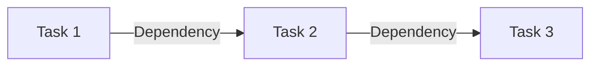

thì:

- Không tận dụng được Parallel Execution
- Worker bị idle
- Throughput thấp
- Không hỗ trợ hàng nghìn Execution

Scheduler giải quyết các vấn đề này.

---

# Responsibilities

Runtime Scheduler chịu trách nhiệm:

- Queue Management
- Task Dispatching
- Priority Scheduling
- Dependency Resolution
- Delayed Execution
- Cron Scheduling
- Retry Scheduling
- Worker Assignment
- Load Distribution
- Backpressure Control

---

# Architecture

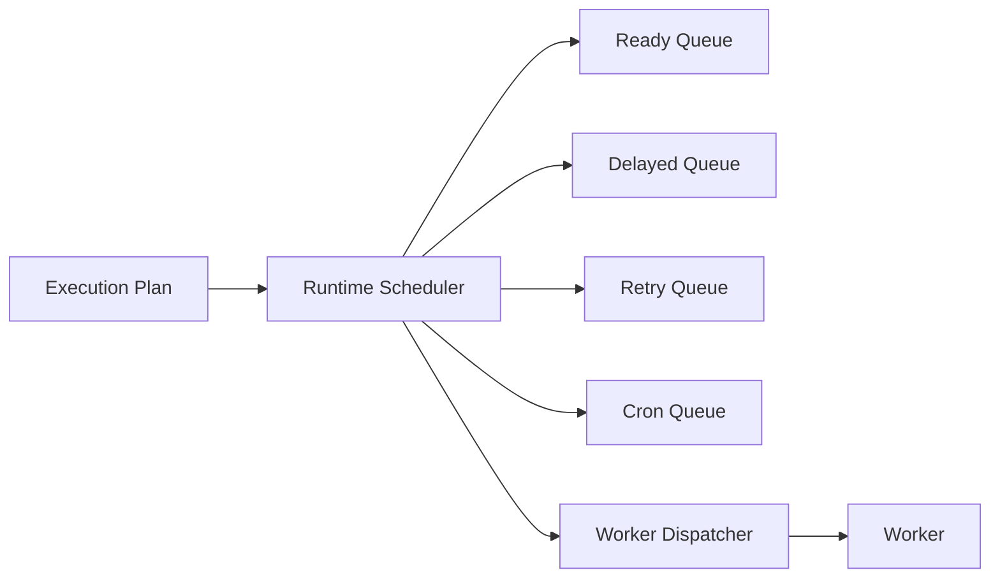

---

# Scheduling Lifecycle

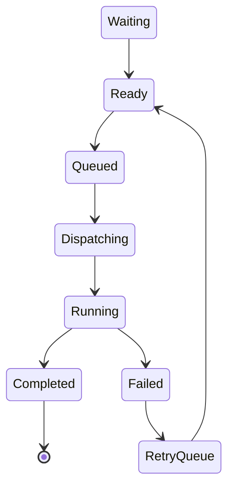

---

# Queue Types

```text
Scheduler

├── Ready Queue

├── Priority Queue

├── Delayed Queue

├── Retry Queue

├── Cron Queue

├── Dead Letter Queue

└── Completed Queue
```

---

# Ready Queue

Các Task đã đủ điều kiện chạy.

Ví dụ

```mermaid
flowchart LR
```

Dispatch Worker

---

# Priority Queue

Task được sắp xếp theo Priority.

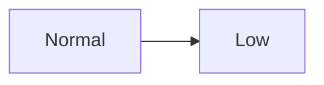

Priority chỉ ảnh hưởng thứ tự lấy Task.

Không thay đổi Execution Plan.

---

# Dependency Scheduling

Task chỉ được đưa vào Ready Queue khi tất cả Dependency đã hoàn thành.

Ví dụ

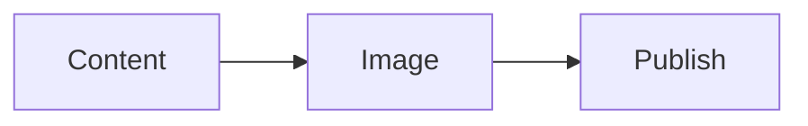

Publish sẽ không xuất hiện trong Queue cho đến khi Image hoàn thành.

---

# Parallel Scheduling

Scheduler tự động chạy song song các Task độc lập.

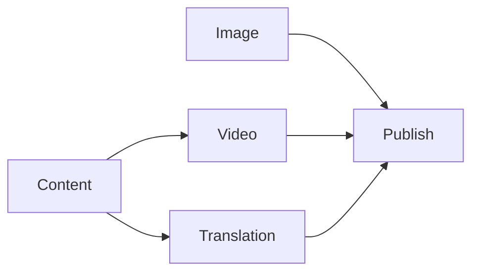

---

# Delayed Execution

Task có thể được lên lịch trong tương lai.

Ví dụ

```yaml
run_at:

2026-07-30T08:00:00+07:00
```

Scheduler giữ Task trong Delayed Queue.

Đến thời điểm phù hợp sẽ chuyển sang Ready Queue.

---

# Cron Execution

Scheduler hỗ trợ Cron.

Ví dụ

```mermaid
flowchart LR
```

Scheduler tạo Execution mới thay vì tái sử dụng Execution cũ.

---

# Retry Scheduling

Task lỗi sẽ được Retry theo Policy.

Ví dụ

```yaml
retry:

max_attempts:

3

strategy:

exponential_backoff
```

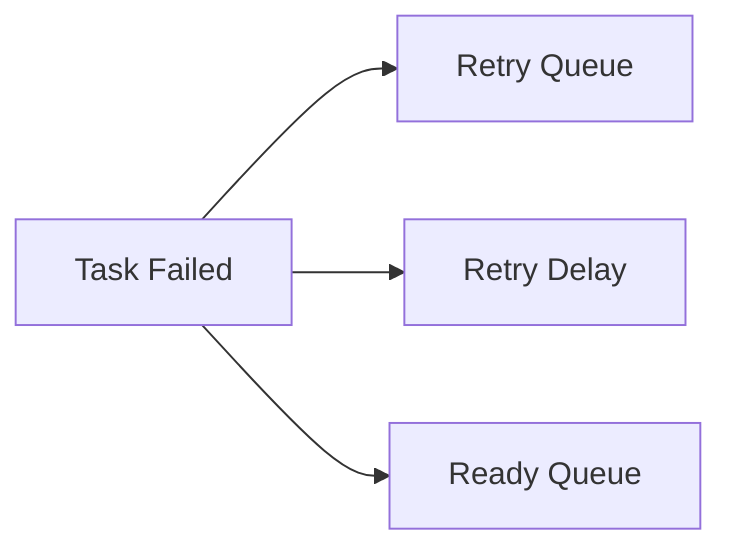

---

# Distributed Scheduling

Nhiều Scheduler Node có thể hoạt động đồng thời.

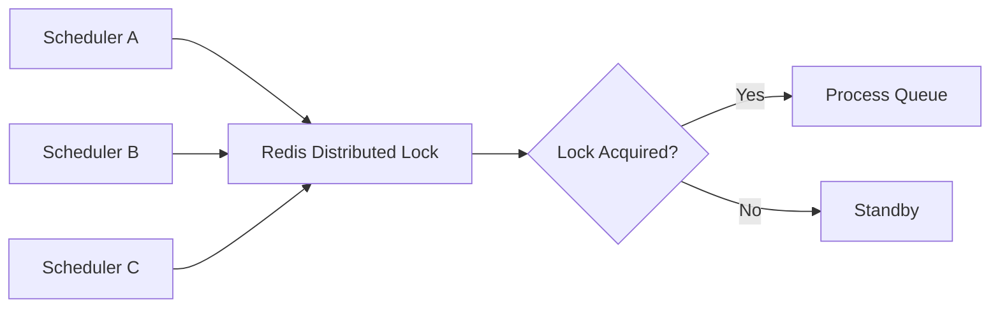

Chỉ một Scheduler được phép lấy một Task.

---

# Worker Dispatching

Scheduler không gọi Worker trực tiếp.

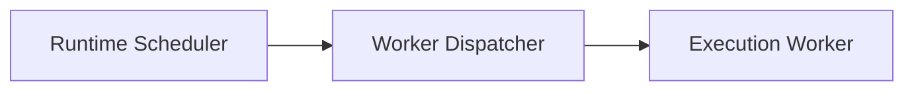

Worker Dispatcher sẽ chọn Worker tối ưu dựa trên:

- Capability
- Availability
- Health Score
- Load
- Policy

---

# Backpressure

Nếu Queue quá lớn.

Scheduler sẽ:

- Giảm tốc độ Dispatch
- Hoãn Task Low Priority
- Chờ Worker rảnh
- Phát tín hiệu Autoscaling

---

# Dead Letter Queue

Task Retry nhiều lần nhưng vẫn thất bại sẽ được chuyển sang Dead Letter Queue.

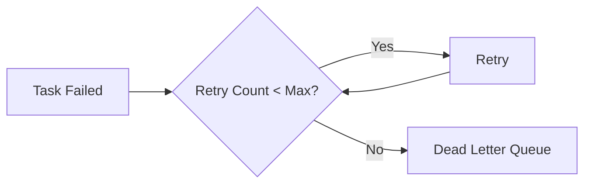

Administrator có thể:

- Retry thủ công
- Xem Log
- Debug
- Hủy Task

---

# Scheduling Policies

Ví dụ

```yaml
max_parallel_tasks:

20

max_execution_per_workspace:

100

max_retry:

5
```

Scheduler tuân thủ Policy Engine.

---

# Task Ordering

Scheduler sử dụng nhiều tiêu chí:

1. Priority
2. Scheduled Time
3. Dependency
4. Workspace Quota
5. Resource Availability

Không chỉ dựa vào FIFO.

---

# Scheduler Metrics

Theo dõi:

- Queue Length
- Waiting Time
- Dispatch Time
- Scheduling Latency
- Retry Count
- Success Rate
- Worker Utilization

---

# Scheduler Events

Ví dụ

- TaskQueued
- TaskDispatched
- TaskStarted
- TaskCompleted
- TaskRetryScheduled
- TaskDelayed
- QueueOverflow
- DeadLetterCreated

---

# Failure Recovery

Nếu Scheduler bị Restart.

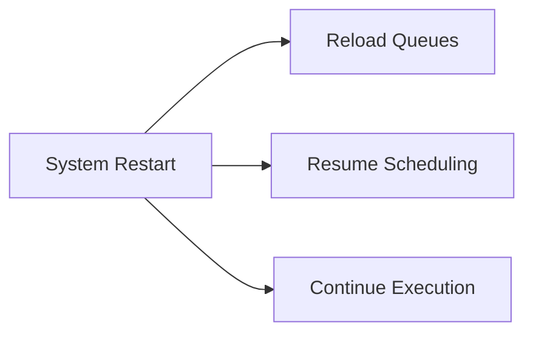

Queue được khôi phục từ Redis hoặc Message Broker.

Không mất Task.

---

# Design Decisions

| Decision | Reason |
|-----------|--------|
| Queue tách theo mục đích | Dễ mở rộng |
| Scheduler không chạy Business Logic | Single Responsibility |
| Distributed Scheduler | Horizontal Scaling |
| Dead Letter Queue | Dễ Debug |
| Retry Queue riêng | Không ảnh hưởng Queue chính |
| Cron sinh Execution mới | Lưu đầy đủ lịch sử |
| Worker Dispatcher độc lập | Giảm Coupling |

---

# Runtime Flow

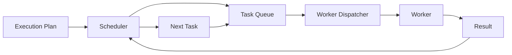

---

# Summary

Runtime Scheduler là bộ điều phối trung tâm của AI Social OS Runtime.

Scheduler chịu trách nhiệm:

- quản lý hàng đợi Task
- lập lịch thực thi
- xử lý Dependency
- hỗ trợ Parallel Execution
- thực hiện Cron và Delayed Task
- Retry theo Policy
- phân phối Task tới Worker Dispatcher

Thiết kế này giúp Runtime có thể xử lý hàng triệu Task theo mô hình phân tán, đảm bảo hiệu năng, khả năng mở rộng và độ tin cậy cao mà không phụ thuộc vào một Scheduler duy nhất.