# Event Bus

> AI Social OS Runtime Kernel

Version: 2.0.0

Status: Draft

Last Updated: 2026-07-25

---

# Table of Contents

- Overview
- Why Event Bus
- Responsibilities
- Event-Driven Architecture
- Event Lifecycle
- Event Model
- Event Categories
- Event Producers
- Event Consumers
- Event Routing
- Event Persistence
- Event Replay
- Event Ordering
- Event Versioning
- Failure Handling
- Design Decisions

---

# Overview

Event Bus là trung tâm giao tiếp của toàn bộ AI Social OS.

Mọi thay đổi trong Runtime đều được biểu diễn dưới dạng Event.

Thay vì các module gọi trực tiếp nhau.

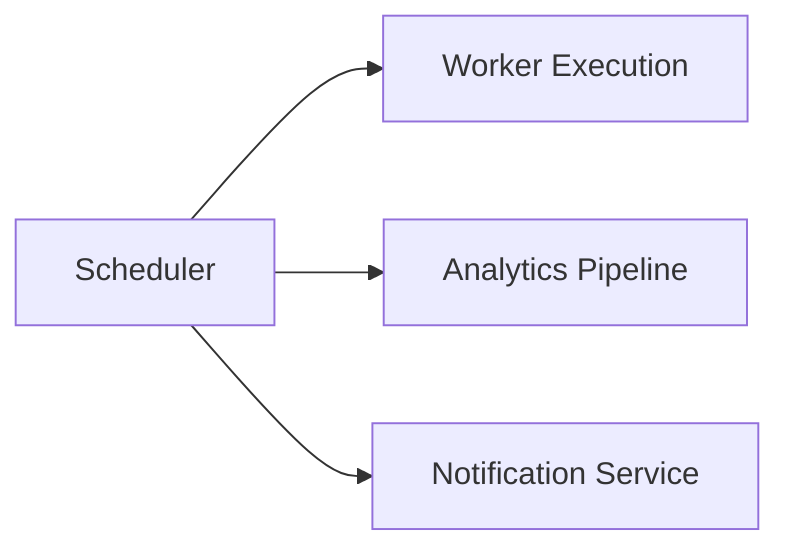

Runtime chỉ phát Event.

Các module khác tự đăng ký lắng nghe.

---

# Why Event Bus

Nếu các module gọi trực tiếp nhau.

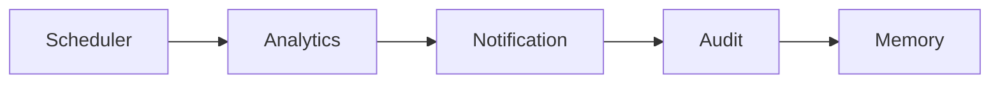

hệ thống sẽ bị Coupling rất lớn.

Thay vào đó.

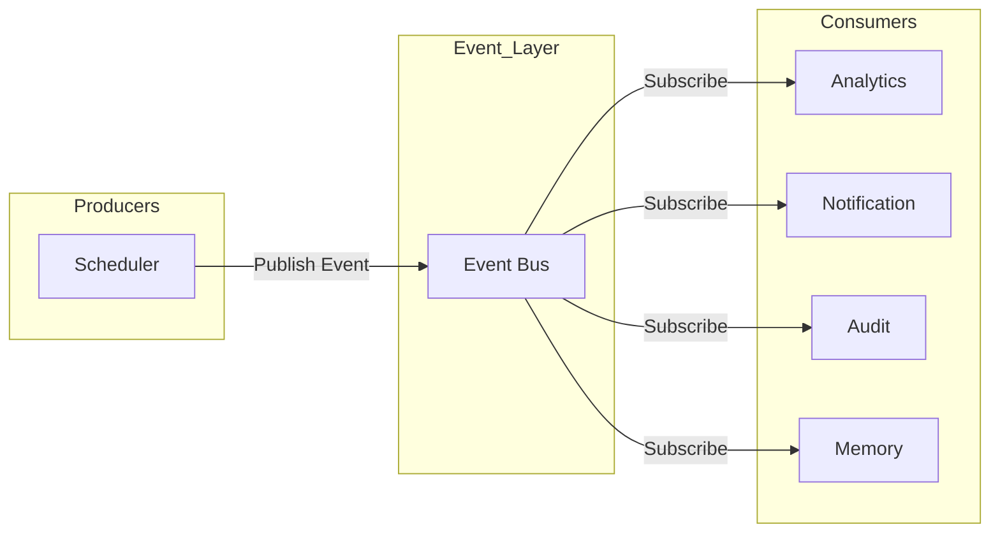

Mỗi module hoàn toàn độc lập.

---

# Responsibilities

Event Bus chịu trách nhiệm:

- Publish Event
- Subscribe Event
- Route Event
- Persist Event
- Replay Event
- Retry Delivery
- Dead Letter Queue
- Event Ordering
- Event Versioning

---

# Architecture

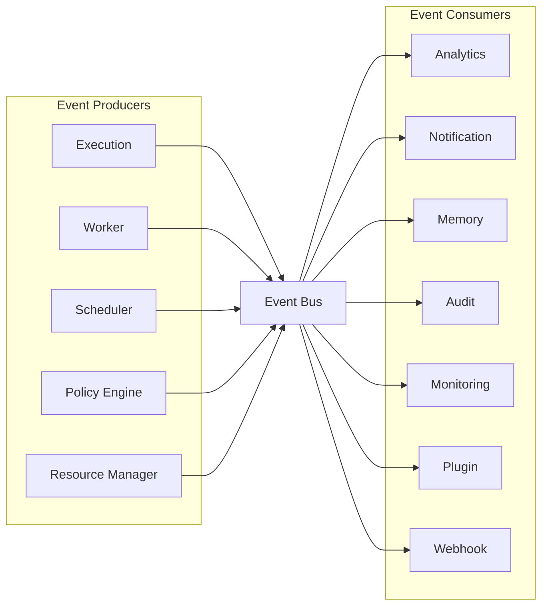

---

# Event Lifecycle

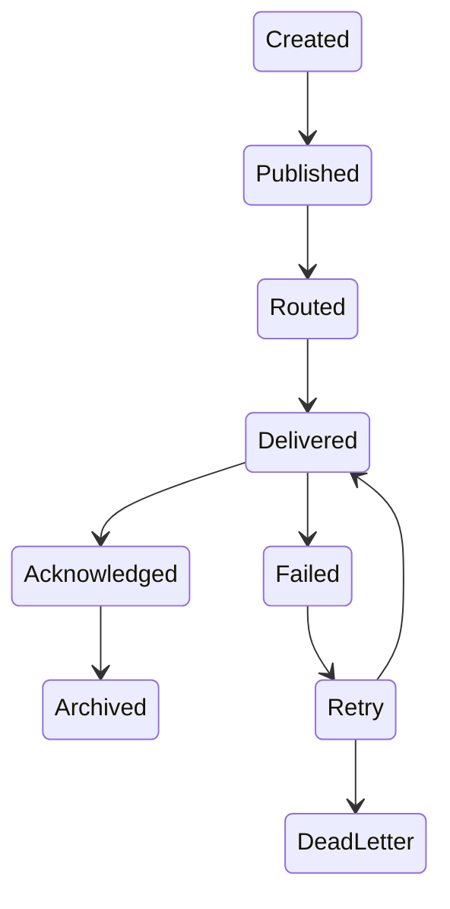

---

# Event Model

```typescript
Event

├── id

├── type

├── source

├── executionId

├── taskId

├── timestamp

├── version

├── payload

├── metadata

└── correlationId
```

---

# Event Categories

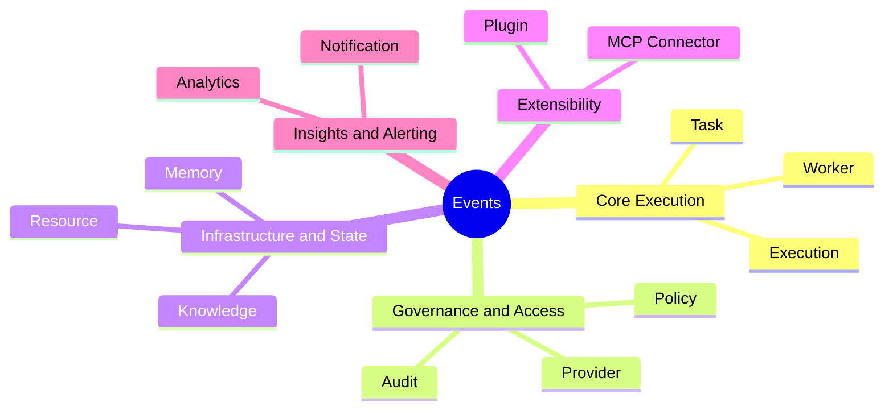

---

# Execution Events

Ví dụ

- ExecutionCreated
- ExecutionStarted
- ExecutionPaused
- ExecutionResumed
- ExecutionCompleted
- ExecutionFailed
- ExecutionCancelled

---

# Task Events

Ví dụ

- TaskQueued
- TaskStarted
- TaskCompleted
- TaskFailed
- TaskRetry
- TaskTimeout

---

# Worker Events

Ví dụ

- WorkerAssigned
- WorkerReleased
- WorkerUnavailable
- WorkerRecovered

---

# Provider Events

Ví dụ

- ProviderSelected
- ProviderFailed
- ProviderRecovered
- ProviderRateLimited

---

# Policy Events

Ví dụ

- PolicyApproved
- PolicyDenied
- BudgetExceeded
- ApprovalRequired

---

# Resource Events

Ví dụ

- ResourceAllocated
- ResourceReleased
- QuotaExceeded
- CostUpdated

---

# Event Producers

Các module phát Event.

```text
Planning Engine

Scheduler

Worker

Policy Engine

Resource Manager

Memory Engine

Connector

Plugin Runtime
```

---

# Event Consumers

Các module lắng nghe Event.

```text
Analytics

Audit

Notification

Monitoring

Memory

Plugin Runtime

Webhook

Dashboard
```

---

# Event Routing

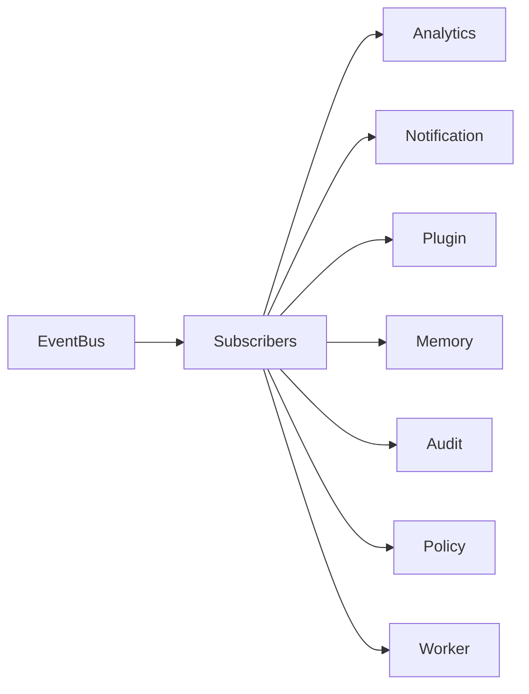

Một Event có thể được nhiều Consumer xử lý đồng thời.

---

# Event Persistence

Toàn bộ Event được lưu lại.

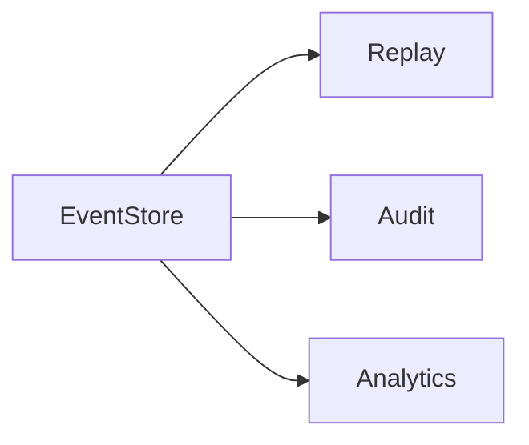

Event Store phục vụ:

- Audit
- Replay
- Debug
- Analytics

---

# Event Replay

Có thể phát lại toàn bộ Event.

Ví dụ

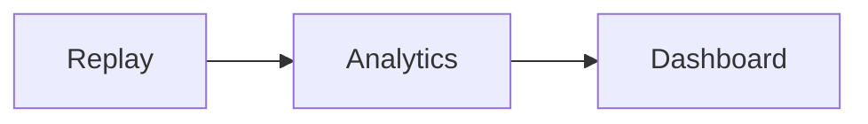

Không cần chạy lại Execution.

---

# Event Ordering

Trong cùng một Execution.

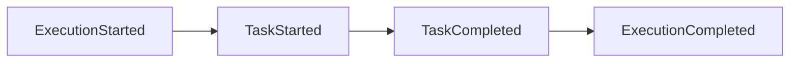

Thứ tự Event phải được giữ nguyên.

---

# Correlation ID

Mỗi Event đều có Correlation ID.

Ví dụ

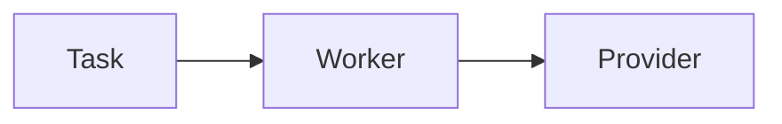

Tất cả Event thuộc cùng Execution dùng chung Correlation ID.

Điều này giúp Trace toàn bộ Runtime.

---

# Event Versioning

Ví dụ

```yaml
ExecutionCompleted

version:

2
```

Consumer vẫn xử lý được Event cũ.

---

# Delivery Guarantee

Runtime hướng tới:

```
At Least Once Delivery
```

Consumer phải Idempotent.

Ví dụ

```mermaid
flowchart LR
```

---

# Dead Letter Queue

Nếu Consumer xử lý thất bại nhiều lần.

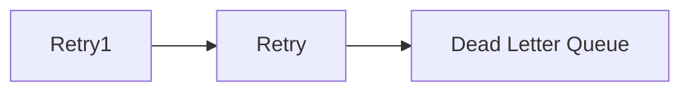

Administrator có thể Replay sau.

---

# Event Security

Payload có thể chứa dữ liệu nhạy cảm.

Runtime phải:

- Mask Secret
- Encrypt Sensitive Data
- Sign Internal Event
- Validate Event Source

---

# Event Metrics

Theo dõi:

- Publish Rate
- Delivery Latency
- Retry Count
- Dead Letter Count
- Consumer Lag
- Queue Length

---

# Example

Execution

```
Đăng bài Facebook
```

Event Flow

```mermaid
flowchart LR
```

---

# Design Decisions

| Decision | Reason |
|-----------|--------|
| Event Driven | Loose Coupling |
| Event Store | Replay & Audit |
| Correlation ID | Distributed Tracing |
| At Least Once | Reliability |
| Dead Letter Queue | Error Recovery |
| Versioning | Backward Compatibility |
| Multiple Consumers | High Scalability |

---

# Runtime Flow

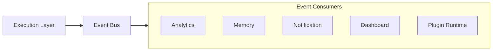

---

# Summary

Event Bus là xương sống giao tiếp của AI Social OS Runtime.

Mọi thay đổi trong hệ thống đều được biểu diễn bằng Event và được phân phối tới các module liên quan theo mô hình Publish/Subscribe.

Nhờ Event Bus, AI Social OS đạt được:

- Loose Coupling
- Event Sourcing
- Distributed Tracing
- Replay
- Audit
- Horizontal Scaling
- Plugin Extensibility

Event Bus là nền tảng để toàn bộ Runtime hoạt động theo kiến trúc Event-Driven hiện đại, cho phép mở rộng hệ thống mà không làm tăng sự phụ thuộc giữa các thành phần.