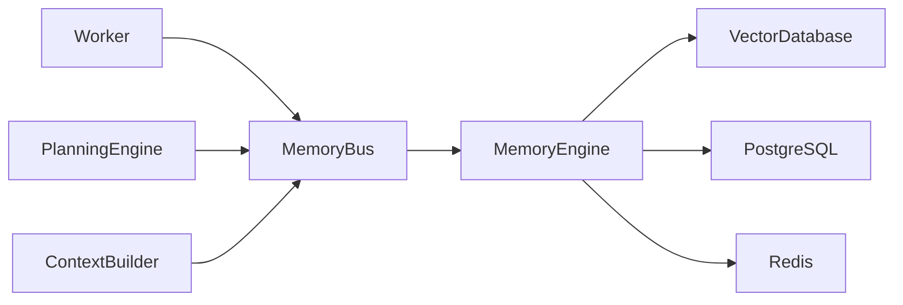
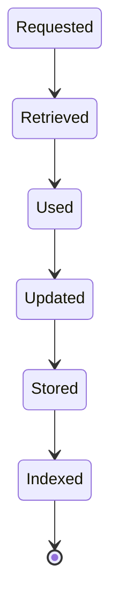
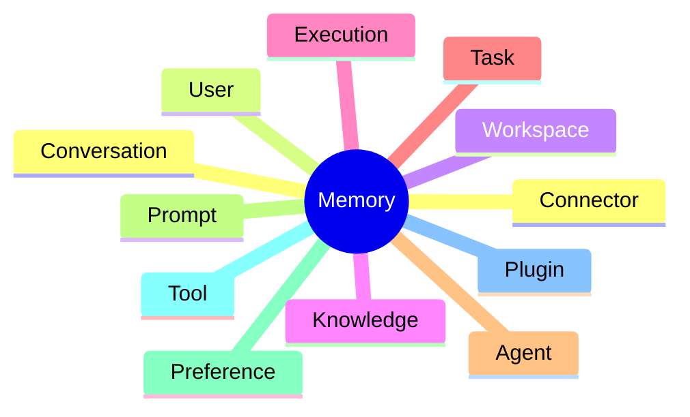
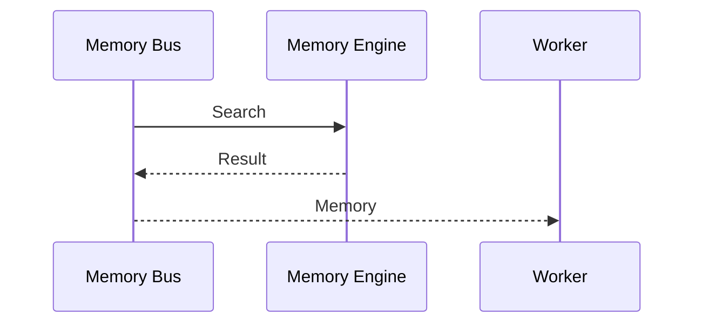
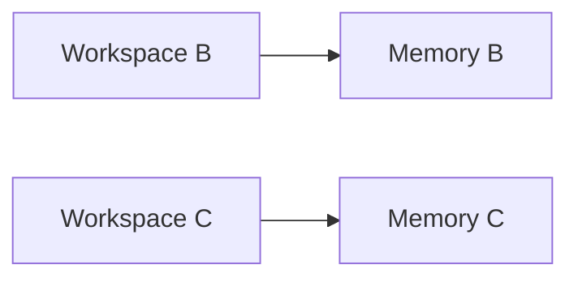
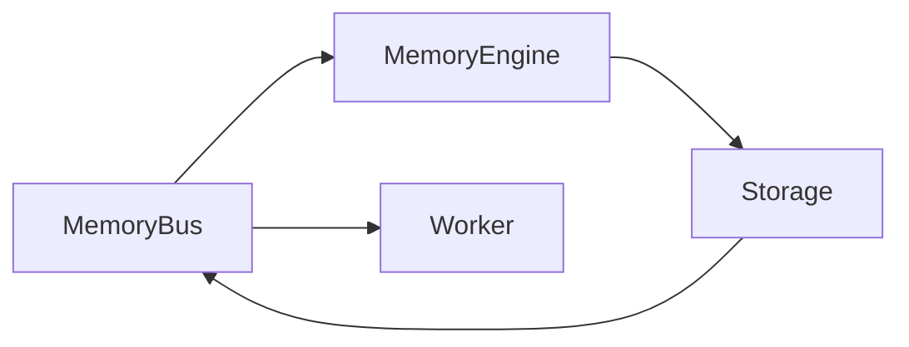

# Memory Bus

> AI Social OS Runtime Kernel

Version: 2.0.0

Status: Draft

Last Updated: 2026-07-25

---

# Table of Contents

- Overview
- Why Memory Bus
- Responsibilities
- Architecture
- Memory Lifecycle
- Memory Types
- Memory Sources
- Memory Retrieval
- Memory Update
- Memory Consolidation
- Memory Expiration
- Memory Security
- Design Decisions

---

# Overview

Memory Bus là thành phần chịu trách nhiệm quản lý luồng dữ liệu giữa Runtime và Memory System.

Memory Bus không lưu Memory.

Memory Bus chỉ điều phối việc:

- đọc Memory
- ghi Memory
- cập nhật Memory
- đồng bộ Memory
- phát Event liên quan đến Memory

Memory Bus đóng vai trò cầu nối giữa Runtime và Memory Engine.

---

# Why Memory Bus

Nếu Worker tự đọc Memory.

```mermaid
flowchart LR
```

thì:

- Worker phụ thuộc Database
- Khó thay đổi Memory Backend
- Không Cache
- Không Version
- Không Audit

Thay vào đó.

```mermaid
flowchart LR
```

Worker hoàn toàn không biết Memory được lưu ở đâu.

---

# Responsibilities

Memory Bus chịu trách nhiệm:

- Memory Retrieval
- Memory Update
- Memory Synchronization
- Memory Cache
- Memory Versioning
- Memory Events
- Memory Deduplication
- Memory Routing

---

# Architecture



---

# Memory Lifecycle



---

# Memory Categories



---

# Conversation Memory

Ví dụ

```mermaid
flowchart LR
```

---

# User Memory

Ví dụ

```
Preferred Language

vi

Preferred Provider

Claude

Preferred Tone

Professional
```

---

# Workspace Memory

Ví dụ

```
Brand Voice

Company Style

Posting Rule

Timezone
```

---

# Execution Memory

Ví dụ

```
Execution ID

Previous Outputs

Generated Images

Temporary Files
```

Execution Memory chỉ tồn tại trong vòng đời Execution.

---

# Task Memory

Ví dụ

```
Task Output

Intermediate Result

Temporary Context
```

Task Memory sẽ bị giải phóng sau khi Execution hoàn tất.

---

# Knowledge Memory

Bao gồm:

- Vector Embedding
- Document Chunk
- FAQ
- SOP
- Internal Wiki

Memory Bus chỉ chuyển tiếp yêu cầu.

Knowledge Engine xử lý Retrieval.

---

# Prompt Memory

Ví dụ

```
Prompt Template

Few-shot Example

System Prompt
```

---

# Memory Retrieval



Worker không truy cập trực tiếp Database.

---

# Memory Update

Sau khi Task hoàn thành.


Memory được cập nhật bất đồng bộ.

---

# Memory Consolidation

Runtime có thể tạo nhiều Memory giống nhau.

Ví dụ


Memory Bus sẽ:

- Merge
- Remove Duplicate
- Normalize

---

# Memory Version

Memory có Version.

```mermaid
flowchart LR
```

Giúp:

- Rollback
- Audit
- Replay

---

# Memory Cache

Memory thường dùng được Cache.


Giảm thời gian truy vấn.

---

# Memory Expiration

Không phải Memory nào cũng tồn tại vĩnh viễn.

Ví dụ

| Memory | TTL |
|----------|------|
| Execution | 24 giờ |
| Task | 2 giờ |
| Cache | 30 phút |
| User Preference | Không hết hạn |
| Brand Guideline | Không hết hạn |

---

# Memory Indexing

Sau khi ghi.

Memory sẽ được Index.


---

# Memory Events

Ví dụ

- MemoryCreated
- MemoryUpdated
- MemoryDeleted
- MemoryExpired
- MemoryIndexed
- MemoryMerged

Các Event được phát lên Event Bus.

---

# Memory Security

Memory có thể chứa dữ liệu nhạy cảm.

Runtime phải:

- Encrypt
- Mask Secret
- Permission Check
- Workspace Isolation
- Audit Access

---

# Workspace Isolation

Memory không được chia sẻ giữa Workspace.



---

# Failure Handling

Nếu Memory Engine lỗi.

Runtime có thể:

- Retry
- Cache Fallback
- Continue Without Memory
- Human Approval

Không làm dừng toàn bộ Runtime nếu Memory không bắt buộc.

---

# Metrics

Theo dõi:

- Cache Hit Rate
- Query Latency
- Memory Size
- Embedding Count
- Index Time
- Retrieval Time

---

# Design Decisions

| Decision | Reason |
|-----------|--------|
| Memory Bus độc lập | Giảm Coupling |
| Worker không truy cập DB | Dễ mở rộng |
| Cache Layer | Hiệu năng |
| Versioning | Audit |
| TTL theo loại Memory | Tiết kiệm tài nguyên |
| Memory Event | Đồng bộ hệ thống |
| Workspace Isolation | Multi-tenant |

---

# Runtime Flow



---

# Summary

Memory Bus là lớp trung gian giữa Runtime và Memory System.

Thành phần này chịu trách nhiệm điều phối toàn bộ hoạt động đọc, ghi và đồng bộ Memory mà không để Worker hoặc Runtime phụ thuộc trực tiếp vào cơ chế lưu trữ.

Nhờ Memory Bus, AI Social OS có thể:

- tái sử dụng tri thức giữa nhiều Execution
- quản lý Memory theo Version và TTL
- tối ưu hiệu năng thông qua Cache
- đảm bảo cô lập dữ liệu giữa các Workspace
- hỗ trợ Audit, Replay và mở rộng sang nhiều Memory Backend trong tương lai