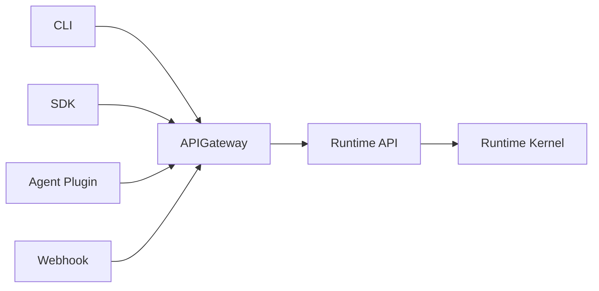
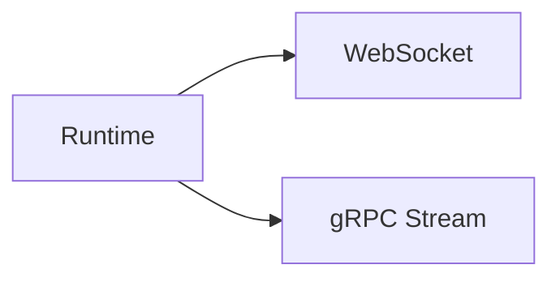
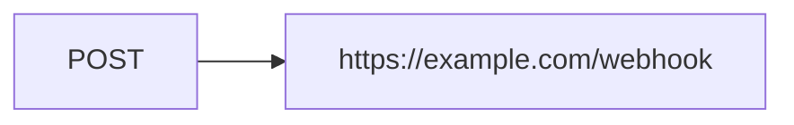
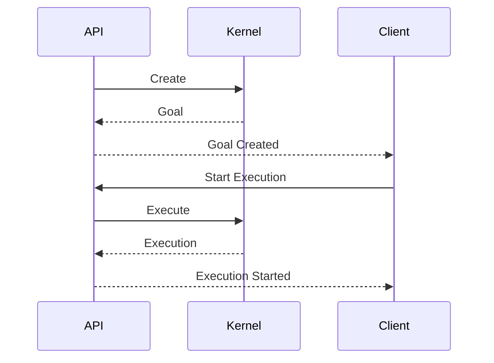

# Runtime API

> AI Social OS Runtime Kernel

Version: 2.0.0

Status: Draft

Last Updated: 2026-07-25

---

# Table of Contents

- Overview
- Design Principles
- API Architecture
- Authentication
- API Versioning
- Goal API
- Execution API
- Task API
- Scheduler API
- Event API
- Memory API
- Capability API
- Runtime Control API
- Streaming API
- Webhook API
- Error Response
- API Lifecycle

---

# Overview

Runtime API là lớp giao tiếp giữa Client và Runtime Kernel.

Toàn bộ UI, CLI, SDK, Agent và Plugin đều tương tác với Runtime thông qua Runtime API.

Runtime API không chứa Business Logic.

Mọi request đều được chuyển đến Runtime Kernel.

---

# Architecture



---

# Design Principles

Runtime API được thiết kế theo các nguyên tắc:

- REST First
- Event Driven
- Async Friendly
- Idempotent
- Versioned
- Stateless
- Secure
- Observable

---

# API Versioning

```
/api/v1/runtime
```

Ví dụ

```
POST /api/v1/goals

GET /api/v1/executions

POST /api/v1/tasks

GET /api/v1/events
```

---

# Authentication

Tất cả API đều yêu cầu Access Token.

Ví dụ

```
Authorization

Bearer <ACCESS_TOKEN>
```

Runtime hỗ trợ

- JWT
- OAuth2
- API Key
- Service Token

---

# Goal API

## Create Goal

```
POST /goals
```

Request

```json
{
  "title": "Daily AI Post",
  "objective": "Write Facebook post every morning",
  "schedule": "0 8 * * *"
}
```

Response

```json
{
  "goalId": "...",
  "status": "CREATED"
}
```

---

## Get Goal

```
GET /goals/{goalId}
```

---

## Update Goal

```
PATCH /goals/{goalId}
```

---

## Delete Goal

```
DELETE /goals/{goalId}
```

---

# Execution API

## Start Execution

```
POST /executions
```

Request

```json
{
  "goalId": "...",
  "inputs": {}
}
```

---

## Get Execution

```
GET /executions/{executionId}
```

---

## List Executions

```
GET /executions
```

Query

```
status

workspace

owner

date

priority
```

---

## Cancel Execution

```
POST /executions/{id}/cancel
```

---

## Pause Execution

```
POST /executions/{id}/pause
```

---

## Resume Execution

```
POST /executions/{id}/resume
```

---

# Task API

## List Tasks

```
GET /executions/{id}/tasks
```

---

## Retry Task

```
POST /tasks/{taskId}/retry
```

---

## Cancel Task

```
POST /tasks/{taskId}/cancel
```

---

## Task Logs

```
GET /tasks/{taskId}/logs
```

---

# Scheduler API

## Schedule Execution

```
POST /scheduler
```

---

## List Scheduled Jobs

```
GET /scheduler
```

---

## Disable Schedule

```
PATCH /scheduler/{id}
```

---

# Event API

## List Events

```
GET /events
```

---

## Get Event

```
GET /events/{id}
```

---

## Replay Event

```
POST /events/{id}/replay
```

---

# Memory API

## Search Memory

```
POST /memory/search
```

---

## List Memories

```
GET /memory
```

---

## Delete Memory

```
DELETE /memory/{id}
```

---

# Capability API

## List Capabilities

```
GET /capabilities
```

---

## Get Capability

```
GET /capabilities/{id}
```

---

## Refresh Registry

```
POST /capabilities/refresh
```

---

# Runtime Control API

## Health

```
GET /runtime/health
```

---

## Metrics

```
GET /runtime/metrics
```

---

## Workers

```
GET /runtime/workers
```

---

## Providers

```
GET /runtime/providers
```

---

## Queue Status

```
GET /runtime/queues
```

---

# Streaming API

Runtime hỗ trợ Streaming.



Ví dụ

```
GET /executions/{id}/stream
```

Client nhận

```mermaid
flowchart LR
```

---

# Webhook API

Runtime có thể phát Webhook.

Ví dụ



Payload

```json
{
  "event": "ExecutionCompleted",
  "executionId": "...",
  "status": "SUCCESS"
}
```

---

# Pagination

Danh sách lớn sử dụng Cursor Pagination.

Ví dụ

```
GET /executions

?cursor=...

&limit=50
```

---

# Filtering

Ví dụ

```
GET /executions

?status=RUNNING

&workspace=marketing

&priority=HIGH
```

---

# Error Response

Tất cả lỗi có format thống nhất.

```json
{
  "code": "EXECUTION_NOT_FOUND",
  "message": "Execution does not exist.",
  "requestId": "...",
  "timestamp": "..."
}
```

---

# Status Codes

| Code | Meaning |
|--------|----------|
| 200 | Success |
| 201 | Created |
| 202 | Accepted |
| 400 | Bad Request |
| 401 | Unauthorized |
| 403 | Forbidden |
| 404 | Not Found |
| 409 | Conflict |
| 422 | Validation Error |
| 429 | Rate Limited |
| 500 | Internal Error |

---

# Idempotency

Một số API hỗ trợ

```
Idempotency-Key
```

Ví dụ

```
POST /executions
```

Nếu Client retry.

Execution sẽ không bị tạo hai lần.

---

# API Lifecycle



---

# Security

Runtime API hỗ trợ

- HTTPS Only
- JWT Authentication
- API Key
- Rate Limiting
- Audit Logging
- RBAC
- Workspace Isolation

---

# Observability

Mỗi Request có

- Request ID
- Trace ID
- Correlation ID
- Execution ID

Giúp theo dõi toàn bộ vòng đời của một Execution.

---

# Design Decisions

| Decision | Reason |
|-----------|--------|
| REST First | Dễ tích hợp |
| Streaming riêng | Realtime UI |
| Idempotent | An toàn khi Retry |
| Cursor Pagination | Scale tốt |
| Versioned API | Tương thích lâu dài |
| Runtime Control API | Vận hành hệ thống |
| Webhook | Tích hợp hệ thống ngoài |

---

# Summary

Runtime API là cổng giao tiếp chính giữa các Client và Runtime Kernel.

API cung cấp đầy đủ khả năng quản lý Goal, Execution, Task, Memory, Event và Capability, đồng thời hỗ trợ Streaming, Webhook và Runtime Control.

Thiết kế này giúp AI Social OS có thể phục vụ Web App, Desktop App, Mobile App, CLI, SDK và các Agent bên thứ ba thông qua một giao diện API thống nhất, ổn định và dễ mở rộng.