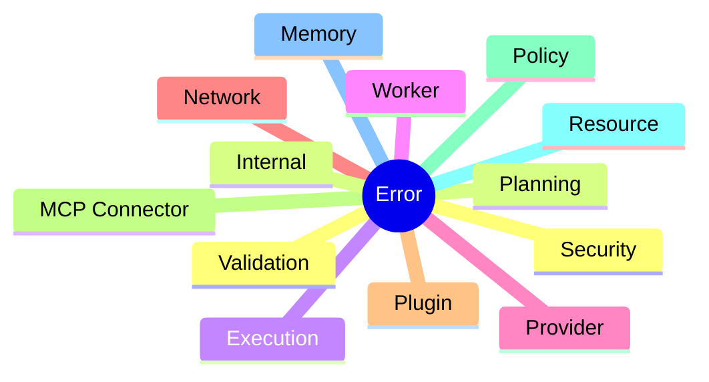
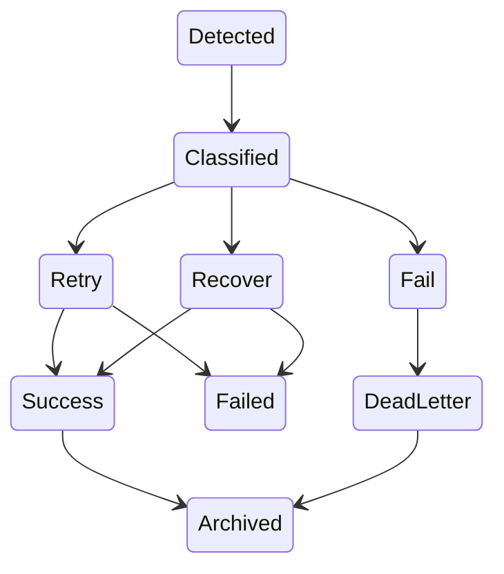
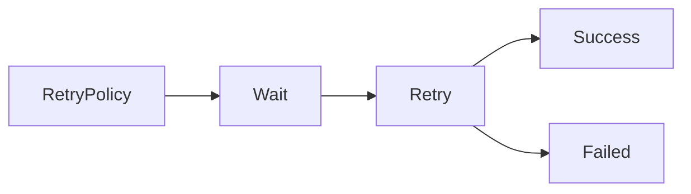
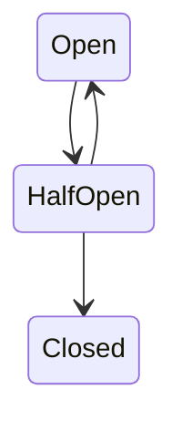
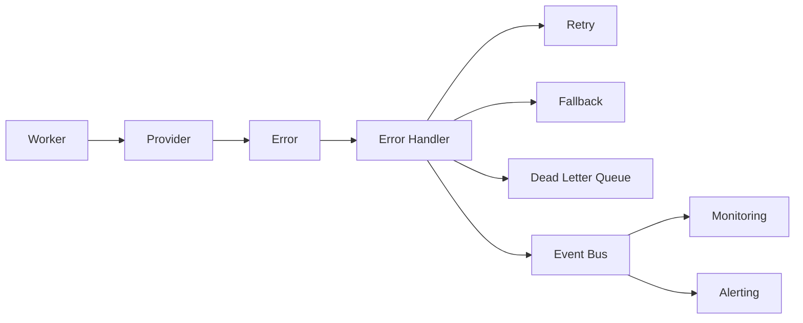

# Error Handling

> AI Social OS Runtime Kernel

Version: 2.0.0

Status: Draft

Last Updated: 2026-07-25

---

# Table of Contents

- Overview
- Design Principles
- Error Taxonomy
- Error Lifecycle
- Error Classification
- Retry Strategy
- Fallback Strategy
- Circuit Breaker
- Dead Letter Queue
- Recovery
- Error Propagation
- Error Reporting
- Monitoring
- Design Decisions

---

# Overview

Error Handling chịu trách nhiệm đảm bảo Runtime có thể xử lý lỗi một cách an toàn, có khả năng phục hồi và không làm gián đoạn toàn bộ hệ thống.

Mục tiêu không phải là loại bỏ hoàn toàn lỗi.

Mục tiêu là:

- Detect
- Isolate
- Retry
- Recover
- Observe
- Audit

---

# Design Principles

Runtime tuân theo các nguyên tắc:

- Fail Fast
- Retry Smart
- Graceful Degradation
- Observable
- Recoverable
- Idempotent
- Never Lose Execution State

---

# Error Taxonomy



---

# Error Lifecycle



---

# Error Classification

## Validation Error

Ví dụ

- Missing Goal
- Invalid Input
- Invalid Schedule

Retry

```
No
```

---

## Planning Error

Ví dụ

- Intent Resolution Failed
- Capability Not Found

Retry

```
Sometimes
```

---

## Provider Error

Ví dụ

- Claude Timeout
- GPT Rate Limited
- Gemini Unavailable

Retry

```
Yes
```

Fallback

```
Another Provider
```

---

## Worker Error

Ví dụ

- Worker Crash
- Worker Timeout
- Out of Memory

Retry

```
Yes
```

---

## Network Error

Ví dụ

- DNS Error
- HTTP Timeout
- TLS Error

Retry

```
Yes
```

---

## Connector Error

Ví dụ

- Facebook API Error
- YouTube API Error
- Telegram API Error

Retry

```
Depends
```

---

## Policy Error

Ví dụ

- Permission Denied
- Budget Exceeded
- Approval Required

Retry

```
No
```

---

## Resource Error

Ví dụ

- No Worker Available
- GPU Exhausted
- Queue Full

Retry

```
Yes
```

---

## Plugin Error

Ví dụ

- Plugin Crash
- Plugin Panic
- Invalid Manifest

Plugin sẽ bị cô lập khỏi Runtime.

---

## MCP Error

Ví dụ

- MCP Server Offline
- Invalid Tool
- Timeout

Fallback

```mermaid
flowchart LR
```

---

# Error Severity

| Level | Description |
|--------|-------------|
| INFO | Thông tin |
| WARNING | Có vấn đề nhỏ |
| ERROR | Một Task thất bại |
| CRITICAL | Execution không thể tiếp tục |
| FATAL | Runtime cần dừng |

---

# Retry Strategy

Retry được cấu hình theo từng Capability.

Ví dụ

```yaml
retry:

max_attempts: 3

backoff: exponential

max_delay: 60s
```

---

# Retry Flow



---

# Fallback Strategy

Nếu Retry không thành công.

Runtime thử Fallback.

Ví dụ


---

# Circuit Breaker

Nếu một Provider lỗi liên tục.



Provider sẽ tạm thời bị loại khỏi Resource Pool.

---

# Dead Letter Queue

Task không thể Recover.


Administrator có thể:

- Replay
- Debug
- Delete
- Force Retry

---

# Recovery

Runtime luôn ưu tiên Resume thay vì Restart.


---

# Error Propagation

Lỗi được lan truyền theo chiều dọc.

```mermaid
flowchart LR
```

Mỗi tầng đều bổ sung Context.

---

# Error Context

Mỗi Error đều chứa:

```yaml
errorId:

executionId:

taskId:

workerId:

provider:

traceId:

correlationId:

timestamp:

stack:

metadata:
```

---

# User-Friendly Error

Internal Error

```
ProviderTimeoutException
```

```mermaid
flowchart LR
```

```
AI Provider is temporarily unavailable.
Please try again later.
```

Không để lộ Stack Trace.

---

# Monitoring

Runtime theo dõi:

- Error Rate
- Retry Rate
- Recovery Rate
- Dead Letter Count
- Provider Failure
- Plugin Failure
- Queue Failure

---

# Error Events

Ví dụ

- ExecutionFailed
- TaskFailed
- RetryScheduled
- RetryCompleted
- ProviderUnavailable
- WorkerCrashed
- PluginDisabled
- DeadLetterCreated

---

# Alerting

Một số Error sẽ tạo Alert.

Ví dụ

| Error | Alert |
|--------|-------|
| Provider Down | Yes |
| Queue Full | Yes |
| Budget Exceeded | Optional |
| Plugin Crash | Yes |
| Validation Error | No |

---

# Audit

Toàn bộ Error đều được ghi vào Audit Log.

Ví dụ

```yaml
Execution:

ex-001

Task:

task-001

Error:

ProviderTimeout

Recovered:

true
```

---

# Design Decisions

| Decision | Reason |
|-----------|--------|
| Retry theo Task | Không ảnh hưởng toàn bộ Execution |
| Circuit Breaker | Tránh lặp lỗi |
| Dead Letter Queue | Không mất Task |
| Snapshot Recovery | Resume nhanh |
| Error Context đầy đủ | Debug dễ dàng |
| User-friendly Message | Bảo mật |
| Event cho mọi Error | Quan sát hệ thống |

---

# Runtime Flow



---

# Summary

Error Handling là lớp đảm bảo khả năng phục hồi của AI Social OS Runtime.

Thay vì coi lỗi là trạng thái kết thúc, Runtime xem lỗi là một phần bình thường của quá trình thực thi và cố gắng xử lý thông qua Retry, Fallback, Recovery hoặc Dead Letter Queue.

Thiết kế này giúp hệ thống:

- không mất Execution
- tự động phục hồi khi có thể
- giảm phụ thuộc vào AI Provider
- dễ giám sát và kiểm toán
- hỗ trợ vận hành ở quy mô lớn với độ tin cậy cao

Sau khi hoàn thành tài liệu này, toàn bộ thư mục `kernel/` được hoàn thiện và Runtime Kernel đã có đầy đủ đặc tả về Goal, Execution, Context, State, Planning, Capability, Policy, Resource, Scheduling, Event, Memory, API và Error Handling.