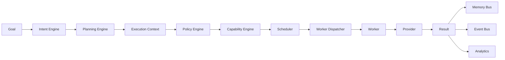
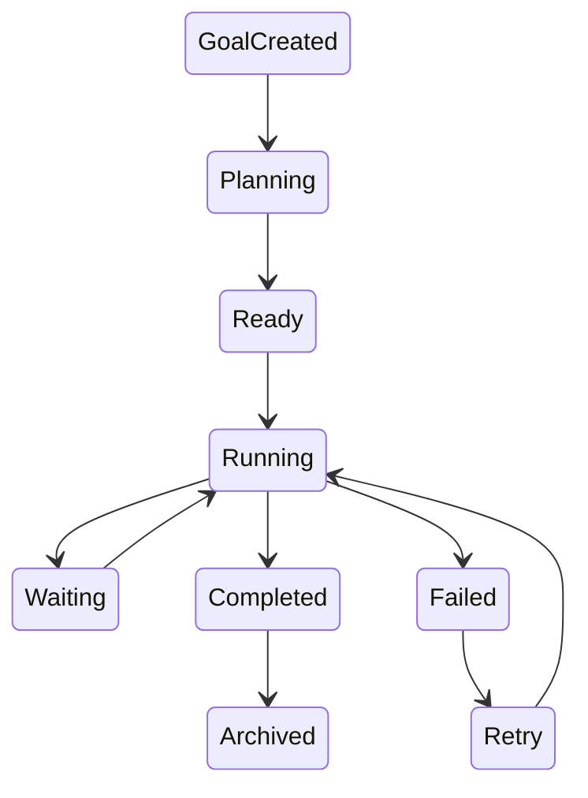

# Runtime Kernel

> AI Social OS Kernel Documentation

Version: 2.0.0

Status: Draft

---

# Overview

Kernel là trái tim của AI Social OS.

Khác với các Workflow Engine (n8n, Make, Zapier), Kernel không thực thi một DAG cố định.

Kernel nhận Goal từ người dùng, tự xây dựng Execution Plan và điều phối toàn bộ quá trình thực thi.

Kernel chịu trách nhiệm cho:

- Goal Management
- Execution Lifecycle
- Planning
- Scheduling
- Capability Resolution
- Context Building
- State Management
- Event Dispatching
- Resource Allocation
- Policy Enforcement

Kernel không trực tiếp gọi AI Provider hay Social API.

Mọi thao tác đều thông qua Worker và Gateway.

---

# Documentation Structure

```
kernel/

├── README.md
│
├── 01_GOAL_MODEL.md
├── 02_EXECUTION_MODEL.md
├── 03_EXECUTION_CONTEXT.md
├── 04_STATE_MACHINE.md
├── 05_INTENT_ENGINE.md
├── 06_PLANNING_ENGINE.md
├── 07_CAPABILITY_ENGINE.md
├── 08_POLICY_ENGINE.md
├── 09_RESOURCE_MANAGER.md
├── 10_RUNTIME_SCHEDULER.md
├── 11_EVENT_BUS.md
├── 12_MEMORY_BUS.md
├── 13_RUNTIME_API.md
└── 14_ERROR_HANDLING.md
```

---

# Runtime Architecture



---

# Kernel Responsibilities

## Goal Management

Quản lý Goal do người dùng tạo.

Ví dụ

- Chat
- Automation
- Campaign
- Scheduled Task

---

## Planning

Chuyển Goal thành Execution Plan.

Ví dụ

```mermaid
flowchart LR
```

---

## Execution

Điều phối toàn bộ Task.

Bao gồm

- Queue
- Retry
- Timeout
- Pause
- Resume
- Cancel

---

## State

Theo dõi trạng thái của từng Execution.

---

## Context

Xây dựng Context từ

- Memory
- Knowledge
- Workspace
- Prompt
- Previous Conversation

---

## Policy

Áp dụng Rule

- Permission
- Approval
- Budget
- Cost
- Retry
- Timeout

---

## Capability

Tìm Worker phù hợp để thực hiện Task.

---

## Resource

Quản lý

- Worker
- Token
- API Quota
- AI Cost

---

## Event

Phát Event cho toàn hệ thống.

---

## Memory

Ghi Memory sau khi Task hoàn thành.

---

# Runtime Lifecycle



---

# Core Design Principles

- Runtime First
- Event Driven
- Goal Driven
- Capability Driven
- Stateless Worker
- Provider Agnostic
- Connector Agnostic
- Plugin Extensible
- Observable
- Recoverable

---

# Documentation Order

Đọc theo thứ tự sau:

1. Goal Model
2. Execution Model
3. Execution Context
4. State Machine
5. Intent Engine
6. Planning Engine
7. Capability Engine
8. Policy Engine
9. Resource Manager
10. Runtime Scheduler
11. Event Bus
12. Memory Bus
13. Runtime API
14. Error Handling

Sau khi hoàn thành toàn bộ thư mục `kernel`, mới chuyển sang:

- `runtime/`
- `platform/`
- `ai/`
- `social_network/`
- `plugin/`