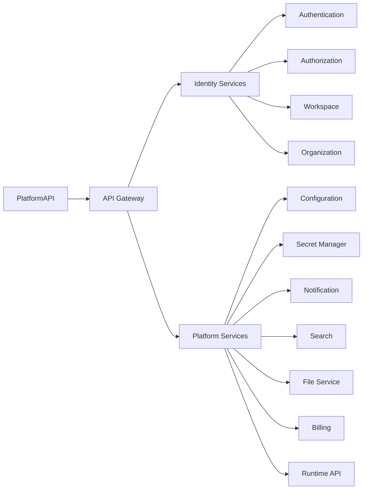
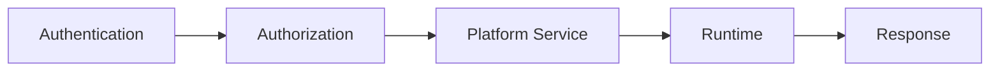
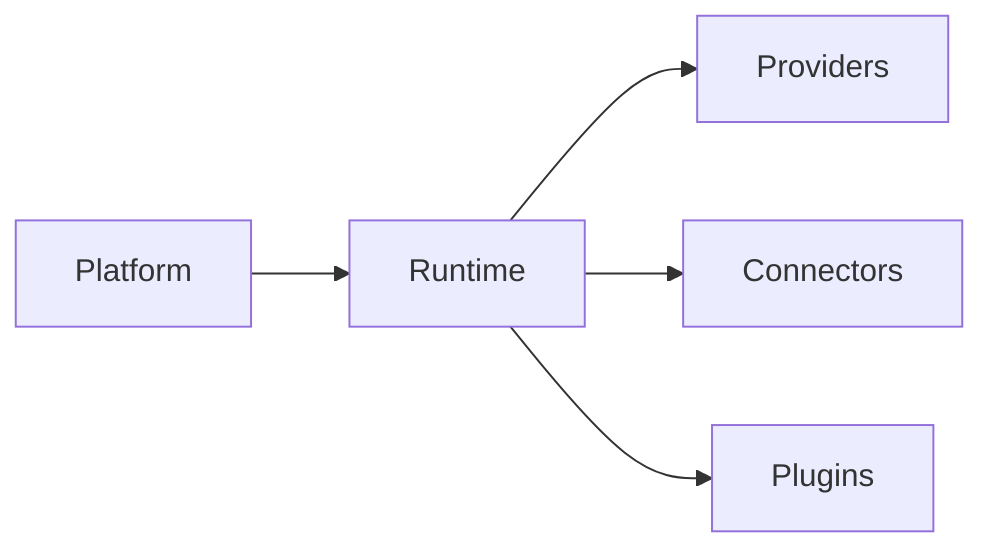

# Platform Overview

> AI Social OS Platform Layer

Version: 2.0.0

Status: Stable

Last Updated: 2026-07-25

---

# Table of Contents

- Overview
- Why Platform
- Vision
- Goals
- Responsibilities
- Platform Architecture
- Platform Domains
- Core Components
- Platform Lifecycle
- Relationship with Runtime
- Design Principles
- Summary

---

# Overview

Platform là tầng dịch vụ trung tâm của AI Social OS, cung cấp toàn bộ năng lực dùng chung cho các ứng dụng, Workspace và Runtime.

Nếu Runtime chịu trách nhiệm **thực thi**, thì Platform chịu trách nhiệm **quản lý**.

Platform tập trung toàn bộ các dịch vụ như:

- Identity
- Workspace
- Organization
- API Gateway
- Security
- Configuration
- Search
- Notification
- Billing
- File Management
- License Management

Mọi Application đều tương tác với Platform trước khi sử dụng Runtime.

---

# Why Platform

Nếu mọi Application đều tự xây dựng:

- Authentication
- User Management
- Billing
- Notification
- Search
- API Gateway

thì sẽ dẫn đến.

- Trùng lặp chức năng
- Khó bảo trì
- Không thống nhất
- Khó mở rộng
- Khó tích hợp

Platform giải quyết vấn đề này bằng cách cung cấp các dịch vụ dùng chung dưới dạng Platform Services.

---

# Vision

Platform hướng đến việc trở thành hệ điều hành dịch vụ của AI Social OS.

Mọi sản phẩm trong hệ sinh thái đều chia sẻ chung.

- Users
- Workspaces
- Organizations
- Permissions
- APIs
- Configuration
- Files
- Billing
- Notifications

Platform không chứa Business Logic của từng ứng dụng.

Platform chỉ cung cấp hạ tầng.

---

# Goals

Platform hướng đến các mục tiêu.

- Multi Tenant
- Secure
- Scalable
- Configurable
- Extensible
- Observable
- API First
- Cloud Native

---

# Responsibilities

Platform chịu trách nhiệm.

- Quản lý User
- Quản lý Organization
- Quản lý Workspace
- Quản lý Authentication
- Quản lý Authorization
- Quản lý Permission
- Quản lý API Gateway
- Quản lý Secret
- Quản lý Configuration
- Quản lý Notification
- Quản lý Billing
- Quản lý Subscription
- Quản lý License
- Quản lý Search
- Quản lý File
- Quản lý Media

Platform không thực thi Workflow.

Platform chuyển yêu cầu thực thi xuống Runtime.

---

# Platform Architecture



---

# Platform Domains

Platform được chia thành các Domain chính.

```text
Identity

Workspace

Organization

Security

Configuration

Storage

Notification

Search

Business

Integration
```

Mỗi Domain có Service riêng và có thể mở rộng độc lập.

---

# Core Components

```text
Platform

├── Workspace Service
├── User Service
├── Organization Service
├── Authentication Service
├── Authorization Service
├── Permission Service
├── API Gateway
├── Configuration Service
├── Secret Manager
├── Notification Service
├── Search Service
├── File Service
├── Media Service
├── Billing Service
├── Subscription Service
├── License Service
└── Platform API
```

---

# Platform Lifecycle



Platform xử lý toàn bộ yêu cầu trước khi chuyển xuống Runtime.

---

# Relationship with Runtime



Platform không thay thế Runtime.

Hai tầng bổ sung cho nhau.

---

# Platform Characteristics

Platform có các đặc điểm.

- Multi Tenant
- Stateless
- API Driven
- Service Oriented
- Event Driven
- Cloud Ready
- Extensible
- Secure by Default

---

# Multi-Tenancy

Platform được thiết kế cho nhiều khách hàng cùng sử dụng.

```text
Platform

├── Organization A
│   ├── Workspace A1
│   └── Workspace A2
│
├── Organization B
│   └── Workspace B1
│
└── Organization C
```

Mỗi Organization và Workspace được cô lập hoàn toàn.

---

# Platform Services

Platform Services cung cấp năng lực dùng chung.

Ví dụ.

- Login
- Invite User
- Upload File
- Send Notification
- Search
- Billing
- License Check

Các dịch vụ này có thể được nhiều Application sử dụng đồng thời.

---

# Design Principles

Platform được xây dựng theo các nguyên tắc.

- API First
- Service Oriented
- Multi Tenant
- Event Driven
- Stateless
- Secure by Default
- Configurable
- Extensible
- Observable

---

# Summary

Platform là tầng dịch vụ nền tảng của AI Social OS, chịu trách nhiệm quản lý Identity, Workspace, Security, Configuration, API Gateway và các dịch vụ dùng chung cho toàn bộ hệ sinh thái.

Bằng cách tách biệt rõ vai trò giữa Platform và Runtime, hệ thống có thể mở rộng linh hoạt, tái sử dụng dịch vụ hiệu quả và cung cấp một nền tảng thống nhất để xây dựng nhiều ứng dụng AI trên cùng một kiến trúc.