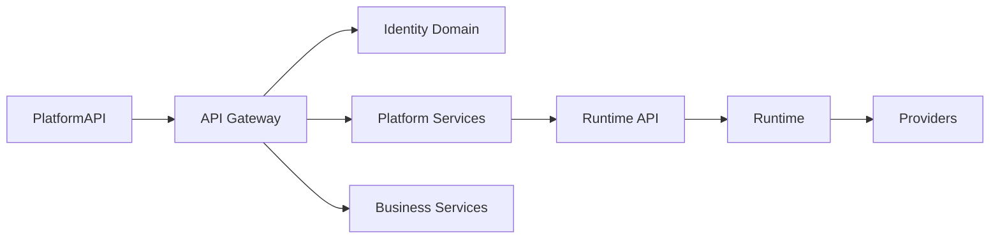
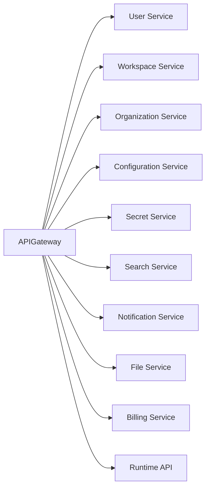
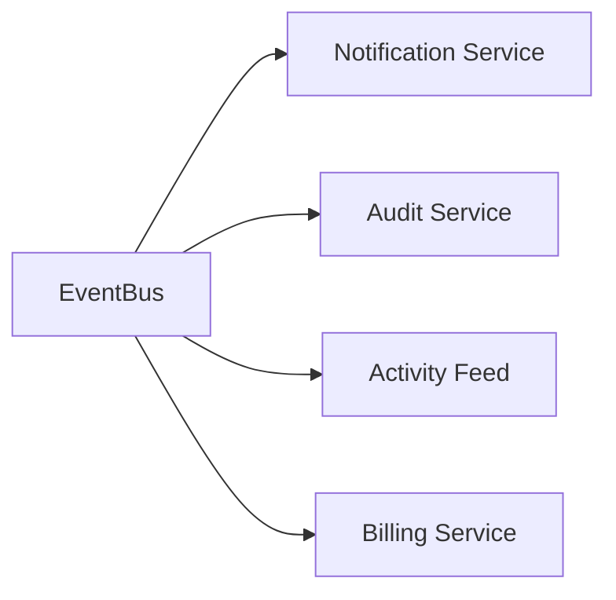
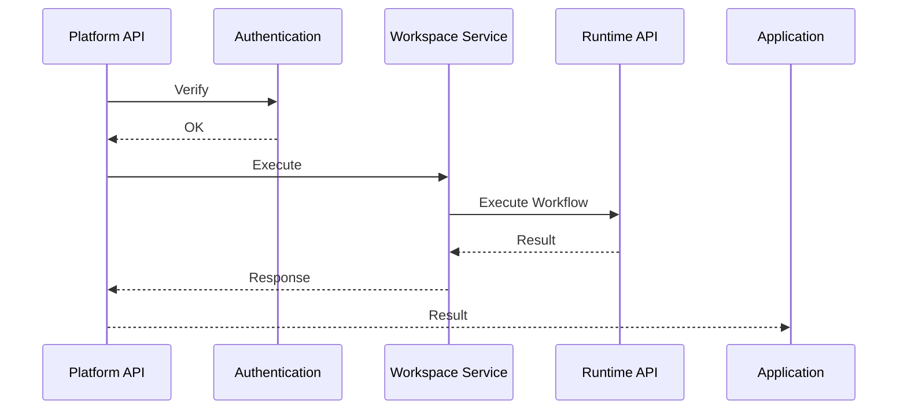
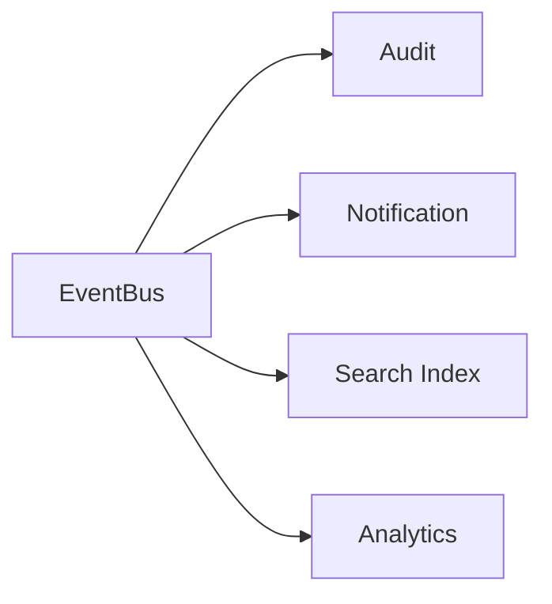
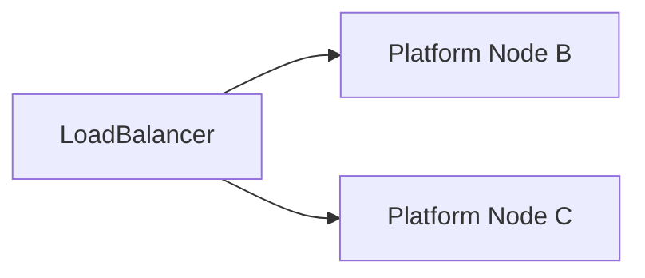

# Platform Architecture

> AI Social OS Platform Layer

Version: 2.0.0

Status: Stable

Last Updated: 2026-07-25

---

# Table of Contents

- Overview
- Architecture Goals
- Design Principles
- Layered Architecture
- Platform Domains
- Service Topology
- Internal Communication
- External Interfaces
- Platform Components
- Data Flow
- Event Flow
- Scalability
- High Availability
- Design Decisions
- Summary

---

# Overview

Platform Architecture mô tả cấu trúc tổng thể của Platform Layer trong AI Social OS.

Platform là lớp trung gian giữa Applications và Runtime, cung cấp toàn bộ Platform Services dùng chung.

Platform không chứa Business Logic của từng ứng dụng.

Platform chỉ cung cấp các năng lực nền tảng phục vụ toàn bộ hệ sinh thái.

---

# Architecture Goals

Kiến trúc Platform hướng tới.

- Multi Tenant
- Modular
- Service Oriented
- Event Driven
- Secure
- Scalable
- Observable
- Extensible

---

# Design Principles

Platform được thiết kế theo các nguyên tắc.

- API First
- Domain Driven
- Stateless Services
- Shared Infrastructure
- Event Driven
- Horizontal Scaling
- Zero Trust
- Loose Coupling

---

# Layered Architecture



---

# Platform Domains

Platform được chia thành các Domain độc lập.

```text
Platform

├── Identity
├── Workspace
├── Organization
├── Security
├── Configuration
├── Search
├── Notification
├── File
├── Media
├── Billing
├── Subscription
├── License
└── API
```

Mỗi Domain có thể được phát triển và triển khai độc lập.

---

# Service Topology



---

# Identity Domain

Identity Domain quản lý.

- User
- Role
- Permission
- Authentication
- Authorization
- Session
- Access Token

Đây là nền tảng bảo mật của Platform.

---

# Workspace Domain

Workspace là đơn vị làm việc chính.

Workspace chứa.

- Users
- Projects
- Agents
- Workflows
- Files
- Secrets
- Configuration

Workspace được cô lập hoàn toàn với Workspace khác.

---

# Organization Domain

Organization đại diện cho doanh nghiệp hoặc nhóm.

Một Organization có thể chứa nhiều Workspace.

```text
Organization

├── Workspace A

├── Workspace B

└── Workspace C
```

---

# Security Domain

Security bao gồm.

- Authentication
- Authorization
- Secret Management
- API Key
- Session
- Audit Log

Security áp dụng cho toàn bộ Platform.

---

# Platform Services

Platform Services cung cấp.

- Notification
- Search
- File Storage
- Media Storage
- Configuration
- Audit
- Activity Feed

Các dịch vụ này được chia sẻ cho toàn bộ Applications.

---

# Business Services

Business Layer quản lý.

- Billing
- Subscription
- License
- Plan
- Usage

Đây là tầng phục vụ hoạt động thương mại của nền tảng.

---

# Internal Communication

Các Service giao tiếp thông qua Event Bus hoặc API nội bộ.



Ưu tiên giao tiếp bất đồng bộ để giảm Coupling.

---

# External Interfaces

Platform cung cấp các giao diện.

```text
REST API

GraphQL

WebSocket

SDK

CLI
```

Các giao diện đều sử dụng chung Platform API.

---

# Platform Components

```text
Platform

├── API Gateway
├── Identity
├── Workspace
├── Organization
├── Configuration
├── Secret Manager
├── Notification
├── Search
├── File Service
├── Media Service
├── Billing
├── Subscription
├── License
├── Audit
└── Activity Feed
```

---

# Data Flow



---

# Event Flow



Một Event có thể được nhiều Service xử lý đồng thời.

---

# Scalability

Platform được Scale theo từng Domain.

Ví dụ.

```text
User Service × 5

Workspace Service × 8

Search Service × 3

Notification × 10
```

Không cần Scale toàn bộ Platform cùng lúc.

---

# High Availability



Nếu một Node lỗi.

Các Node còn lại tiếp tục phục vụ.

---

# Platform Boundaries

Platform chịu trách nhiệm.

- Identity
- Configuration
- Workspace
- Business Services
- API

Runtime chịu trách nhiệm.

- Execution
- Scheduling
- Worker
- Provider
- Agent Runtime

Ranh giới giữa hai tầng được xác định thông qua Runtime API.

---

# Design Decisions

| Decision | Reason |
|-----------|--------|
| Domain-based Architecture | Dễ mở rộng |
| API Gateway | Điểm truy cập thống nhất |
| Event Driven | Giảm Coupling |
| Stateless Services | Horizontal Scaling |
| Shared Identity | Đồng nhất bảo mật |
| Runtime Separation | Phân tách trách nhiệm |
| Multi-Tenant Design | Phục vụ nhiều khách hàng |

---

# Summary

Platform Architecture tổ chức AI Social OS thành các Domain độc lập như Identity, Workspace, Configuration, Search, Notification và Business Services, tất cả được truy cập thông qua một API Gateway thống nhất.

Kiến trúc này giúp Platform có khả năng mở rộng theo từng dịch vụ, hỗ trợ Multi-Tenancy, giao tiếp hướng sự kiện và tích hợp chặt chẽ với Runtime, đồng thời vẫn giữ ranh giới rõ ràng giữa quản lý nền tảng và thực thi Workflow.